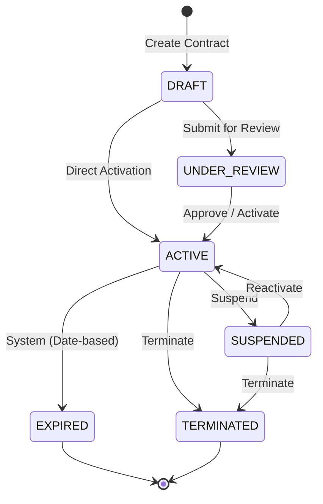
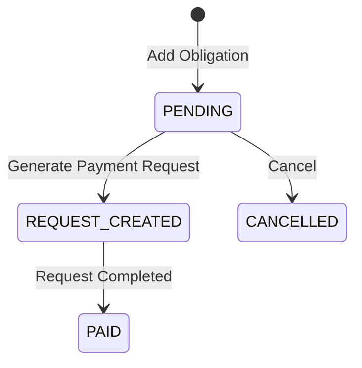
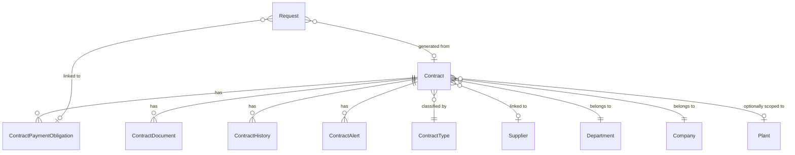

# Contracts Workflow — BPM Reference

> **Document Owner:** Agent  
> **Created:** 2026-04-19  
> **Status:** Active (MVP v1)

---

## 1. Process Overview

The Contracts module manages the lifecycle of external agreements (service contracts, leases, supply agreements, maintenance contracts) from registration through payment obligation execution.

**Core Flow:**

```
Contract → ContractPaymentObligation → Manual User Action → Request (PAYMENT)
```

Payment Requests are **never auto-created**. A human user must explicitly trigger the "Generate Payment Request" action on each pending obligation.

---

## 2. Contract Lifecycle State Machine



### Status Definitions

| Status | Code | Description |
|--------|------|-------------|
| Rascunho | `DRAFT` | Initial state. Editable. No financial operations allowed. |
| Em Revisão | `UNDER_REVIEW` | Submitted for approval. Still editable. |
| Ativo | `ACTIVE` | Fully operational. Obligations can generate Payment Requests. |
| Suspenso | `SUSPENDED` | Temporarily halted. No new operations. Can be reactivated. |
| Expirado | `EXPIRED` | Past expiration date. System-driven (future background job). |
| Terminado | `TERMINATED` | Permanently closed by user action. No reactivation. |

### Transition Rules

| From | To | Who Can Trigger | Preconditions |
|------|----|-----------------|---------------|
| DRAFT | UNDER_REVIEW | Contracts | — |
| DRAFT | ACTIVE | Contracts | — |
| UNDER_REVIEW | ACTIVE | Contracts | — |
| ACTIVE | SUSPENDED | Contracts | Contract must be ACTIVE |
| ACTIVE | TERMINATED | Contracts | Contract must be ACTIVE |
| SUSPENDED | ACTIVE | Contracts | Contract must be SUSPENDED |
| SUSPENDED | TERMINATED | Contracts | Contract must be SUSPENDED |
| ACTIVE | EXPIRED | System | `ExpirationDateUtc < now` |

---

## 3. Obligation Lifecycle



### Obligation Status Definitions

| Status | Code | Description |
|--------|------|-------------|
| Pendente | `PENDING` | Awaiting action. Editable. |
| Pedido Criado | `REQUEST_CREATED` | Payment Request has been generated. Read-only. |
| Pago | `PAID` | Payment confirmed (future: auto-sync from Request status). |
| Cancelado | `CANCELLED` | Obligation voided by user. |

---

## 4. Generate Payment Request — Detailed Flow

This is the critical business operation connecting Contracts to the existing Requests workflow.

### Preconditions
1. Contract status must be `ACTIVE`
2. Contract must have a `SupplierId` assigned
3. Obligation status must be `PENDING`
4. No existing `Request` linked to this obligation

### Generated Request Properties

| Request Field | Source |
|---------------|--------|
| `RequestNumber` | Generated from `GLOBAL_REQUEST_COUNTER` (same sequence as manual requests) |
| `Title` | `Pagamento Contratual — {ContractNumber} — {ObligationDescription}` |
| `RequestTypeId` | Looked up from `RequestTypes` where `Code = 'PAYMENT'` |
| `StatusId` | Looked up from `RequestStatuses` where `Code = 'DRAFT'` |
| `DepartmentId` | Inherited from Contract |
| `CompanyId` | Inherited from Contract |
| `PlantId` | Inherited from Contract |
| `SupplierId` | Inherited from Contract |
| `CurrencyId` | Obligation currency, fallback to Contract currency |
| `EstimatedTotalAmount` | `Obligation.ExpectedAmount` |
| `NeedByDateUtc` | `Obligation.DueDateUtc` |
| `ContractId` | FK back to source Contract |
| `ContractPaymentObligationId` | FK back to source Obligation |

### Post-Actions
- Obligation status transitions to `REQUEST_CREATED`
- A `ContractHistory` entry is logged with `EventType = REQUEST_LINKED`
- The generated Request enters the standard request workflow (approvals, buyer, finance)

---

## 5. Data Visibility (Scope Rules)

Contract visibility follows the same scope model as Requests:

| Role | Scope | Access |
|------|-------|--------|
| System Administrator | Global | All contracts |
| Contracts | Scoped by Plant + Department | Read/Write |
| Finance | Scoped by Plant + Department | Read-only + Generate Requests |

### Scope Derivation
- Company scope is derived from user's plant assignments (`Plant → Company`)
- Plant-level contracts are visible to users assigned to that plant
- Company-wide contracts (`PlantId = NULL`) are visible to all users within the company scope

---

## 6. Entity Relationship Diagram



### FK Strategy (Unidirectional)
- `Request.ContractId` → `Contract.Id` (nullable)
- `Request.ContractPaymentObligationId` → `ContractPaymentObligation.Id` (nullable)
- Contract does NOT have a direct collection of Requests
- Delete behavior: `RESTRICT` on both FKs (prevents cascade path conflicts)

---

## 7. API Endpoints

| Method | Endpoint | Description |
|--------|----------|-------------|
| GET | `/api/v1/contracts` | List contracts (filtered, paged, with summary) |
| GET | `/api/v1/contracts/{id}` | Get contract detail with obligations, docs, history |
| POST | `/api/v1/contracts` | Create new contract (DRAFT) |
| PUT | `/api/v1/contracts/{id}` | Update contract (DRAFT/UNDER_REVIEW only) |
| POST | `/api/v1/contracts/{id}/submit-review` | Transition to UNDER_REVIEW |
| POST | `/api/v1/contracts/{id}/activate` | Transition to ACTIVE |
| POST | `/api/v1/contracts/{id}/suspend` | Transition to SUSPENDED |
| POST | `/api/v1/contracts/{id}/reactivate` | Transition to ACTIVE |
| POST | `/api/v1/contracts/{id}/terminate` | Transition to TERMINATED |
| POST | `/api/v1/contracts/{id}/obligations` | Add payment obligation |
| PUT | `/api/v1/contracts/{id}/obligations/{oblId}` | Update obligation |
| DELETE | `/api/v1/contracts/{id}/obligations/{oblId}` | Cancel obligation |
| POST | `/api/v1/contracts/{id}/obligations/{oblId}/generate-request` | **Generate Payment Request** |
| POST | `/api/v1/contracts/{id}/documents` | Upload document |
| GET | `/api/v1/contracts/{id}/documents/{docId}/download` | Download document |
| GET | `/api/v1/contracts/alerts` | List active alerts |
| POST | `/api/v1/contracts/alerts/{alertId}/dismiss` | Dismiss alert |
| GET | `/api/v1/contracts/types` | List contract types |

---

## 8. History Event Types

| Event | Code | Description |
|-------|------|-------------|
| Created | `CREATED` | Contract registered |
| Status Changed | `STATUS_CHANGED` | Lifecycle transition |
| Field Updated | `FIELD_UPDATED` | Data modifications |
| Obligation Added | `OBLIGATION_ADDED` | New payment obligation |
| Request Linked | `REQUEST_LINKED` | Payment Request generated |
| Document Uploaded | `DOCUMENT_UPLOADED` | File attachment |
| Renewed | `RENEWED` | Contract renewal (future) |

---

## 9. Alert Types (MVP Scope)

| Alert Type | Trigger | Description |
|------------|---------|-------------|
| EXPIRATION_WARNING | `ExpirationDateUtc - RenewalNoticeDays` | Contract approaching expiration |
| OBLIGATION_DUE | `Obligation.DueDateUtc - 7 days` | Payment obligation approaching due date |

> **Note:** Alert creation is not automated in MVP. Alerts are designed for future background job integration.

---

## 10. Future Considerations (Post-MVP)

- [ ] Background job for automatic EXPIRED status transitions
- [ ] Automated alert creation via scheduled task
- [ ] OCR pipeline integration for contract document parsing
- [ ] Obligation auto-sync with Request payment status
- [ ] Bulk obligation schedule generation assistant
- [ ] Contract renewal workflow
- [ ] Budget consumption tracking per contract
