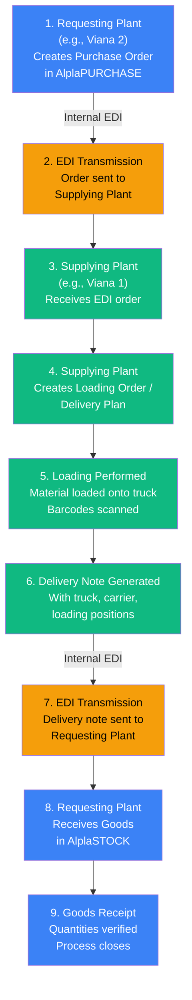
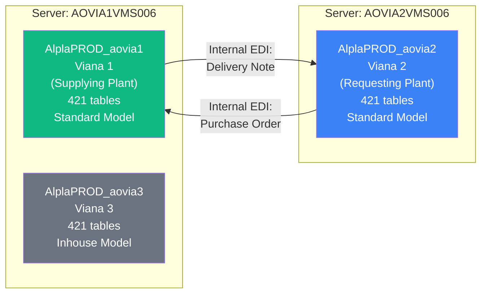
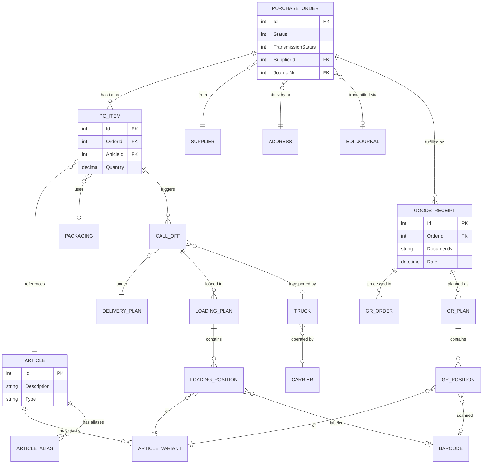
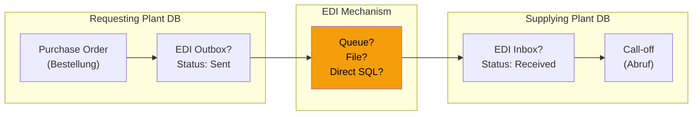
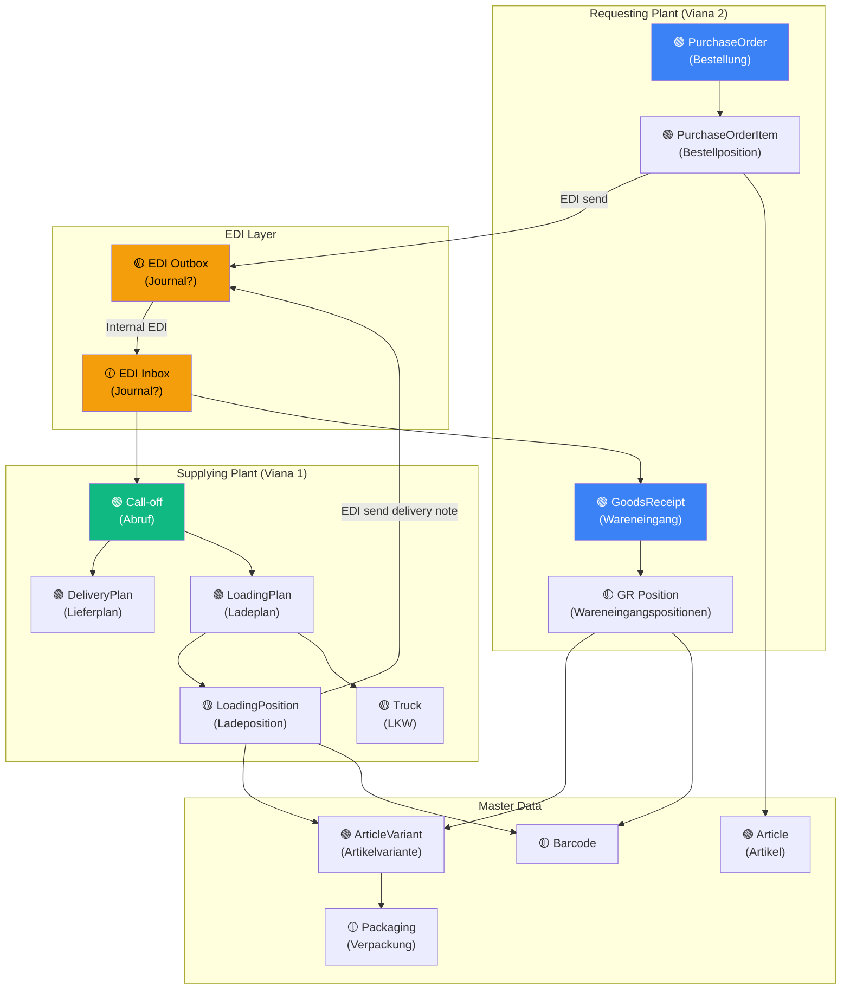
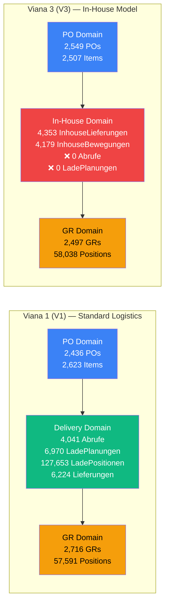
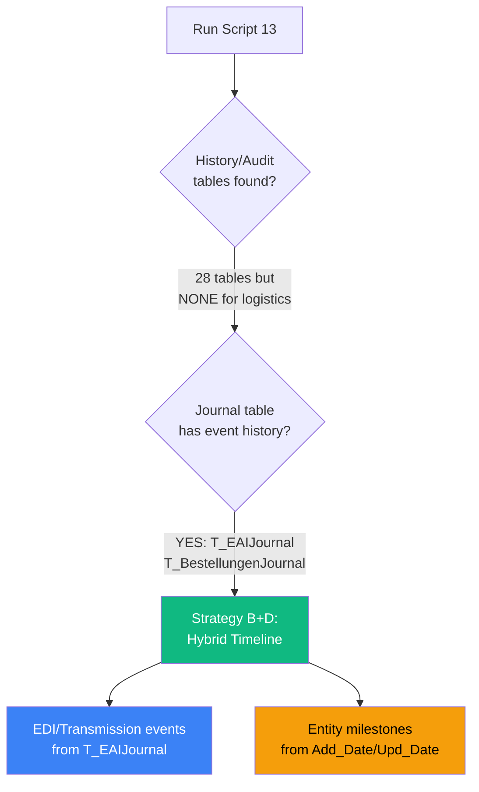

# Operations Module — AlplaPROD Discovery Report

> **Status**: DISCOVERY COMPLETE — All scripts (01–14) executed across V1/V2/V3. OQ1–OQ5 RESOLVED. Technical Design available.  
> **Date**: 2026-05-29  
> **Updated**: 2026-05-31 (Technical Design document created)  
> **Next**: [OPERATIONS_MODULE_TECHNICAL_DESIGN.md](file:///c:/dev/alpla-portal/docs/OPERATIONS_MODULE_TECHNICAL_DESIGN.md)  
> **Module**: Operations (future)  
> **Focus**: Inter-plant material transfer process  
> **Constraint**: READ-ONLY — All database interactions are strictly SELECT-only

> [!NOTE]
> **DISCOVERY PHASE COMPLETE.** All 14 scripts executed across all 3 AlplaPROD databases.  
> **Pipeline Model CONFIRMED**: Viana 1 + Viana 2 = Standard Model, Viana 3 = Inhouse Model.  
> **Timeline Strategy DECIDED**: **Strategy D (Hybrid)** — EAI Journal events + Entity Snapshots.  
> MVP timeline validated: 10 events (V1/V2 Standard), 7 events (V3 Inhouse).  
> **Cross-plant linking**: EDI web services, no linked servers.  
> **Material display fields**: `T_Artikelvarianten.Bezeichnung` + `T_ArtikelvariantenTyp` + `T_VpkVorschrift`.  
> **T_InhouseBewegungen gap RESOLVED**: V3 has 4,179 movements + 4,353 deliveries with full audit columns.  
> **OQ1–OQ5 RESOLVED**: All status fields mapped. See Status Value Interpretation section.

---

## 1. Purpose

This document captures the discovery and investigation work for the future **Operations** module of the Portal Gerencial. The Operations module will serve both **Logistics** and **Production** departments by presenting AlplaPROD data in a clearer, more visual, and didactic way.

### Module Goal

Read AlplaPROD data and present it visually to logistics and production users. The module is **read-only** — it will never write to AlplaPROD databases.

### First Screen Goal

The first Operations screen will focus on **Logistics users** and will visualize the **inter-plant material transfer process** — from purchase order creation to goods receipt closure.

### This Document's Purpose

Identify the AlplaPROD tables, columns, keys, relationships, and EDI references involved in the inter-plant material transfer process, so that a future implementation can build read-only services against confirmed database structures.

---

## 2. Business Process Summary

### Inter-Plant Material Transfer Flow

The inter-plant transfer process involves multiple Alpla plants exchanging materials. Each plant has its own AlplaPROD database. The process uses internal EDI (Electronic Data Interchange) to communicate between plants.

### Step-by-Step Flow



### Concrete Example from Screenshots

| Step | Entity | ID (from screenshots) | Description |
|------|--------|----------------------|-------------|
| 1. PO Created | Bestellung (Purchase Order) | 26 | Requesting plant creates order for resin |
| 1a. PO Item | Bestellposition (PO Line) | 94 | Article 2295 / MM JADE CZ-328 |
| 2. EDI Sent | Journal-Nr. | (visible in UI) | Transmission status tracked |
| 4. Delivery Plan | Lieferplan | 16391 | Supplying plant plans delivery |
| 4a. Call-off | Abruf | 5939 | Specific delivery call-off |
| 5. Loading | Ladeplan / Ladepositionen | (visible in UI) | With barcodes, truck assignment |
| 8. Goods Receipt | Wareneingang | 887 | Requesting plant confirms arrival |
| 8a. GR Order | Wareneingangsauftrag | 1805 | GR processing order |
| 8b. GR Plan | Wareneingangsplan | 1907 | GR planned quantities |
| 8c. GR Positions | Wareneingangspositionen | 13032, 13033 | Individual items received |

---

## 3. Database Servers and Databases

### Infrastructure Map — ✅ CONFIRMED



| Server | Database | Plant | Role | Tables | SQL Server Version | Pipeline Model | Status |
|--------|----------|-------|------|--------|--------------------|---------------|--------|
| `AOVIA1VMS006` | ✅ `AlplaPROD_aovia1` | Viana 1 | Supplying plant | 421 tables | SQL Server 2022 (RTM-CU24) 16.0.4245.2 | **Standard** | ✅ Phase 1+2+3 |
| `AOVIA1VMS006` | ✅ `AlplaPROD_aovia3` | Viana 3 | (secondary) | 421 tables | SQL Server 2022 (RTM-CU24) 16.0.4245.2 | **Inhouse** | ✅ Phase 1+2+3 |
| `AOVIA2VMS006` | ✅ `AlplaPROD_aovia2` | Viana 2 | Requesting plant | 421 tables | SQL Server 2022 Standard (RTM) 16.0.1000.6 | **Standard** | ✅ Phase 1, Phase 2 in progress |

> [!NOTE]
> **Q1 ANSWERED:** Database names follow the pattern `AlplaPROD_aovia{N}` where N is the plant suffix.
> All three databases confirmed: `AlplaPROD_aovia1` (V1), `AlplaPROD_aovia2` (V2), `AlplaPROD_aovia3` (V3).
> **Pipeline Model CONFIRMED:** V1 + V2 = Standard Logistics, V3 = Inhouse Logistics.

### Schema — ✅ CONFIRMED

Both databases have 3 schemas:

| Schema | Schema ID | Logistics Tables |
|--------|-----------|------------------|
| ✅ `dbo` | 1 | **All logistics entities** — Bestellungen, Abrufe, Wareneingaenge, etc. |
| `AlplaAPP` | 5 | Mobile app-related tables (10 tables, mostly empty) |
| `AlplaREPORTBUDGET` | 6 | Budget reporting (no tables found in this schema) |

> [!NOTE]
> **Q2 ANSWERED:** All logistics tables are under the `dbo` schema. No need for multi-schema queries.

### Schema Parity — ✅ CONFIRMED (All 3 Plants)

> [!NOTE]
> **Q7 ANSWERED:** All three databases share **identical table structures** — 421 tables each,
> same table names, same schemas (`dbo`, `AlplaAPP`, `AlplaREPORTBUDGET`).
> The only differences are in data volumes and pipeline model usage:
> - V1 (Standard) and V2 (Standard): Active standard logistics tables (Abrufe, LadePlanungen, etc.)
> - V3 (Inhouse): Active inhouse tables (`T_InhouseLieferungen`, `T_InhouseBewegungen`), empty standard logistics tables.

### Database Access

A read-only SQL login has been provisioned for discovery purposes with **SELECT-only** permissions.

> [!CAUTION]
> Credentials must NOT be committed to the repository, written into documentation,
> embedded in SQL scripts, or stored in tracked configuration files.

### Cross-Plant Communication Architecture — ✅ CONFIRMED (Script 09)

> [!IMPORTANT]
> Cross-plant communication uses **EAI/EDI web services**, not linked servers or cross-database queries.
> Each plant database is fully self-contained. Inter-plant data exchange happens via HTTP-based EDI import web services.

#### Communication Mechanism

The plants communicate via **`T_EDIKonfigurationen`** entries that define web service endpoints for EDI document exchange:

```
V1 → V2:  http://AOVIA2VMS006.alpla.net/AlplaPROD/AlplaPROD_WS_aovia2/EDI/V01.00/EDIImport.asmx
V1 → V3:  http://AOVIA1VMS006.alpla.net/AlplaPROD/AlplaPROD_WS_aovia3/EDI/V01.00/EDIImport.asmx
V2 → V1:  http://AOVIA1VMS006.alpla.net/AlplaPROD/AlplaPROD_WS_aovia1/EDI/V01.00/EDIImport.asmx
V3 → V1:  http://AOVIA1VMS006.alpla.net/AlplaPROD/AlplaPROD_WS_aovia1/EDI/V01.00/EDIImport.asmx
```

Schema used: `EAIJournalExport_v06.40` (V1/V2), `EAIJournalExport_v05.70` (V3 legacy configs)

#### EDI Routing Table (`T_EDIRouting`)

| Source DB | IdEDIKonfiguration | Target Plant | EDITyp | EDIRichtung | IdAdressen |
|-----------|-------------------|-------------|--------|-------------|------------|
| V1 | 29 | V3 (aovia3) | 4 | 1 | 61 |
| V1 | 32 | V2 (aovia2) | 0 | 1 | 52 |
| V1 | 33 | V2 (aovia2) | 4 | 1 | 52 |
| V2 | 31 | V1 (aovia1) | 0 | 1 | 25 |
| V2 | 32 | V1 (aovia1) | 4 | 1 | 25 |
| V3 | 16–21 | V1 (aovia1) | 0/4 | 1 | (varies) |

#### Inter-Plant Address References (`T_Adressen`)

| DB | IdAdressen | Bezeichnung | Ort | AdressenTyp | Role |
|----|-----------|-------------|-----|-------------|------|
| V1 | 2 | Alpla viana 1 | Viana | 3 (own plant) | Self |
| V1 | 52 | Alpla Viana 2 (ZEE) | Viana | 3 (plant) | Partner |
| V1 | 56/61 | Alpla viana 3 (SOPRO) | Viana | 3 (plant) | Partner |
| V2 | 2 | Alpla Viana 2 (ZEE) | Viana - Luanda | 3 (own plant) | Self |
| V2 | 25 | Alpla Viana 1 | VIANA | 3 (plant) | Partner |
| V2 | 34 | Alpla Viana 3 (SOPRO) | VIANA | 3 (plant) | Partner |

#### Linked Servers — NOT Used for Cross-Plant

| Server | Linked Servers | Cross-Plant? |
|--------|---------------|-------------|
| AOVIA1VMS006 | `ACDC01VMS006`, `ALPLABILAKE0SQLMI20SER...` | ❌ No link to AOVIA2VMS006 |
| AOVIA2VMS006 | `ACDC01VMS006`, `ALPLA0MANAGEDINSTANCE30/50...`, `ALPLABILAKE0SQLMI20SER...` | ❌ No link to AOVIA1VMS006 |

> [!NOTE]
> **No cross-database queries exist.** The `sys.synonyms`, `sys.views`, and `sys.sql_modules` searches returned
> zero results for four-part names or remote references. Each database is fully isolated.
> Cross-plant data flows through EAI/EDI web services only.

#### `T_Werke` Plant Registry — ✅ CONFIRMED

`T_Werke` contains **536 rows** (global Alpla plant registry) with 36 columns including:

| Column | Type | Purpose |
|--------|------|--------|
| `IdWerk` | `int` | Primary key |
| `werk_id` | `int` | Plant numeric ID |
| `werk_name` | `nvarchar(70)` | Plant display name |
| `werk_country_id` | `nvarchar(50)` | Country code |
| `werk_server` | `nvarchar(100)` | SQL Server hostname |
| `werk_db` | `nvarchar(100)` | Database name |
| `werk_shortcut` | `nvarchar(50)` | Short code (e.g. `aovia1`) |
| `werk_suffix` | `nvarchar(10)` | Suffix identifier |
| `inhouse` | `int` | **Inhouse flag** (-1 or 0) |
| `Aktiv` | `int` | Active status |
| `GLN` | `nvarchar(50)` | Global Location Number |

#### Database Fingerprint Comparison

| Metric | V1 | V2 | V3 |
|--------|----|----|----|
| Server | AOVIA1VMS006 | AOVIA2VMS006 | AOVIA1VMS006 |
| Tables | 421 | 421 | 421 |
| Views | 747 | 746 | 745 |
| SPs | 0 | 0 | 0 |
| FKs | 77 | 77 | 77 |
| Linked Servers | 0 | 0 | 0 |
| Synonyms | 0 | 0 | 0 |

---

## 4. Read-Only Safety Rules

The following rules apply to **all** interactions with AlplaPROD databases, both during discovery and in any future Operations module implementation:

### Absolute Prohibitions

| Action | Rule |
|--------|------|
| `INSERT` | ❌ Never — no records may be created |
| `UPDATE` | ❌ Never — no records may be modified |
| `DELETE` | ❌ Never — no records may be removed |
| `MERGE` | ❌ Never — combines insert/update/delete |
| `TRUNCATE` | ❌ Never — bulk data removal |
| `DROP` | ❌ Never — no schema modifications |
| `ALTER` | ❌ Never — no schema modifications |
| `CREATE` | ❌ Never — no new objects in AlplaPROD |
| `EXEC` (data-modifying SPs) | ❌ Never — unless confirmed read-only |

### Permitted Actions

| Action | Rule |
|--------|------|
| `SELECT` | ✅ Always — with TOP limits and date filters |
| `INFORMATION_SCHEMA` queries | ✅ Always — metadata inspection |
| `sys.*` catalog views | ✅ Always — schema discovery |

### SQL Script Safety Standards

All discovery scripts in `docs/sql-discovery/operations/` follow these standards:

1. **Header warning**: Every script starts with a `READ-ONLY` banner
2. **No credentials**: No passwords, connection strings, or login names in scripts
3. **TOP limits**: All sample data queries use `TOP 50` or similar limits
4. **Template pattern**: Queries requiring table name adjustments are commented out as `TEMPLATE`
5. **No EXEC**: No stored procedure execution
6. **Parameterized examples**: Example record IDs are used as investigation references, not hardcoded assumptions

---

## 5. UI Screens Used as Reference

The following German UI labels were extracted from screenshots of the AlplaPURCHASE and AlplaSTOCK applications. These labels serve as the primary investigation map for database column discovery.

### 5.1 AlplaPURCHASE — Purchase Order Screen

| German Label | English Translation | Business Context | Investigation Script |
|---|---|---|---|
| Bestellung | Purchase Order | Main entity — PO header | `02` A1, `05` |
| Lieferant | Supplier | Supplier reference on PO | `02` A2 |
| Lieferadresse | Delivery Address | Where material should be delivered | `02` A3 |
| Rechnungsadresse | Invoice Address | Billing address | `02` A3 |
| Bestellstatus | Order Status | Current PO lifecycle status | `02` A4 |
| Übertragungsstatus | Transmission Status | EDI transfer status (critical) | `02` A4, `08` |
| Journal | Journal | EDI journal reference | `02` A5, `08` |
| Journal-Nr. | Journal Number | Specific journal entry ID | `02` A5, `08` |
| Revision | Revision | Document version tracking | `02` A6 |
| Hinzugefügt von | Added by | Creator username/ID | `02` A9 |
| Erstellt | Created | Creation date | `02` A9 |
| Geändert von | Modified by | Last modifier | `02` A9 |
| Geändert am | Modified at | Last modification date | `02` A9 |
| Bestellpositionen | Order Positions/Items | PO line items | `02` A1, `05` |
| Artikel | Article | Material/product reference | `02` A7, `10` |
| Artikelalias | Article Alias | Alternative article name | `02` A7, `10` |
| Bestelldatum | Order Date | When PO was placed | `02` A9 |
| Liefertermin | Delivery Date | Required delivery date | `02` A9 |
| Menge | Quantity | Ordered quantity | `02` A8 |
| Menge VPK | Packaging Quantity | Qty in packaging units | `02` A8 |
| Preis | Price | Unit price | `02` A8 |
| Preis Total | Total Price | Line total | `02` A8 |
| Verpackung | Packaging | Packaging type/description | `02` A8, `10` |
| Artikeltyp | Article Type | Product type classification | `02` A7, `10` |
| Artikelvariantentyp | Article Variant Type | Variant classification | `02` A7, `10` |
| Bestellposition | Order Position | Line item number | `02` A1 |
| Wareneingang | Goods Receipt | GR reference on PO line | `02` C1, `07` |

### 5.2 AlplaSTOCK — Delivery/Loading Screen

| German Label | English Translation | Business Context | Investigation Script |
|---|---|---|---|
| Abrufe | Call-offs | Delivery call-off entities | `02` B1, `06` |
| Kunden Nr. | Customer Number | Requesting plant as customer | `02` B5, `09` |
| Kunde | Customer | Customer name | `02` B5, `09` |
| Lieferadresse | Delivery Address | Destination address | `02` A3 |
| Artikelvariante | Article Variant | Specific variant being delivered | `02` A7, `10` |
| Lieferplan | Delivery Plan | Planned delivery schedule | `02` B2, `06` |
| LKWs | Trucks | Assigned trucks | `02` B4, `06` |
| Ladepläne | Loading Plans | Loading plan entities | `02` B3, `06` |
| Ladepositionen | Loading Positions | Individual loaded items | `02` B3, `06` |
| Barcode | Barcode | Label/barcode on physical unit | `02` C4, `10` |
| Menge | Quantity | Loaded quantity | `02` A8 |
| Menge VPK | Packaging Quantity | Qty in packaging units | `02` A8 |
| Verpackung | Packaging | Packaging type | `02` A8, `10` |
| Spediteur | Carrier/Forwarder | Transport company | `02` B4, `06` |
| LKW-Nummer | Truck Number | Vehicle identifier | `02` B4, `06` |
| LKW Name | Truck Name | Vehicle name/description | `02` B4, `06` |

### 5.3 AlplaSTOCK — Goods Receipt Screen

| German Label | English Translation | Business Context | Investigation Script |
|---|---|---|---|
| Wareneingang | Goods Receipt | GR header entity | `02` C1, `07` |
| Bestellung | Purchase Order | Link back to originating PO | `02` A1, `05`, `07` |
| Lieferant | Supplier | Supplying plant as supplier | `02` A2, `09` |
| Beleg | Document/Voucher | GR document reference | `02` C2, `07` |
| Typ | Type | GR type classification | `07` Q10 |
| Lieferantenadresse | Supplier Address | Supplier's address | `02` A3 |
| Kundenadresse | Customer Address | Receiving plant's address | `02` A3 |
| Lieferadresse | Delivery Address | Actual delivery point | `02` A3 |
| Datum | Date | GR date | `02` A9 |
| Planmenge | Planned Quantity | Expected quantity | `02` C3, `07` |
| Offene Menge | Open Quantity | Remaining/pending quantity | `02` C3, `07` |
| Wareneingangsaufträge | GR Orders | Processing orders for GR | `07` |
| Wareneingangspläne | GR Plans | Planned receipt quantities | `07` |
| Wareneingangspositionen | GR Positions | Individual received items | `07` |
| Barcode | Barcode | Label on received item | `02` C4, `10` |
| Laufende Nr. | Running/Serial Number | Internal serial number | `02` C4 |
| Externe Laufende Nr. | External Running Number | External/supplier serial number | `02` C4 |
| Menge | Quantity | Received quantity | `02` A8 |
| Menge VPK | Packaging Quantity | Qty in packaging units | `02` A8 |

---

## 6. Confirmed Tables — ✅ Phase 1 Results

The following tables have been **confirmed** from real database query results (`01_schema_inspection.sql` and `02_column_search_german_labels.sql`). The `_cus` databases were intentionally excluded.

### 6.1 Purchase Order Domain — ✅ CONFIRMED

| Confirmed Table | Rows (V1) | Rows (V3) | Business Entity | Key Columns (confirmed) |
|---|---|---|---|---|
| ✅ `dbo.T_Bestellungen` | 2,436 | 2,549 | Purchase Order header | `IdBestellung`, `IdLieferant`, `Status`, `UebermittlungsStatus`, `IdJournal`, `JournalNummer`, `Bestaetigt`, `Revision`, `IdKundenAdresse`, `IdLieferAdresse`, `IdRechnungsAdresse`, `Bemerkung`, `AXAuftragsNummer` |
| ✅ `dbo.T_Bestellpositionen` | 2,623 | 2,507 | PO line items | `IdBestellPosition`, `IdBestellung`, `IdLieferant`, `IdArtikelVarianten`, `BestellDatum`, `Lieferdatum`, `BestellMenge`, `BestellMengeVPK`, `PositionsStatus`, `IdJournal`, `IdJournalPosition`, `JournalNummer`, `IdHauptmaterial`, `AXLoskennung` |
| ✅ `dbo.T_BestellungenJournal` | 2,411 | 2,550 | PO change journal | — |
| ✅ `dbo.T_Bestellvorschlaege` | 0 | 0 | Purchase suggestions | — |
| ✅ `dbo.T_BestellPositionenBewertungen` | 0 | 0 | PO position evaluations | — |

> [!IMPORTANT]
> **Critical finding**: `T_Bestellungen` has both `Status` and `UebermittlungsStatus` columns (int),
> and links to the Journal via `IdJournal` + `JournalNummer`. This confirms the PO → EDI linkage.

### 6.2 Delivery/Loading Domain — ✅ CONFIRMED

| Confirmed Table | Rows (V1) | Rows (V3) | Business Entity | Key Columns (confirmed) |
|---|---|---|---|---|
| ✅ `dbo.T_Abrufe` | 4,041 | 0 | Call-off (Abruf) | `IdAbrufe`, `IdKonto`, `Lieferdatum`, `MengeVPK`, `Menge`, `LieferStatus`, `Abrufnummer`, `AbgleichTyp`, `AbgleichStatus`, `Status`, `AbrufStatus`, `LadeStatus`, `IdAuftrag`, `AuftragsNummer`, `IdAuftragsPosition`, `IdAuftragsAbruf`, `AbrufDatum`, `PlanMenge`, `LadeMenge`, `IdKundenAdresse`, `IdLieferAdresse`, `IdRechnungsAdresse` |
| ✅ `dbo.T_LadePlanungen` | 6,970 | 0 | Loading plans | — |
| ✅ `dbo.T_LadePositionen` | 127,639 | 0 | Loading positions | — |
| ✅ `dbo.T_LadeAuftraege` | 6,461 | 0 | Loading orders | — |
| ✅ `dbo.T_Lieferungen` | 6,224 | 0 | Deliveries | — |
| ✅ `dbo.T_LieferPositionen` | 127,588 | 0 | Delivery positions | — |
| ✅ `dbo.T_Lieferscheine` | 0 | 0 | Delivery notes | — |
| ✅ `dbo.T_LieferscheinPositionen` | 0 | 0 | Delivery note positions | — |
| ✅ `dbo.T_LKWTypen` | 1 | 1 | Truck types | — |
| ✅ `dbo.T_TransportTypen` | 13 | 13 | Transport types | — |

> [!WARNING]
> **Viana 3 has 0 rows** in Abrufe, LadePlanungen, LadePositionen, LadeAuftraege, Lieferungen,
> and LieferPositionen. This suggests Viana 3 operates with a different delivery model
> (possibly **Inhouse** transfers — see `T_InhouseBewegungen` with 4,179 rows and
> `T_InhouseLieferungen` with 4,353 rows in Viana 3).

### 6.3 Goods Receipt Domain — ✅ CONFIRMED

| Confirmed Table | Rows (V1) | Rows (V3) | Business Entity | Key Columns (confirmed) |
|---|---|---|---|---|
| ✅ `dbo.T_Wareneingaenge` | 2,716 | 2,497 | Goods receipt header | `IdWareneingang`, `Typ`, `AbgleichStatus`, `Status`, `IdJournal`, `IdJournalPosition`, `IdJournalWarenPosition`, `IdRetourware`, `IdVpkRuecknahme`, `IdUmlagerung`, `Datum`, `Beleg`, `IdAuftragsAbruf`, `IdSperrgrund`, `IdLieferantAdresse`, `IdKundenAdresse`, `IdLieferAdresse`, `IdRechnungsAdresse`, `IdArtikelVarianten`, `IdAdresse`, `IdVpkVorschrift`, `SollMenge`, `SollMengeVPK`, `IstMenge`, `IstMengeVPK`, `IdBestellPosition`, `IdBestellung`, `BestellPositionStatus`, `EurologStatus` |
| ✅ `dbo.T_WareneingangAuftraege` | 2,471 | 3,655 | GR orders | — |
| ✅ `dbo.T_WareneingangBewertungen` | 2,548 | 3,904 | GR evaluations | — |
| ✅ `dbo.T_WareneingangPlanungen` | 2,617 | 3,965 | GR plans | — |
| ✅ `dbo.T_WareneingangPositionen` | 57,591 | 58,038 | GR positions | — |

> [!IMPORTANT]
> **Critical finding**: `T_Wareneingaenge` has direct FK references to PO via `IdBestellPosition`
> and `IdBestellung`. It also links to Journal via `IdJournal`, `IdJournalPosition`,
> `IdJournalWarenPosition`. And it has `SollMenge` / `IstMenge` (planned vs actual qty).

### 6.4 EDI / Journal Domain — ✅ CONFIRMED

| Confirmed Table | Rows (V1) | Rows (V3) | Business Entity | Notes |
|---|---|---|---|---|
| ✅ `dbo.T_EAIJournal` | 12,640 | 6,577 | EAI Journal header | Central EDI/EAI journal — **critical** |
| ✅ `dbo.T_EAIJournalPosition` | 13,901 | 8,452 | Journal positions | Line items per journal |
| ✅ `dbo.T_EAIJournalWarenPosition` | 14,433 | 8,452 | Journal goods positions | Goods-level detail |
| ✅ `dbo.T_EAIJournalBestellPosition` | 4,392 | 2,929 | Journal PO positions | **Links journal → PO positions** |
| ✅ `dbo.T_EAIJournalLieferPosition` | 129,885 | 0 | Journal delivery positions | Delivery-level detail (V3=0) |
| ✅ `dbo.T_EAIJournalAdresse` | 50,560 | 26,308 | Journal addresses | Address per journal entry |
| ✅ `dbo.T_EAIJournalSynch` | 11,882 | 9,416 | Journal synchronization | Sync status tracking |
| ✅ `dbo.T_EDIDokumente` | 1,222 | 3,653 | EDI documents | EDI document records |
| ✅ `dbo.T_EDIDokumentPositionen` | 1,457 | 4,007 | EDI document positions | |
| ✅ `dbo.T_EDIPositionDetails` | 16,638 | 58,119 | EDI position details | Very high volume in V3 |
| ✅ `dbo.T_EDIKonfigurationen` | 3 | 6 | EDI configurations | V3 has 6 configs (vs V1=3) |
| ✅ `dbo.T_EDIRouting` | 3 | 6 | EDI routing | V3 has 6 routes (vs V1=3) |
| ✅ `dbo.T_EDIUpload` | 5,462 | 2,625 | EDI uploads | |

> [!IMPORTANT]
> **Critical finding**: The **EAI** (Enterprise Application Integration) tables appear to be the
> primary EDI mechanism. `T_EAIJournal` is the central journal, with sub-tables for positions,
> addresses, and synchronization. `T_EAIJournalBestellPosition` explicitly links journals to
> purchase order positions. The EDI subsystem has a clear table-based architecture.

### 6.5 Article/Material Domain — ✅ CONFIRMED

| Confirmed Table | Rows (V1) | Rows (V3) | Business Entity |
|---|---|---|---|
| ✅ `dbo.T_Artikelvarianten` | 454 | 309 | Article variants |
| ✅ `dbo.T_ArtikelvariantenTyp` | 36 | 26 | Variant types |
| ✅ `dbo.T_Vpk` | 133 | 19 | Packaging (Verpackung) |
| ✅ `dbo.T_VpkPos` | 549 | 18 | Packaging positions |
| ✅ `dbo.T_EtikettenHistorie` | 194,598 | 55,199 | Label/barcode history |
| ✅ `dbo.T_EtikettenGedruckt` | 178,745 | 26 | Printed labels |
| ✅ `dbo.T_EtikettenGemappt` | 15,784 | 55,171 | Mapped labels |
| ✅ `dbo.T_Werke` | 536 | 526 | Plants (Werke) |
| ✅ `dbo.T_Adressen` | 111 | 12 | Addresses |
| ✅ `dbo.T_Konten` | 2,167 | 569 | Accounts |

### 6.6 Stock / Warehouse Domain — ✅ CONFIRMED

| Confirmed Table | Rows (V1) | Rows (V3) | Business Entity | Notes |
|---|---|---|---|---|
| ✅ `dbo.T_LagerBuchungen` | 1,091,127 | 221,066 | Stock movements | **Largest table** |
| ✅ `dbo.T_LagerBestandsHistorie` | 547,911 | 142,163 | Stock history | |
| ✅ `dbo.T_LagerLose` | 386,679 | 125,680 | Stock lots | |
| ✅ `dbo.T_LagerPositionen` | 12,033 | 21,237 | Stock positions | |
| ✅ `dbo.T_LagerKonten` | 2,221 | 457 | Stock accounts | |
| ✅ `dbo.T_LieferBuchungen` | 189,551 | 0 | Delivery movements | V3=0 |
| ✅ `dbo.T_ProduktionsBuchungen` | 285,245 | 79,004 | Production movements | |

### Confidence Legend

- ✅ **Confirmed**: Real SQL output from `01_schema_inspection.sql` validates existence and structure
- ⚠️ **Partial**: Table exists but column details pending deeper investigation
- ⬜ **Pending**: Not yet validated (awaiting Viana 2 data)

---

## 7. Candidate Columns

The following column mappings are predicted based on the German UI field labels. These map UI fields to probable database column names.

### 7.1 Purchase Order Header

| UI Field | Probable Column Name(s) | Data Type (expected) | Notes |
|---|---|---|---|
| Bestellung (ID) | `Id`, `BestellungId`, `OrderId` | `int` / `bigint` | Primary key |
| Bestellstatus | `Status`, `Bestellstatus`, `OrderStatus` | `int` / `nvarchar` | Enum or lookup |
| Übertragungsstatus | `UebertragungsStatus`, `TransmissionStatus`, `EDIStatus` | `int` / `nvarchar` | EDI lifecycle |
| Journal-Nr. | `JournalNr`, `JournalId` | `int` / `nvarchar` | FK to journal table |
| Lieferant | `LieferantId`, `SupplierId` | `int` | FK to supplier |
| Lieferadresse | `LieferadresseId`, `DeliveryAddressId` | `int` | FK to address |
| Rechnungsadresse | `RechnungsadresseId`, `InvoiceAddressId` | `int` | FK to address |
| Revision | `Revision` | `int` | Version counter |
| Erstellt | `Erstellt`, `CreatedDate`, `CreatedAt` | `datetime` | Audit field |
| Geändert am | `GeaendertAm`, `ModifiedDate`, `ModifiedAt` | `datetime` | Audit field |
| Hinzugefügt von | `HinzugefuegtVon`, `CreatedBy` | `nvarchar` / `int` | User reference |
| Geändert von | `GeaendertVon`, `ModifiedBy` | `nvarchar` / `int` | User reference |

### 7.2 Purchase Order Position/Item

| UI Field | Probable Column Name(s) | Data Type (expected) | Notes |
|---|---|---|---|
| Bestellposition (ID) | `Id`, `PositionId` | `int` | Primary key |
| Bestellung (FK) | `BestellungId`, `OrderId` | `int` | FK to PO header |
| Artikel | `ArtikelId`, `ArticleId` | `int` | FK to article |
| Artikelalias | `ArtikelAliasId`, `AliasId` | `int` | FK to alias |
| Bestelldatum | `Bestelldatum`, `OrderDate` | `datetime` | Order date |
| Liefertermin | `Liefertermin`, `DeliveryDate` | `datetime` | Required date |
| Menge | `Menge`, `Quantity` | `decimal` / `float` | Ordered qty |
| Menge VPK | `MengeVPK`, `PackagingQty` | `decimal` / `float` | Packaging qty |
| Preis | `Preis`, `Price` | `decimal` | Unit price |
| Preis Total | `PreisTotal`, `TotalPrice` | `decimal` | Line total |
| Verpackung | `VerpackungId`, `PackagingId` | `int` | FK to packaging |

### 7.3 Goods Receipt

| UI Field | Probable Column Name(s) | Data Type (expected) | Notes |
|---|---|---|---|
| Wareneingang (ID) | `Id`, `WareneingangId` | `int` | Primary key |
| Bestellung | `BestellungId`, `OrderId` | `int` | FK back to PO |
| Beleg | `BelegNr`, `DocumentNr` | `nvarchar` | Document reference |
| Typ | `Typ`, `Type` | `int` / `nvarchar` | GR type |
| Datum | `Datum`, `Date` | `datetime` | Receipt date |
| Planmenge | `Planmenge`, `PlannedQty` | `decimal` | Expected qty |
| Offene Menge | `OffeneMenge`, `OpenQty` | `decimal` | Remaining qty |

> [!WARNING]
> **All column names above are predictions.** The actual column names will be confirmed
> by running Script `02_column_search_german_labels.sql` against the real databases.

---

## 8. Relationship Map

### Predicted Entity Relationships



> [!NOTE]
> This ER diagram reflects the **logical structure** confirmed by Phase 1 schema inspection.
> Phase 2 FK analysis confirmed that almost all relationships are **implicit** (naming-convention
> based). Only 2 explicit FKs exist in the logistics domain.

### Phase 2: Confirmed FK Analysis

> [!WARNING]
> AlplaPROD has **only 77 explicit FK constraints** in the entire database.
> Of these, only **2 are logistics-relevant**. All other relationships are enforced
> at the **application level** via matching column names (e.g., `IdBestellung`).

#### Explicit FKs (Logistics-relevant — only 2)

| FK Name | Child Table | Child Column | Parent Table | Parent Column |
|---------|-----------|-------------|-------------|--------------|
| `T_Abrufe_T_LadePlanungen_FK1` | `T_LadePlanungen` | `IdAbrufe` | `T_Abrufe` | `IdAbrufe` |
| `T_LadeAuftraege_T_LadePlanungen_FK1` | `T_LadePlanungen` | `IdLadeAuftrag` | `T_LadeAuftraege` | `IdLadeAuftrag` |

#### Implicit Relationships (Confirmed by Column Presence)

| Parent Entity | Column | Child Entities | Evidence |
|--------------|--------|---------------|----------|
| `T_Bestellungen` | `IdBestellung` | `T_Bestellpositionen`, `T_Bestellung`, `T_BestellungenJournal`, `T_Bestellvorschlaege`, `T_EAIJournalPosition`, `T_Wareneingaenge` | 7 tables share this column |
| `T_EAIJournal` | `IdJournal` | `T_Bestellungen`, `T_Bestellpositionen`, `T_BestellungenJournal`, `T_EAIJournalBestellPosition`, `T_EAIJournalEx`, `T_EAIJournalPosition`, `T_EAIJournalSynch`, `T_EAIJournalText`, `T_InhouseLieferungen`, `T_Lieferungen`, `T_Wareneingaenge`, `T_WareneingangPlanungen` | 16 tables share this column |
| `T_AuftragsAbrufe` | `IdAuftragsAbruf` | `T_Abrufe`, `T_AuftragsAbrufeHistorie`, `T_EAIJournalPosition`, `T_KundenAbrufe`, `T_LieferscheinPositionen`, `T_Wareneingaenge` | 7 tables share this column |
| `T_Lieferscheine` | `IdLieferschein` | `T_EAIJournalPosition`, `T_LadePlanungen`, `T_LieferBuchungen`, `T_LieferPositionen`, `T_LieferscheinPositionen`, `T_WareneingangPlanungen` | 7 tables share this column |
| `T_Wareneingaenge` | `IdWareneingang` | `T_WareneingangPlanungen` | 2 tables share this column |

> [!TIP]
> **Implication for read-only queries**: JOINs must use `ON a.IdBestellung = b.IdBestellung`
> even though no FK constraint enforces this. The database will not prevent orphaned records,
> so queries should use `LEFT JOIN` patterns and include null-checking.

### Key Relationship Questions — Phase 2 Status

| Question | Script | Status |
|----------|--------|--------|
| How does PO → EDI link work? | `08` Q12 | ✅ **ANSWERED**: `T_Bestellungen.IdJournal` → `T_EAIJournal.IdJournal` (implicit FK) |
| How does EDI → Delivery Plan link work? | `08` Q13 | ✅ **ANSWERED**: `T_EAIJournalPosition.IdAuftragsAbruf` → `T_Abrufe.IdAuftragsAbruf` → `T_LadePlanungen.IdAbrufe` (FK) |
| How does Goods Receipt → PO link work? | `07` Q8 | ✅ **ANSWERED**: `T_Wareneingaenge.IdBestellung` + `T_Wareneingaenge.IdBestellPosition` (direct implicit FK) |
| Are FKs declared or implicit? | `03` Q5 | ✅ **ANSWERED**: 77 total, only 2 logistics-relevant. Mostly implicit. |
| How are plants identified? | `09` Q3 | ⬜ Phase 4 pending |

---

## 9. EDI Flow Investigation

EDI (Electronic Data Interchange) is the **critical glue** between plants. Without understanding the EDI mechanism, we cannot trace a transfer from start to finish.

### What We Know (from UI)

- The PO screen shows **Übertragungsstatus** (Transmission Status)
- The PO screen shows **Journal** and **Journal-Nr.** fields
- These suggest that each PO has a status tracking its EDI transmission
- A Journal table likely records EDI events

### What We Need to Discover



### Investigation Strategy (Script `08`)

| Query | Purpose | Expected Output |
|-------|---------|-----------------|
| Q1-Q4 | Find EDI/Journal/Transfer tables | Table names and row counts |
| Q5-Q8 | Find EDI-related columns across all tables | Column-to-entity mapping |
| Q9 | Full column listing for EDI tables | Complete schema of EDI entities |
| Q10-Q11 | Sample data from EDI/Journal tables | Understand data format and lifecycle |
| Q12-Q14 | Trace PO 26 → EDI → Abruf 5939 → GR 887 | Confirm the chain |
| Q15-Q16 | Distinct status values | EDI state machine |
| Q17-Q18 | SPs and Views related to EDI | Business logic clues |
| Q19 | FKs involving EDI tables | Formal relationships |

### Possible EDI Architectures — ✅ ANSWERED (Phase 2)

| Architecture | How to Detect | Status |
|---|---|---|
| **Table-based queue** | EDI tables with Status columns (Pending/Sent/Received/Processed) | ✅ **CONFIRMED** — Primary mechanism. `T_EAIJournal` (header), `T_EAIJournalSynch` (sync status), `T_EDIUpload` (file transfer). |
| **File-based exchange** | Config tables with file paths; no EDI data tables | ⚠️ **Secondary** — `T_EDIUpload` (5,463 rows) suggests file-based EDI for external customers only. |
| **Linked server direct SQL** | Synonyms or views pointing to remote databases | ⬜ Not yet confirmed — needs `09` script on AOVIA1VMS006. |
| **Service/API-based** | Minimal DB footprint; journal entries only | ⬜ `T_AxTransferQueueEntry` and `T_AxIncasTransferQueueEntry` suggest AX/ERP API calls exist alongside EAI. |

### Phase 2 Confirmed EAI Architecture

> [!IMPORTANT]
> AlplaPROD uses **two parallel subsystems** for inter-company communication:
> - **EAI (Enterprise Application Integration)**: Table-based, for **inter-plant** transfers. This is what the Operations module needs.
> - **EDI (Electronic Data Interchange)**: File/document-based, for **external customer** orders. Less relevant for inter-plant tracking.

#### EAI Tables (Core — 18 tables confirmed)

| Table | Columns | Rows (V1) | Role |
|-------|---------|-----------|------|
| `T_EAIJournal` | 59 | ~12,000 | **Central header** — IdJournal PK, JournalNummer, IdJournalTyp, IdJournalStatus, JournalDatum, carrier/truck details, export date |
| `T_EAIJournalEx` | 49 | ~12,000 | **Extended header** — additional address, tax, and reporting fields |
| `T_EAIJournalPosition` | 91 | — | **Position detail** — IdJournal FK + IdBestellung + IdAuftragsAbruf + BestellungNummer + LieferscheinNummer + many cross-references |
| `T_EAIJournalBestellPosition` | 52 | — | **PO position bridge** — IdJournal → PO items with article, quantity, pricing |
| `T_EAIJournalWarenPosition` | 57 | — | **Goods position** — quantity, article variant, packaging details |
| `T_EAIJournalLieferPosition` | 18 | — | **Delivery position** — barcode, production date, EAN, radiation number |
| `T_EAIJournalLeistungsPosition` | — | — | **Service position** — for non-goods items |
| `T_EAIJournalAdresse` | 29 | — | **Address data** — customer/supplier/delivery/invoice addresses per journal |
| `T_EAIJournalBeleg` | — | — | **Document reference** — links journal to formal documents |
| `T_EAIJournalText` | — | — | **Text data** — remarks, header/footer text per position |
| `T_EAIJournalTextPosition` | — | — | **Text position detail** |
| `T_EAIJournalLayout` | — | — | **Layout/format** — printing templates per article variant |
| `T_EAIJournalSynch` | — | — | **Sync status** — IdEDIKonfiguration + TransaktionUID + Status + Dateiname |
| `T_EAIJournalAmo` | — | — | **AMO data** — article master organization |
| `T_EAIJournalLeistungsVorlageZuordnung` | — | — | **Service template mapping** |
| `T_EAIJournalTextVorlageZuordnung` | — | — | **Text template mapping** |
| `T_EAIKundenAbrufe` | — | — | **Customer call-off mirror** — EAI representation of customer demand |
| `T_EAIKundenAbrufBestaetigungen` | — | — | **Customer call-off confirmations** |

#### EAI Cross-Reference Fields in T_EAIJournalPosition

This is the **richest cross-referencing table** in AlplaPROD (91 columns). Key reference fields:

| Field | Type | Purpose |
|-------|------|---------|
| `IdJournal` | int | Link to journal header |
| `IdBestellung` | int | Link to purchase order |
| `IdAuftragsAbruf` | int | Link to call-off |
| `IdLieferschein` | int | Link to delivery note |
| `IdBestellvorschlag` | int | Link to order suggestion |
| `IdLieferscheinPosition` | int | Link to delivery note position |
| `IdLadePlanung` | int | Link to loading plan |
| `BestellungNummer` | nvarchar | Human-readable PO number |
| `AuftragsNummer` | nvarchar | Human-readable order number |
| `AuftragsAbrufNummer` | nvarchar | Human-readable call-off number |
| `LieferscheinNummer` | nvarchar | Human-readable delivery note number |
| `RechnungsNummer` | nvarchar | Invoice number |
| `ReferenzBestellungNummer` | nvarchar | Reference PO (cross-plant) |
| `ReferenzLieferscheinNummer` | nvarchar | Reference delivery note (cross-plant) |
| `AuftragsBestNummer` | nvarchar | Order confirmation number |

#### EDI Tables (External — 6 tables)

| Table | Rows (V1) | Role |
|-------|-----------|------|
| `T_EDIDokumente` | 33,459 | External EDI document headers |
| `T_EDIDokumentPositionen` | 197,709 | Document positions with order/article mapping |
| `T_EDIKonfigurationen` | 149 | Configuration per EDI partner |
| `T_EDIRouting` | 20 | Message routing rules |
| `T_EDIUpload` | 5,463 | File upload tracking |
| `T_EDIDifferenzen` | — | Discrepancy tracking |

#### Transfer Queue Tables (AX Integration)

| Table | Role |
|-------|------|
| `T_AxTransferQueueEntry` | WebService-based transfer to AX ERP (URL + Payload + Retries + ErrorMessage) |
| `T_AxIncasTransferQueueEntry` | INCAS transfer queue (IdJournal + IdJournalTyp + Payload) |
| `T_TransferQueue` | Generic transfer queue |

#### Key EAI Views (Pre-built Read Paths)

| View | Purpose |
|------|---------|
| `V_BestellungenEAIJournal` | **PO ↔ Journal** join — IdJournal, IdJournalTyp, IdJournalStatus, JournalDatum, Exportiert |
| `V_EAIJournalHeader` | Journal header summary |
| `V_EAIJournalHistoryHeader` | Journal history (previous versions) |
| `V_EAIJournalBasisJournal` | Base journal view |
| `V_EAIJournalBeziehung` | **Journal-to-journal relationships** — IdBezugsJournal + IdBezugsJournalTyp |
| `V_LieferungenFromEAIJournal` | Deliveries derived from journal entries |
| `V_TrackerBestellPositionen` | PO position tracking with journal references |
| `V_TrackerGelieferteMengenJeBestellPosition` | Delivered quantities per PO position |
| `V_TrackerLieferscheinLieferPositionen` | Delivery note position tracker |

---

## 10. Example Record Trace

The following IDs were extracted from screenshots and serve as concrete starting points for tracing the data flow across tables.

### Reference Values

| Entity | German Label | ID | Description |
|--------|-------------|-----|-------------|
| Purchase Order | Bestellung | 26 | Main PO in the example flow |
| PO Item | Bestellposition | 94 | Line item on PO 26 |
| Article | Artikel | 2295 | MM JADE CZ-328 |
| Call-off | Abruf | 5939 | Delivery call-off |
| Delivery Plan | Lieferplan | 16391 | Planned delivery |
| Article Variant | Artikelvariante | 1269 | MM PET CR-8828F |
| Goods Receipt | Wareneingang | 887 | GR on requesting plant |
| GR Order | Wareneingangsauftrag | 1805 | Processing order |
| GR Plan | Wareneingangsplan | 1907 | Planned receipt |
| GR Positions | Wareneingangspositionen | 13032, 13033 | Individual items |
| Packaging | Verpackung | — | SRESINA 1100 KGS BIG BAG |

### Trace Strategy

```
Step 1: Run 05_purchase_order_trace.sql
  → Discover PO table name, find PO 26 and its items (especially item 94)
  → Note the JournalNr and TransmissionStatus fields

Step 2: Run 08_edi_investigation.sql
  → Find the Journal entry linked to PO 26
  → Understand the EDI status values

Step 3: Run 06_delivery_plan_trace.sql
  → Find Abruf 5939 and Lieferplan 16391
  → Trace loading plans and truck assignments

Step 4: Run 07_goods_receipt_trace.sql
  → Find Wareneingang 887, Order 1805, Plan 1907
  → Verify the link back to PO 26

Step 5: Run 10_article_variant_trace.sql
  → Trace Article 2295 and Variant 1269 across all entities

Step 6: Run 09_cross_plant_linking.sql
  → Understand how Viana 1 and Viana 2 reference each other
```

---

## 11. Proposed Data Flow

### Table-by-Table Chain (Predicted)



### Confidence per Entity

| Entity | Confidence | Basis |
|--------|-----------|-------|
| PurchaseOrder (Bestellung) | 🟢 High | Direct UI label, explicit ID |
| PO Item (Bestellposition) | 🟢 High | Direct UI label, explicit ID |
| Call-off (Abruf) | 🟢 High | Direct UI label, explicit ID |
| Delivery Plan (Lieferplan) | 🟢 High | Direct UI label, explicit ID |
| Goods Receipt (Wareneingang) | 🟢 High | Direct UI label, explicit ID |
| Article (Artikel) | 🟢 High | Direct UI label |
| Article Variant (Artikelvariante) | 🟢 High | Direct UI label, explicit ID |
| Loading Plan (Ladeplan) | 🟡 Medium | UI label present, no explicit ID |
| Loading Position | 🟡 Medium | UI label present |
| Truck (LKW) | 🟡 Medium | UI label present |
| EDI Journal | 🟡 Medium | UI shows Journal-Nr. field |
| GR Order/Plan/Position | 🟡 Medium | UI labels present, explicit IDs |
| Packaging (Verpackung) | 🟡 Medium | UI shows packaging name |
| Barcode | 🟡 Medium | UI column present |

---

## 12. Open Questions

> [!IMPORTANT]
> The following questions must be answered before the discovery can be considered complete.
> Most answers will come from executing the SQL discovery scripts against the real databases.

### ✅ Q0 — Universal Transfer Reference — ANSWERED (Phase 2)

> [!IMPORTANT]
> **`IdJournal` is the semi-universal reference** that links most entities in the
> inter-plant transfer flow. There is **no single universal field** that appears on
> every entity, but `IdJournal` comes closest, appearing on **16 tables** including
> the most critical ones: PO, PO Items, EAI Journal, Deliveries, GR, and GR Plans.

**Answer**: The inter-plant transfer uses a **multi-path reference chain** with `IdJournal` as the central hub:

#### Confirmed Reference Fields (Phase 2)

| Reference Field | Tables Present | Role | Evidence |
|----------------|---------------|------|----------|
| `IdJournal` (int) | 16 tables: `T_Bestellungen`, `T_Bestellpositionen`, `T_BestellungenJournal`, `T_Bestellvorschlaege`, `T_EAIJournal`, `T_EAIJournalBestellPosition`, `T_EAIJournalEx`, `T_EAIJournalPosition`, `T_EAIJournalSynch`, `T_EAIJournalText`, `T_InhouseLieferungen`, `T_Lieferungen`, `T_Wareneingaenge`, `T_WareneingangPlanungen`, `T_KonsignationsBewegungen`, `T_AxIncasTransferQueueEntry` | **Central hub** — links PO ↔ EAI ↔ Delivery ↔ GR | Script `12` Q2, `08` column analysis |
| `IdBestellung` (int) | 7 tables: `T_Bestellungen`, `T_Bestellpositionen`, `T_Bestellung`, `T_BestellungenJournal`, `T_Bestellvorschlaege`, `T_EAIJournalPosition`, `T_Wareneingaenge` | **PO identity** — GR links directly back to PO | Script `12` Q2 |
| `IdAuftragsAbruf` (int) | 7 tables: `T_Abrufe`, `T_AuftragsAbrufe`, `T_AuftragsAbrufeHistorie`, `T_EAIJournalPosition`, `T_KundenAbrufe`, `T_LieferscheinPositionen`, `T_Wareneingaenge` | **Call-off link** — bridges GR ↔ Abruf | Script `12` Q2 |
| `JournalNummer` (nvarchar) | 6 tables: `T_Bestellpositionen`, `T_Bestellungen`, `T_EAIJournal`, `T_EAIJournalEx`, `T_InhouseLieferungen`, `T_Lieferungen` | **Human-readable** journal number | Script `12` Q2 |
| `IdJournalPosition` (int) | 9 tables | **Position-level** journal link | Script `12` Q2 |
| `IdJournalWarenPosition` (int) | 6 tables | **Goods position-level** journal link | Script `12` Q2 |
| `IdJournalBestellPosition` (int) | 4 tables: `T_Bestellpositionen`, `T_EAIJournalBestellPosition`, `T_EAIJournalPosition`, `T_Wareneingaenge` | **PO position-level** journal link | Script `12` Q2 |
| `Beleg` (nvarchar) | 11 tables | **Voucher/document** reference | Script `12` Q3 |
| `GUID` (uniqueidentifier) | 18 tables | **GUID** exists on many EAI/logistics entities | Script `12` Q6 |

#### Confirmed Reference Chain

```
T_Bestellungen.IdBestellung (PK)  →  IdJournal  →  T_EAIJournal.IdJournal (PK)
  ├─ T_Bestellpositionen (IdBestellung FK, + IdJournal, IdJournalBestellPosition)
  ├─ T_BestellungenJournal (IdBestellung + IdJournal → revision history)
  └─ T_EAIJournalBestellPosition (IdJournal FK → bridge to PO positions)
      └─ T_EAIJournalPosition (IdJournal + IdBestellung + IdAuftragsAbruf → full chain)
          ├─ T_EAIJournalWarenPosition (goods-level detail)
          └─ T_EAIJournalLieferPosition (delivery-level detail)

[Cross-plant EDI replication — T_EAIJournalSynch + T_EDIUpload]

T_Abrufe (IdAuftrag, IdAuftragsAbruf → inbound from EDI)
  └─ T_LadePlanungen (IdAbrufe FK ✅ EXPLICIT, IdLadeAuftrag FK ✅ EXPLICIT)
      └─ T_LadePositionen / T_LieferPositionen
          └─ T_Lieferungen (IdJournal → back to EAI Journal)

T_Wareneingaenge (IdJournal + IdBestellung + IdBestellPosition + IdAuftragsAbruf)
  ├─ Direct to PO via IdBestellung
  ├─ Direct to Abruf via IdAuftragsAbruf  
  ├─ Direct to EAI via IdJournal
  └─ T_WareneingangPlanungen (IdJournal + IdWareneingang)
```

> [!TIP]
> **For the Operations module**, the recommended query strategy is:
> 1. Start from `T_Bestellungen.IdBestellung` to get the PO
> 2. Use `T_Bestellungen.IdJournal` → `T_EAIJournal` for EDI status
> 3. Use `T_EAIJournalPosition.IdAuftragsAbruf` → `T_Abrufe` for loading/delivery
> 4. Use `T_Wareneingaenge.IdBestellung` (direct FK back) for goods receipt
> 5. Three independent paths confirm the link: IdJournal, IdBestellung, IdAuftragsAbruf

**See also**: [OPERATIONS_ENTITY_MAP.md — Section 3](file:///c:/dev/alpla-portal/docs/OPERATIONS_ENTITY_MAP.md) for the full Universal Reference Candidates table.

---

### Infrastructure Questions

| # | Question | Required Action | Priority | Status |
|---|----------|----------------|----------|--------|
| Q1 | What are the **exact database names** on each server? | Run `01` Q1 on each DB | 🔴 Critical | ✅ **ANSWERED**: `AlplaPROD_aovia1` (V1), `AlplaPROD_aovia3` (V3). V2 pending. |
| Q2 | Is all data under the `dbo` schema, or are there multiple schemas? | Run `01` Q2 | 🔴 Critical | ✅ **ANSWERED**: All logistics tables under `dbo`. Also `AlplaAPP` (mobile) and `AlplaREPORTBUDGET`. |
| Q3 | Is there a **named SQL instance** on each server? | Confirm with DBA | 🟡 High | ⬜ Still pending |
| Q4 | Can we use **cross-database queries** between the two servers? | Run `09` Q6 (linked servers) | 🟡 High | ⬜ Phase 2 |

### Business Questions

| # | Question | Required Action | Priority | Status |
|---|----------|----------------|----------|--------|
| Q5 | Is the "internal EDI" a **table-based queue**, **file exchange**, **linked server**, or **API call**? | Run `08` Q1-Q4, Q17 | 🔴 Critical | ✅ **ANSWERED**: Table-based EAI confirmed. `T_EAIJournal` (59 cols, 12K rows in V1) is the central header. `T_EAIJournalPosition` (91 cols) carries the full document detail including `IdBestellung`, `IdAuftragsAbruf`, `BestellungNummer`, `LieferscheinNummer`, `ReferenzBestellungNummer`, and many cross-reference fields. `T_EAIJournalSynch` tracks sync status with `IdEDIKonfiguration` and `TransaktionUID`. `T_EDIUpload` (5,463 rows) handles file uploads to external EDI. Two parallel subsystems: **EAI** (inter-plant, table-based) and **EDI** (external customers, file-based with `T_EDIDokumente`/`T_EDIKonfigurationen`/`T_EDIRouting`). |
| Q6 | Are Viana plants registered as **customers** and **suppliers** within each other's databases? | Run `09` Q10-Q11 | 🟡 High | ⬜ Phase 4 |
| Q7 | Do all 3 databases share the **same schema** (table/column structure)? | Run `09` Q12-Q13 on each DB | 🟡 High | ✅ **ANSWERED**: V1 and V3 have **identical schemas** (421 tables each, same names). V2 pending. |
| Q8 | What AlplaPROD **version** is installed? | Confirm with app owner | 🟡 High | ✅ **ANSWERED**: SQL Server 2022 (RTM-CU24), build 16.0.4245.2, Standard Edition x64 on Windows Server 2022. |
| Q9 | Are the purchase order item IDs **unique across plants** or **unique per plant**? | Run `05` Q3 on multiple DBs | 🟡 Medium | ⬜ Phase 3 |
| Q10 | What is the complete list of possible **Bestellstatus** (PO status) values? | Run `05` Q8 | 🟡 Medium | ⬜ Phase 3 |
| Q11 | What is the complete list of possible **Übertragungsstatus** (transmission status) values? | Run `05` Q9 | 🟡 Medium | ⬜ Phase 3 |

### Timeline & Audit Questions

| # | Question | Required Action | Priority | Status |
|---|----------|----------------|----------|--------|
| Q12 | Does AlplaPROD have **dedicated history/audit tables**? | Run `13` Q1-Q6 | 🔴 Critical | ✅ **ANSWERED (Script 13)**: **28 history/log tables** exist but **NONE are for the core logistics pipeline** (PO, Delivery, GR). History tables found: `T_AuftragsAbrufeHistorie` (24 rows V1, 0 V3 — call-off only), `T_KontenHistorie` (401K V1), `T_LagerBestandsHistorie` (548K V1), `T_EtikettenHistorie` (195K V1), `T_ProdPlanungHistory` (127K V1). No `T_BestellungenHistorie`, no `T_LieferungenHistorie`, no `T_WareneingaengeHistorie`. **No Old/New status columns** (`*Vorher*`/`*Nachher*`) found anywhere (0 results for Q10). **No German-style audit columns** (`Erstellt`/`Geändert`) — uses `Add_Date`/`Upd_Date` pattern instead (Q11/Q12 = 0 results). |
| Q13 | Does the **Journal table** function as an event history for the transfer flow? | Run `13` Q13-Q15 | 🟡 High | ✅ **ANSWERED (Script 13)**: `T_EAIJournal` (59 cols) has `IdJournalStatus`, `IdJournalTyp`, `IdJournalQuellModul`, `JournalDatum`, `Exportiert`, `Add_User/Add_Date/Upd_User/Upd_Date` — confirmed as event-like structure. `T_BestellungenJournal` (2,411 rows V1, 2,550 V3) tracks PO revisions via `IdBestellung + IdJournal + Revision + Add_Date/Add_User`. `T_EAIJournalSynch` tracks sync status per journal. Views `V_EAIJournalHistory`, `V_EAIJournalBeziehung` exist. **Journal is the strongest event source for EDI/transmission events.** |
| Q14 | Is SQL Server **Change Tracking** or **temporal tables** enabled? | Run `13` Q17-Q19 | 🟡 Medium | ✅ **ANSWERED (Script 13)**: **NO** — `ChangeTrackingEnabled=0` for both `AlplaPROD_aovia1` and `AlplaPROD_aovia3`. **Zero temporal tables** (Q18 = 0 rows). **Zero tables with Change Tracking** (Q19 = 0 rows). No CDC mechanisms detected. |
| Q15 | Do tables have **Created + Modified date pairs**? | Run `11` Q2-Q3, `13` Q11 | 🟡 High | ✅ **ANSWERED**: Yes — all logistics tables have `Add_User`, `Add_Date`, `Upd_User`, `Upd_Date` audit columns. Script 13 confirms the naming pattern is `Add_*`/`Upd_*` (not German `Erstellt`/`Geändert`). **86 tables** also have `Bemerkung` (comment/reason) fields. |

### Technical Questions

| # | Question | Required Action | Priority | Status |
|---|----------|----------------|----------|--------|
| Q16 | Does AlplaPROD have **explicit FK constraints** or only implicit naming conventions? | Run `03` Q5 | 🟡 High | ✅ **ANSWERED**: **Only 77 explicit FKs** exist in the entire database, and only **2 are logistics-relevant**: `T_LadePlanungen.IdAbrufe → T_Abrufe.IdAbrufe` and `T_LadePlanungen.IdLadeAuftrag → T_LadeAuftraege.IdLadeAuftrag`. **All other logistics relationships are IMPLICIT** — enforced by naming convention (`IdBestellung`, `IdJournal`, `IdWareneingang`, etc.) but NOT by database constraints. This means the application layer enforces referential integrity, not the database. Identical FK structure in V1 and V3 (77 FKs each, same names). |
| Q17 | Are there **views** that pre-join related tables? | Run `01` Q6 | 🟡 Medium | ✅ **ANSWERED**: Yes — hundreds of views including: `V_BestellungenEAIJournal` (joins PO ↔ Journal with IdJournal, IdJournalTyp, IdJournalStatus, JournalDatum), `V_EAIJournalHeader`, `V_EAIJournalBasisJournal`, `V_EAIJournalBeziehung` (journal-to-journal relationships), `V_LieferungenFromEAIJournal` (deliveries from journal), `V_TrackerBestellPositionen`, `V_TrackerGelieferteMengenJeBestellPosition`. These views are **critical shortcuts** for read-only queries. |
| Q18 | Are there **stored procedures** to study? | Run `01` Q7 | 🟡 Medium | ⬜ Low priority — views provide sufficient read-only access |

---

## 13. Risks and Assumptions

### Assumptions

| # | Assumption | Impact if Wrong | Mitigation |
|---|-----------|----------------|------------|
| A1 | Table names use German or English naming conventions matching UI labels | Table discovery fails | Broad LIKE searches in Script `02` |
| A2 | All 3 databases share a common schema structure | Cross-plant queries need adaptation per DB | Run `09` Q12-Q13 to compare |
| A3 | EDI is table-based (not file-based or API-based) | EDI investigation scripts find nothing | ✅ **CONFIRMED**: EAI is table-based. T_EAIJournal (59 cols, 12K rows) + T_EAIJournalSynch + T_EDIUpload |
| A4 | The example IDs (PO 26, etc.) still exist in the database | Trace queries return empty | Scripts are generic and support other IDs |
| A5 | The `dbo` schema contains the relevant tables | Schema-qualified queries may miss data | Script `01` Q2 lists all schemas |
| A6 | SQL Server version supports `STRING_AGG` (SQL 2017+) | Index inspection Q1/Q2 may fail | Fall back to `FOR XML PATH` if needed |

### Risks

| # | Risk | Impact | Mitigation |
|---|------|--------|------------|
| R1 | AlplaPROD uses stored procedures for all data access, with no direct table access | Read-only queries may miss business logic | Script `08` Q17 lists SPs for analysis |
| R2 | EDI mechanism is external (file-based or service-based), leaving minimal DB footprint | Cannot trace EDI flow from SQL alone | Check SP definitions and config tables |
| R3 | Cross-database queries are blocked by network/permission configuration | Cannot join data between plants in a single query | Treat each plant as an independent data source |
| R4 | `alplaprod_viewer` login may not have access to `sys.*` catalog views | Metadata queries may be restricted | Use `INFORMATION_SCHEMA` as fallback |
| R5 | Some tables may be very large (millions of rows), causing slow discovery queries | Sample queries may time out | All queries use TOP 50 limits |
| R6 | Connection to `AOVIA1VMS006` / `AOVIA2VMS006` may require VPN or specific network configuration | Cannot execute scripts remotely | Scripts are designed to be run locally via SSMS |

---

## 14. Next Recommended Steps

### Discovery Phase — Phased Execution Plan

#### Phase 1 — Schema and Label Discovery — ✅ COMPLETE (AOVIA1VMS006)

**Goal**: Confirm real database names, schemas, table names, and match German UI labels to actual columns.

| Step | Action | Scripts | Deliverable | Status |
|------|--------|---------|-------------|--------|
| 1 | Connect to AlplaPROD databases via SSMS | — | Confirmed server instances and DB names | ✅ Done |
| 2 | Run schema inspection on AOVIA1VMS006 databases | `01` | Table list + row counts for V1 and V3 | ✅ Done |
| 3 | Run German label column search | `02` | UI labels → actual column mappings | ✅ Done |
| 4 | Update Entity Map with confirmed table names | — | Entity Map v2 | ✅ Done |
| 4b | Run Phase 1 on AOVIA2VMS006 (Viana 2) | `01`, `02` | Complete V2 baseline | ⬜ Pending |

#### Phase 2 — Relationship, EDI, and Universal Reference Discovery — ✅ COMPLETE (AOVIA1VMS006)

**Goal**: Identify relationships, EDI mechanism, and — most critically — the universal transfer reference.

| Step | Action | Scripts | Deliverable | Status |
|------|--------|---------|-------------|--------|
| 5 | Run FK inspection | `03` | Explicit relationship map | ✅ Done — 77 FKs, only 2 logistics-relevant |
| 6 | Run index inspection | `04` | PK/unique constraints identified | ⬜ Skipped (FKs already answered Q16) |
| 7 | Run EDI investigation | `08` | EDI mechanism identified | ✅ Done — EAI is table-based, dual subsystem (EAI + EDI) |
| 8 | Run **universal reference discovery** | `12` | Universal transfer link identified | ✅ Done — `IdJournal` confirmed as semi-universal ref |
| 9 | Run audit/history discovery | `13` | Timeline strategy decided | ✅ Done — Strategy D (Hybrid) selected: no temporal/CT, no Old/New status columns |
| 10 | Update Entity Map with link fields and reference candidates | — | Entity Map v3 | ✅ Done (this update) |

#### Phase 3 — Domain Table Schema Inspection — ✅ COMPLETE (AOVIA1VMS006)

**Goal**: Deep schema inspection of all tables in the PO, Delivery/Loading, and GR domains.

| Step | Action | Scripts | Deliverable | Status |
|------|--------|---------|-------------|--------|
| 11 | PO domain deep inspection — row counts, column schemas, FK candidates | `05` | 14 PO tables inventoried + full column detail | ✅ Done |
| 12 | Delivery/Loading domain deep inspection — row counts, column schemas | `06` | 39 Delivery tables inventoried + column detail | ✅ Done |
| 13 | GR domain deep inspection — row counts, column schemas | `07` | 37 GR/Warehouse tables inventoried + column detail | ✅ Done |
| 14 | V1 vs V3 dual-model confirmation | `05`+`06`+`07` | V3 inhouse model proven with exact row counts | ✅ Done |
| 15 | Trace article 2295, variant 1269, barcodes | `10` | Article structure validated | ⬜ Pending |
| 16 | Run business event candidate profiling | `11` | Date/status/user fields per entity confirmed | ✅ Done — V1: 303 date fields, 72 status fields, 169 user fields. V3: same pattern confirmed |
| 17 | Update Timeline Event Map in Entity Map | — | Timeline Event Map validated | ✅ Done — MVP timeline: 10 events V1, 7 events V3 |

#### Phase 3.5 — Timeline Prototype Queries

**Goal**: Create documentation-only prototype SQL queries to validate the Strategy D timeline approach.

| Step | Action | Deliverable | Status |
|------|--------|-------------|--------|
| 18 | Create V1 Standard Timeline query (10 events) | UNION ALL query with normalized output shape | ✅ Done |
| 19 | Create V3 Inhouse Timeline query (7 events) | UNION ALL query with normalized output shape | ✅ Done |
| 20 | Document conditional pipeline detection logic | Detection SQL for STANDARD / INHOUSE / PARTIAL | ✅ Done |
| 21 | Document `T_InhouseBewegungen` gap | Gap analysis + resolution options | ✅ Done |
| 22 | Document open questions (status values, join paths, display rules) | 13 open questions catalogued | ✅ Done |

**Output Document**: [OPERATIONS_TIMELINE_QUERY_PROTOTYPES.md](file:///c:/dev/alpla-portal/docs/sql-discovery/operations/OPERATIONS_TIMELINE_QUERY_PROTOTYPES.md)

#### Phase 4 — Cross-Plant Comparison

**Goal**: Compare structures across plants and identify cross-database linking.

| Step | Action | Scripts | Deliverable |
|------|--------|---------|-------------|
| 23 | Run cross-plant linking on ALL 3 databases | `09` | Plant IDs, linked servers, cross-DB references |
| 24 | Compare table structures between Viana 1, 2, 3 | `09` Q12-Q13 | Schema differences documented |
| 25 | Update this document and Entity Map with final findings | — | Discovery report v2, Entity Map v4 |

### Post-Discovery (Next Phase)

| Step | Action | Deliverable |
|------|--------|-------------|
| 20 | Create confirmed ER diagram based on real schema | Architecture document |
| 21 | Design read-only C# service layer (following `PrimaveraConnectionFactory` pattern) | Technical design |
| 22 | Register AlplaPROD as new integration provider (following `INTEGRATION_PLAYBOOK.md`) | Provider implementation |
| 23 | Design first Operations screen mockup (timeline-based) | UI specification |

---

## SQL Discovery Scripts

All scripts are located in `docs/sql-discovery/operations/`:

### Phase 1 — Schema & Labels

| Script | Purpose | Phase |
|--------|---------|-------|
| [01_schema_inspection.sql](file:///c:/dev/alpla-portal/docs/sql-discovery/operations/01_schema_inspection.sql) | Database overview — tables, views, SPs, row counts | Phase 1 |
| [02_column_search_german_labels.sql](file:///c:/dev/alpla-portal/docs/sql-discovery/operations/02_column_search_german_labels.sql) | Map UI labels to actual columns | Phase 1 |

### Phase 2 — Relationships, EDI & Universal Reference

| Script | Purpose | Phase |
|--------|---------|-------|
| [03_foreign_key_inspection.sql](file:///c:/dev/alpla-portal/docs/sql-discovery/operations/03_foreign_key_inspection.sql) | FK relationships (explicit and implicit) | Phase 2 |
| [04_index_inspection.sql](file:///c:/dev/alpla-portal/docs/sql-discovery/operations/04_index_inspection.sql) | PKs, unique constraints, indexes | Phase 2 |
| [08_edi_investigation.sql](file:///c:/dev/alpla-portal/docs/sql-discovery/operations/08_edi_investigation.sql) | EDI tables, journals, transmission status | Phase 2 |
| [12_universal_reference_discovery.sql](file:///c:/dev/alpla-portal/docs/sql-discovery/operations/12_universal_reference_discovery.sql) | **Universal transfer link** — cross-entity refs, document numbers, GUIDs | Phase 2 🔴 |
| [13_audit_status_history_discovery.sql](file:///c:/dev/alpla-portal/docs/sql-discovery/operations/13_audit_status_history_discovery.sql) | Audit trail, history tables, status change tracking, temporal features | Phase 2 |

### Phase 3 — Real Example Trace

| Script | Purpose | Phase |
|--------|---------|-------|
| [05_purchase_order_trace.sql](file:///c:/dev/alpla-portal/docs/sql-discovery/operations/05_purchase_order_trace.sql) | Trace PO 26, item 94, article 2295 | Phase 3 |
| [06_delivery_plan_trace.sql](file:///c:/dev/alpla-portal/docs/sql-discovery/operations/06_delivery_plan_trace.sql) | Trace Abruf 5939, Lieferplan 16391 | Phase 3 |
| [07_goods_receipt_trace.sql](file:///c:/dev/alpla-portal/docs/sql-discovery/operations/07_goods_receipt_trace.sql) | Trace WE 887, positions 13032–13033 | Phase 3 |
| [10_article_variant_trace.sql](file:///c:/dev/alpla-portal/docs/sql-discovery/operations/10_article_variant_trace.sql) | Article 2295, variant 1269, barcodes | Phase 3 |
| [11_business_event_candidates.sql](file:///c:/dev/alpla-portal/docs/sql-discovery/operations/11_business_event_candidates.sql) | Timeline event data — date/status/user fields per entity | Phase 3 |

### Phase 4 — Cross-Plant

| Script | Purpose | Phase |
|--------|---------|-------|
| [09_cross_plant_linking.sql](file:///c:/dev/alpla-portal/docs/sql-discovery/operations/09_cross_plant_linking.sql) | Plant IDs, linked servers, cross-DB refs | Phase 4 |

### Recommended Execution Order

```
Phase 1 — Schema & Labels (run on first database, e.g., Viana 1)
  1. Run 01 → Get table landscape
  2. Run 02 → Match UI labels to columns
  3. Update Entity Map with confirmed table names

Phase 2 — Relationships, EDI & Universal Reference
  4. Run 03 + 04 → Understand relationships and keys
  5. Run 08 → Identify EDI mechanism
  6. Run 12 → Find the universal transfer reference (CRITICAL)
  7. Run 13 → Discover audit trail / status history tables
  8. Update Entity Map with link fields and timeline strategy

Phase 3 — Real Example Trace
  9.  Run 05 → Trace PO 26 through tables
  10. Run 06 → Trace Abruf 5939 and Lieferplan 16391
  11. Run 07 → Trace Goods Receipt 887
  12. Run 10 → Trace article 2295 and variant 1269
  13. Run 11 → Profile date/status/user fields for timeline
  14. Update Timeline Event Map with confirmed fields

Phase 4 — Cross-Plant Comparison
  15. Repeat Phase 1 on Viana 2 and Viana 3 databases
  16. Run 09 on ALL 3 databases
  17. Compare structures between plants using 09 Q12-Q13
  18. Update all documents with final findings
```

---

## 15. Phase 3 Results — Domain Schema Inspection (AOVIA1VMS006)

> [!NOTE]
> **Phase 3 scripts `05`, `06`, `07`** executed deep schema inspection for all PO, Delivery/Loading,
> and GR/Warehouse domain tables. Results confirm column-level detail and provide the definitive
> V1 vs V3 architectural comparison.

### 15.1 Purchase Order Domain — Script `05` Results

**14 tables inspected** in both V1 and V3:

| Table | V1 Rows | V3 Rows | Columns | Role |
|-------|---------|---------|---------|------|
| `T_Bestellungen` | 2,436 | 2,549 | 21 | PO Header |
| `T_Bestellpositionen` | 2,623 | 2,507 | 29 | PO Line Items |
| `T_BestellungenJournal` | 2,411 | 2,550 | 8 | PO Revision Log |
| `T_EAIJournalBestellPosition` | 4,316 | 2,929 | 56 | EAI Bridge → PO |
| `T_Bestellvorschlaege` | 0 | 0 | 26 | PO Suggestions (unused) |
| `T_Bestellung` | 0 | 0 | 23 | Legacy PO (unused) |
| `T_BestellMengenGrenzen` | 0 | 0 | 11 | PO Quantity Limits |
| `T_BestellPositionenBewertungen` | 0 | 0 | 11 | PO Item Evaluations |
| `T_RahmenBestellung` | 0 | 0 | 17 | Framework Agreements |
| `T_RahmenBestellungPosition` | 0 | 0 | 20 | Framework Positions |
| `T_BlockingOrders` | 0 | 0 | 20 | Blocking Orders |
| `T_BlockingOrders_Positions` | 0 | 0 | 15 | Blocking Positions |
| `T_BlockingOrdersAdditionalDefects` | 0 | 0 | 8 | Blocking Defects |
| `T_ReworkOrders` | 0 | 0 | 8 | Rework Orders |

**Key Columns Confirmed (T_Bestellpositionen)**:
- `IdBestellPosition` (PK), `IdBestellung` (→ T_Bestellungen), `IdLieferant`, `IdArtikelVarianten`
- `BestellDatum`, `Lieferdatum`, `BestellMenge`, `BestellMengeVPK`
- `IdJournal`, `IdJournalPosition`, `JournalNummer`, `IdJournalBestellPosition`
- `PositionsStatus` (int), `IdHauptmaterial`, `IdVpkVorschrift`
- `AXLoskennung` (nvarchar 50) — Microsoft Dynamics AX integration

### 15.2 Delivery / Loading Domain — Script `06` Results

**39 tables inspected** across 4 sub-groups. This domain has the **strongest V1 vs V3 divergence**:

#### Call-off / Order Fulfillment (8 tables)

| Table | V1 Rows | V3 Rows | Columns | Notes |
|-------|---------|---------|---------|-------|
| `T_Abrufe` | **4,041** | **0** | 48 | ⚠️ V3=0 |
| `T_AuftragsAbrufe` | **4,041** | **0** | 64 | ⚠️ V3=0 |
| `T_AuftragsAbrufeHistorie` | 24 | 0 | 51 | History (small in V1) |
| `T_EAIKundenAbrufBestaetigungen` | 0 | 0 | 13 | Customer Confirmations |
| `T_EAIKundenAbrufe` | 0 | 0 | 15 | Customer Call-offs |
| `T_KundenAbrufBestaetigungen` | 0 | 0 | 22 | |
| `T_KundenAbrufe` | 0 | 0 | 39 | |
| `T_KundenAbrufeHistorie` | 0 | 0 | 18 | |

#### Delivery / Shipping (17 tables)

| Table | V1 Rows | V3 Rows | Columns | Notes |
|-------|---------|---------|---------|-------|
| `T_LieferPositionen` | **127,602** | **0** | 36 | ⚠️ V3=0 |
| `T_EAIJournalLieferPosition` | **129,899** | **0** | 18 | ⚠️ V3=0 |
| `T_LieferBuchungen` | **189,576** | **0** | 40 | ⚠️ V3=0 |
| `T_Lieferungen` | **6,224** | **0** | 20 | ⚠️ V3=0 |
| `T_LieferKonten` | 623 | 0 | 19 | |
| `T_InhouseLieferungen` | 0 | **4,353** | 20 | ✅ **V3 uses this instead** |
| `T_ZentraleLieferanten` | 909 | 909 | 12 | Same count (master data) |
| `T_Lieferkonditionen` | 1 | 11 | 10 | |
| Other 9 tables | 0 | 0 | — | Empty/unused |

#### Loading / Unloading (10 tables)

| Table | V1 Rows | V3 Rows | Columns | Notes |
|-------|---------|---------|---------|-------|
| `T_LadePositionen` | **127,653** | **0** | 12 | ⚠️ V3=0 |
| `T_LadePlanungen` | **6,970** | **0** | 34 | ⚠️ V3=0 |
| `T_LadeAuftraege` | **6,461** | **0** | 38 | ⚠️ V3=0 |
| `T_EDIUpload` | 5,463 | 2,625 | 11 | Both active |
| `T_LadeEinheiten` | 5 | 5 | 7 | Master data |
| `T_VpkVorschrift_LadeEinheiten` | 133 | 19 | 7 | |
| Other 4 tables | 0 | 0 | — | Empty/unused |

#### Transport (4 tables)

| Table | V1 Rows | V3 Rows | Columns |
|-------|---------|---------|---------|
| `T_TransportTypen` | 13 | 13 | 9 |
| `T_LKWTypen` | 1 | 1 | 9 |
| `T_HistoryTransportkosten` | 0 | 0 | 19 |
| `T_ExportPalettenBewegungenLKW` | 0 | 0 | 7 |

#### Packaging (15 tables)

| Table | V1 Rows | V3 Rows |
|-------|---------|---------|
| `T_Vpk` | 133 | 19 |
| `T_VpkPos` | 549 | 18 |
| `T_VpkDimensionen` | 133 | 19 |
| `T_VpkEtiketten` | 133 | 19 |
| Other 11 tables | 0-7 | 0-1 |

**Key Columns Confirmed (T_Abrufe)** — 48 columns:
- `IdAbrufe` (PK), `IdKonto`, `IdAuftrag`, `IdAuftragsPosition`, `IdAuftragsAbruf`
- `Lieferdatum`, `AbrufDatum`, `LadeDatum`, `LetztesLieferDatum`
- `Menge`, `MengeVPK`, `PlanMenge`, `PlanMengeVPK`, `LadeMenge`, `LadeMengeVPK`
- `Status`, `AbrufStatus`, `LieferStatus`, `LadeStatus`, `AbgleichTyp`, `AbgleichStatus` (6 status fields!)

**Key Columns Confirmed (T_LadePlanungen)** — 34 columns:
- `IdLadePlanung` (PK), `IdAbrufe` (→ T_Abrufe, EXPLICIT FK), `IdLadeAuftrag` (→ T_LadeAuftraege, EXPLICIT FK)
- `IdKonto`, `Reihenfolge`, `Menge`, `MengeVPK`, `LadeMenge`, `LadeMengeVPK`
- `LadeStatus`, `Status`, `Typ`, `PlanLogik`
- `IdLieferschein`, `IdLieferscheinPosition`, `LieferDatum`
- `IdAuftragsBest`, `IdAuftragsBestPosition`, `AuftragsBestDatum`
- `IdSpedAnfrage`, `IdSpedAnfragePos`, `SpedAnfrageDatum`
- `IdLieferPlan`, `IdLieferPlanPos`, `LieferPlanDatum`
- `ExtLieferscheinNummer` (nvarchar 50)

**Key Columns Confirmed (T_LadeAuftraege)** — 38 columns:
- `IdLadeAuftrag` (PK), `LadeDatum`, `IdRampe`, `IdSpediteur`
- `LKWNummer`, `LKWBezeichnung`, `IdStapler`, `IdScanner`
- `Status`, `LadeStatus`, `LKWStatus`, `LieferplanStatus`
- `WAAvisoStatus`, `LieferAvisoStatus`, `SpedAnfrageStatus` (7 status fields!)
- `TransportKosten`, `FWTransportKosten` (foreign currency)
- `VolumenGeplant`, `VolumenGeliefert`, `BruttoGewicht`
- `FahrtTyp`, `FrachtTyp`, `IdLKWTyp`
- `PlanMenge`, `PlanMengeVPK`, `ExtLieferscheinNummer`

### 15.3 Goods Receipt / Warehouse Domain — Script `07` Results

**37 tables inspected** across 2 sub-groups:

#### Goods Receipt (5 core tables)

| Table | V1 Rows | V3 Rows | Columns | Notes |
|-------|---------|---------|---------|-------|
| `T_WareneingangPositionen` | **57,591** | **58,038** | 13 | ≈ Equal volume! |
| `T_Wareneingaenge` | **2,716** | **2,497** | 42 | Both plants active for GR |
| `T_WareneingangAuftraege` | **2,471** | **3,655** | 24 | V3 has MORE GR orders |
| `T_WareneingangPlanungen` | **2,617** | **3,965** | 34 | V3 has MORE GR plans |
| `T_WareneingangBewertungen` | **2,548** | **3,904** | 9 | V3 has MORE evaluations |

> [!IMPORTANT]
> **Critical finding**: Unlike the Delivery domain (V1-only), the GR domain is **active in BOTH V1 and V3**.
> V3 even has MORE GR records (3,965 plans vs 2,617). This confirms V3 RECEIVES goods
> (via its in-house transfer model) but does NOT ship via the standard loading pipeline.

#### Warehouse / Stock (32 tables)

| Table | V1 Rows | V3 Rows | Notes |
|-------|---------|---------|-------|
| `T_LagerBuchungen` | **1,091,141** | 221,066 | **Largest table** — stock movements |
| `T_LagerBestandsHistorie` | 547,911 | 142,163 | Stock history |
| `T_LagerLose` | 386,679 | 125,680 | Batch/lot tracking |
| `T_LagerPlanungen` | 90,692 | 0 | V1 only — warehouse planning |
| `T_LogHistorizeStocks` | 363,413 | 132,692 | Stock snapshots |
| `T_LagerPositionen` | 12,019 | 21,237 | V3 has more positions |
| `T_LagerAbteilungen` | 10,232 | 10,019 | Warehouse sections |
| `T_LagerKonten` | 2,221 | 457 | Warehouse accounts |
| `T_AktuellerLagerBestand` | 814 | 257 | Current stock |
| `T_InhouseBewegungen` | 0 | **4,179** | ✅ V3 in-house movements |
| Other 22 tables | 0-155 | 0-17 | Mostly master/config data |

**Key Columns Confirmed (T_WareneingangPlanungen)** — 34 columns:
- `IdWareneingangPlanung` (PK), `IdWareneingangAuftrag` (→ parent)
- `IdJournal`, `IdJournalPosition`, `IdJournalWarenPosition` (EAI links)
- `IdKonto`, `IdLagerAbteilung`, `Reihenfolge`, `Typ`
- `Menge`, `MengeVPK`, `NOKMenge`, `NOKMengeVPK`, `EntladeMenge`, `EntladeMengeVPK`
- `Status`, `LadeStatus`
- `IdLieferschein`, `IdLieferscheinPosition`
- `IdLadePlanung`, `IdWareneingang`, `Beleg`
- `IdEDIDokumentPosition`, `Bestrahlungsnummer` (radiation tracking)

**Key Columns Confirmed (T_WareneingangAuftraege)** — 24 columns:
- `IdWareneingangAuftrag` (PK), `Typ`, `Datum`
- `LKWNummer`, `LKWBezeichnung`, `Beleg`, `Bemerkung`
- `Status`, `WEAvisoStatus` (goods receipt notification status)
- `IdSpediteur`, `IdRampe`, `IdLagerAbteilung`, `IdStapler`, `IdScanner`
- `FertigungsmittelMengeTE`, `FertigwarenMengeTE` (transport unit counts)
- `IdLadeAuftrag` (→ links back to loading order!)
- `ExtLieferscheinNummer`, `ExtLieferscheinDatum`

### 15.4 V1 vs V3 Architecture Summary — ✅ PROVEN



| Aspect | Viana 1 (V1) | Viana 3 (V3) |
|--------|-------------|-------------|
| **PO Domain** | ✅ Active (2,436 POs) | ✅ Active (2,549 POs) |
| **Call-off / Abruf** | ✅ Active (4,041 records) | ❌ Empty (0 records) |
| **Loading Pipeline** | ✅ Active (6,970 plans, 127K positions) | ❌ Empty (0 records) |
| **Standard Delivery** | ✅ Active (6,224 deliveries, 127K positions) | ❌ Empty (0 records) |
| **In-House Transfer** | ❌ Empty (0 records) | ✅ Active (4,353 deliveries, 4,179 movements) |
| **GR Domain** | ✅ Active (2,716 GRs, 57K positions) | ✅ Active (2,497 GRs, 58K positions) |
| **Warehouse** | ✅ Active (1.09M stock movements) | ✅ Active (221K stock movements) |
| **Model** | Standard logistics: PO → Abruf → Load → Ship → GR | In-house: PO → InhouseLieferung → GR |

> [!WARNING]
> **Portal implication**: The Operations module must support **two pipeline variants**:
> 1. **Standard pipeline** (V1): PO → EDI → Abruf → LadePlanung → LadePositionen → Lieferung → GR
> 2. **In-house pipeline** (V3): PO → InhouseLieferung → InhouseBewegung → GR
> 
> The timeline UI needs conditional rendering — some steps (loading, delivery note) will not exist for V3 transfers.

---

## Appendix A: Business Events for Operations Timeline

The future Operations module will present the inter-plant transfer as a **visual timeline** of business events, not as a collection of database tables. This section defines the mapping from technical records to user-facing events.

### User Perspective

The Logistics user does not think in terms of `Bestellung`, `Abruf`, or `Wareneingang`. They think:

> *"Where is my inter-plant transfer right now?"*

The Operations timeline answers this by showing a chronological sequence of events:

```
Transfer 879 / PO 26
───────────────────────────────────────────────────────
✓ Pedido criado          │ 01-05  09:30  │ user.name
✓ EDI enviado            │ 01-05  10:16  │ SISTEMA
✓ EDI recebido           │ 01-05  10:17  │ SISTEMA
✓ Abruf criado           │ 02-05  08:00  │ user.name
✓ Carregamento iniciado  │ 03-05  07:00  │ user.name
✓ Carregamento concluído │ 03-05  11:30  │ user.name
✓ Nota de entrega        │ 03-05  12:00  │ SISTEMA
✓ Recebimento concluído  │ 04-05  10:00  │ user.name
───────────────────────────────────────────────────────
Status atual: ✅ Concluída
```

### Business Event Catalog

| # | Business Event | User Description | Source Table (candidate) | Key Field | Date/Time Field | Status Field | User/Audit Field | Confidence | Script Ref |
|---|---|---|---|---|---|---|---|---|---|
| 1 | PO Created | Pedido de compra criado pela planta solicitante | `*Bestell*` | `Id` | `Erstellt` | `Bestellstatus` (initial) | `HinzugefuegtVon` | 🟢 High | `05`, `11` Q7 |
| 2 | PO Finalized | Pedido finalizado e pronto para transmissão EDI | `*Bestell*` | `Id` | `GeaendertAm`? | `Bestellstatus` (finalized) | `GeaendertVon` | 🟡 Medium | `05`, `11` Q7 |
| 3 | EDI Sent (PO) | Pedido enviado via EDI interno para planta fornecedora | `*EDI*` / `*Journal*` | `JournalNr`? | `SentDate`? | `TransmissionStatus` | — | 🟡 Medium | `08`, `11` Q10 |
| 4 | EDI Received (PO) | Pedido recebido pela planta fornecedora via EDI | `*EDI*` / `*Journal*` | `JournalNr`? | `ReceivedDate`? | `TransmissionStatus` | — | 🟡 Medium | `08`, `11` Q10 |
| 5 | Call-off Created | Abruf / encomenda criada na planta fornecedora | `*Abruf*` | `Id` | `Erstellt`? | `Status` (initial) | `User`? | 🟢 High | `06`, `11` Q8 |
| 6 | Delivery Planned | Plano de entrega criado | `*Lieferplan*` | `Id` | `Erstellt`? | `Status` (initial) | `User`? | 🟢 High | `06`, `11` Q8 |
| 7 | Loading Started | Carregamento iniciado — material sendo carregado no caminhão | `*Ladeplan*` | `Id` | `StartDatum`? | `Status` (started) | `User`? | 🟡 Medium | `06`, `11` Q8 |
| 8 | Loading Completed | Carregamento concluído — todo material carregado | `*Ladeplan*` | `Id` | `EndDatum`? | `Status` (completed) | `User`? | 🟡 Medium | `06`, `11` Q8 |
| 9 | Delivery Note Generated | Nota de entrega gerada com posições de carga e caminhão | `*Lieferschein*` / `*Beleg*` | `BelegNr`? | `Datum` | `Status` | `User`? | 🟡 Medium | `06`, `08` |
| 10 | DN EDI Sent | Nota de entrega enviada via EDI para planta solicitante | `*EDI*` / `*Journal*` | `JournalNr`? | `SentDate`? | `TransmissionStatus` | — | 🟡 Medium | `08`, `11` Q10 |
| 11 | DN EDI Received | Nota de entrega recebida pela planta solicitante | `*EDI*` / `*Journal*` | `JournalNr`? | `ReceivedDate`? | `TransmissionStatus` | — | 🟡 Medium | `08`, `11` Q10 |
| 12 | GR Created | Recebimento de mercadorias criado na planta solicitante | `*Wareneingang*` | `Id` | `Erstellt`? / `Datum` | `Status` (initial) | `User`? | 🟢 High | `07`, `11` Q9 |
| 13 | GR Items Received | Materiais recebidos — posições escaneadas/confirmadas | `*WareneingangsPosition*` | `Id` | `Datum`? | — | `User`? | 🟡 Medium | `07`, `11` Q9 |
| 14 | GR Completed | Recebimento concluído — todas as quantidades verificadas | `*Wareneingang*` | `Id` | `GeaendertAm`? | `Status` (completed) | `GeaendertVon`? | 🟡 Medium | `07`, `11` Q9 |
| 15 | Transfer Closed | Transferência encerrada — todo o fluxo do pedido ao recebimento concluído | (derived) | — | Latest date | All final | — | 🟡 Medium | — |

### Investigation Requirements

| What to Discover | Script | Purpose |
|---|---|---|
| Which tables have date/time fields? | `11` Q1-Q3 | Powers the "when" of each event |
| Which tables have status fields? | `11` Q4-Q5 | Powers the "what happened" of each event |
| Which tables have user/audit fields? | `11` Q6 | Powers the "who did it" of each event |
| Are there history tables that record status changes? | `13` Q1-Q6 | Enables real timeline vs snapshot reconstruction |
| What status values exist per entity? | `05` Q8, `06` Q14-Q15 | Maps status values to business events |

**See also**: [OPERATIONS_ENTITY_MAP.md — Section 4](file:///c:/dev/alpla-portal/docs/OPERATIONS_ENTITY_MAP.md) for the complete Timeline Event Map with data source details.

---

## Appendix B: Audit Trail and Status History Investigation — ✅ COMPLETE

The accuracy of the Operations timeline depends on **how AlplaPROD records status changes over time**. This section documents the investigation results from Script `13`.

> [!NOTE]
> **Script 13 Correction**: The original script referenced `sys.databases.is_change_tracking_enabled`,
> which is not a valid column in this SQL Server environment. The corrected version uses
> `LEFT JOIN sys.change_tracking_databases` instead. The corrected script is at:
> [13_audit_status_history_discovery.sql](file:///c:/dev/alpla-portal/docs/sql-discovery/operations/13_audit_status_history_discovery.sql)

### Investigation Results

| Scenario | Timeline Quality | Data Source | ✅ Found? |
|----------|-----------------|-------------|----------|
| AlplaPROD has dedicated **history tables** with old/new status per change | 🟢 Excellent | History tables | ❌ **NOT for logistics** — 28 history tables exist but none for PO/Delivery/GR |
| AlplaPROD has **journal tables** that log events per entity | 🟢 Good | Journal tables | ✅ **YES** — `T_EAIJournal` + `T_BestellungenJournal` + `T_EAIJournalSynch` |
| AlplaPROD has **SQL Server temporal tables** or **Change Tracking** | 🟢 Good | System-versioned | ❌ **NO** — CT=0, Temporal=0, CDC=0 |
| AlplaPROD only has **Created/Modified dates** on main tables | 🟡 Limited | Main entity tables | ✅ **YES** — universal `Add_Date`/`Upd_Date`/`Add_User`/`Upd_User` |
| AlplaPROD has **no audit trail** at all | 🔴 Poor | Current status only | ❌ Not applicable — there IS audit trail (limited) |

### History Tables Inventory (Script 13 Q1-Q6)

| Table | V1 Rows | V3 Rows | Domain | Logistics-Relevant? |
|-------|---------|---------|--------|---------------------|
| `T_AuftragsAbrufeHistorie` | **24** | 0 | Call-off | 🟡 **Marginal** — only 24 rows, has `AenderungsTyp`+`AenderungsTypBez` |
| `T_BestellungenJournal` | **2,411** | 2,550 | PO Revision | ✅ **Yes** — PO revision via `IdBestellung + IdJournal + Revision` |
| `T_KontenHistorie` | 401,802 | 13,113 | Account/Inventory | ⚠️ Indirect — `IdKonto` + `Typ` + `Datum` + quantities |
| `T_LagerBestandsHistorie` | 547,911 | 142,163 | Stock levels | ⚠️ Indirect — stock snapshots, not logistics events |
| `T_EtikettenHistorie` | 194,598 | 55,199 | Label/barcode | ⚠️ Indirect — label lifecycle, not transfer events |
| `T_ProdPlanungHistory` | 126,612 | 8,488 | Production planning | ❌ No — production domain, has `Del_User`+`Del_Date`+`Aktion` |
| `T_HistoryVK` | 1,018 | 349 | Sales pricing | ❌ No |
| `T_HistoryEK` | 563 | 270 | Purchase pricing | ❌ No |
| `T_HistoryVKProtokoll` | 0 | 0 | Sales price log | ❌ No — has `*Alt`/`*Neu` (Old/New) pattern for prices only |
| Other 19 tables | 0-101K | 0-5 | Various | ❌ No — production, labels, master data |

> [!IMPORTANT]
> **Critical negative finding**: There are **NO dedicated history tables** for:
> - Purchase Orders (`T_Bestellungen`) — no `T_BestellungenHistorie`
> - Deliveries (`T_Lieferungen`) — no `T_LieferungenHistorie`
> - Loading Orders (`T_LadeAuftraege`) — no `T_LadeAuftraegeHistorie`
> - Goods Receipts (`T_Wareneingaenge`) — no `T_WareneingaengeHistorie`
> - Inhouse Deliveries (`T_InhouseLieferungen`) — no `T_InhouseLieferungenHistorie`
>
> **Strategy A (History-Table-Based) is NOT viable** for the logistics pipeline.

### Old/New Status Pattern Search (Script 13 Q10)

**Result: 0 rows** — No columns matching `*Old*Status*`, `*New*Status*`, `*Vorher*`, `*Nachher*` exist.

The only Old/New pattern found is in `T_HistoryVKProtokoll` (sales pricing) which uses `*Alt`/`*Neu` suffix for price fields (e.g., `VKPreisAlt`/`VKPreisNeu`), NOT for status tracking.

### German Audit Naming Pattern (Script 13 Q11-Q12)

**Result: 0 rows** — No columns using `Erstellt`/`Geändert`/`ErstelltVon`/`GeändertVon` exist.

AlplaPROD uses the English-abbreviated pattern: `Add_User`, `Add_Date`, `Upd_User`, `Upd_Date`.

### SQL Server Features (Script 13 Q17-Q19)

| Feature | V1 (`AlplaPROD_aovia1`) | V3 (`AlplaPROD_aovia3`) |
|---------|------------------------|------------------------|
| Change Tracking (DB-level) | ❌ `ChangeTrackingEnabled=0` | ❌ `ChangeTrackingEnabled=0` |
| Temporal Tables | ❌ 0 tables | ❌ 0 tables |
| Per-Table Change Tracking | ❌ 0 tables | ❌ 0 tables |
| CDC | ❌ Not detected | ❌ Not detected |

### Comment/Reason Fields (Script 13 Q16)

**86 tables** have `Bemerkung` (comment/remark) or `Grund` (reason) fields. Key logistics tables:
- `T_Bestellungen.Bemerkung`, `T_Wareneingaenge.Bemerkung`, `T_WareneingangAuftraege.Bemerkung`
- `T_LadeAuftraege.Bemerkung`, `T_LadePlanungen.Bemerkung`, `T_LieferBuchungen.Bemerkung`
- `T_EAIJournal.Bemerkung`, `T_EAIJournalPosition.Bemerkung`

### ✅ Timeline Strategy Decision

**DECIDED: Strategy D — Hybrid Timeline**

Neither pure history tables (A) nor temporal tables (C) are available. The journal system provides event-level data for EDI/transmission milestones, while entity `Add_Date`/`Upd_Date` columns provide creation/modification timestamps.



#### Strategy D — Hybrid Timeline: How It Works

| Event Type | Data Source | Quality |
|-----------|-------------|--------|
| PO Created | `T_Bestellungen.Add_Date` + `Add_User` | 🟢 Exact timestamp + user |
| PO Revision | `T_BestellungenJournal.Revision` + `Add_Date` | 🟢 Revision history with user |
| EDI Sent (PO) | `T_EAIJournal.Exportiert` + `JournalDatum` + `IdJournalStatus` | 🟢 Event-level from journal |
| EDI Received | `T_EAIJournalSynch.Status` + `Add_Date` | 🟢 Sync status per journal |
| Call-off Created | `T_Abrufe.Add_Date` + `Add_User` | 🟢 Exact timestamp + user |
| Loading Planned | `T_LadePlanungen.Add_Date` + `Add_User` | 🟢 Exact timestamp + user |
| Loading Order Started | `T_LadeAuftraege.LadeDatum` + `LadeStatus` | 🟢 Date + status |
| Loading Completed | `T_LadeAuftraege.Upd_Date` + `LadeStatus` (final) | 🟡 Last modification only |
| Delivery Made | `T_Lieferungen.Add_Date` / `IdJournal` → journal | 🟢 Cross-ref to journal |
| Inhouse Delivery (V3) | `T_InhouseLieferungen.Add_Date` + `IdJournal` | 🟢 Same journal pattern |
| GR Created | `T_Wareneingaenge.Datum` + `Add_Date` | 🟢 Business date + system date |
| GR Completed | `T_Wareneingaenge.Upd_Date` + `Status` (final) | 🟡 Last modification only |

#### V1 vs V3 Timeline Strategy

| Aspect | Viana 1 (Standard) | Viana 3 (In-House) |
|--------|-------------------|-------------------|
| Strategy | D: Hybrid (EAI Journal + Entity Snapshots) | D: Hybrid (EAI Journal + Entity Snapshots) |
| PO Events | `T_Bestellungen.Add_Date` + `T_BestellungenJournal` | Same |
| EDI Events | `T_EAIJournal` + `T_EAIJournalSynch` | Same |
| Delivery Events | `T_Abrufe` → `T_LadePlanungen` → `T_LadeAuftraege` → `T_Lieferungen` | `T_InhouseLieferungen` → `T_InhouseBewegungen` |
| GR Events | `T_Wareneingaenge.Datum` + `Add_Date`/`Upd_Date` | Same |
| Timeline Steps | 12-15 steps (full logistics pipeline) | 6-8 steps (shorter in-house path) |
| `Bemerkung` available | ✅ Yes (PO, GR, Loading, Delivery) | ✅ Yes (PO, GR) |

> [!TIP]
> **Implementation recommendation**: Build the timeline as a **UNION ALL query** across entity
> `Add_Date`/`Upd_Date` fields, enriched with `T_EAIJournal` event data for EDI milestones.
> Use `T_BestellungenJournal.Revision` to show PO revision count. The V1 vs V3 conditional
> rendering decides which entity tables to include in the UNION based on the plant model.

**See also**: [OPERATIONS_ENTITY_MAP.md — Section 4](file:///c:/dev/alpla-portal/docs/OPERATIONS_ENTITY_MAP.md) for the complete Timeline Event Map with data source details.

---

**See also**: [OPERATIONS_ENTITY_MAP.md — Section 4.3](file:///c:/dev/alpla-portal/docs/OPERATIONS_ENTITY_MAP.md) for the detailed comparison of timeline strategies.

---

## Appendix C: Existing Integration Patterns

The Portal Gerencial already has established patterns for integrating with external SQL databases. The Operations module should follow these patterns:

| Pattern | Source | Reference |
|---------|--------|-----------|
| Provider registration | `IntegrationProvider` seed data | [INTEGRATION_PLAYBOOK.md](file:///c:/dev/alpla-portal/docs/INTEGRATION_PLAYBOOK.md) |
| Connection factory | `PrimaveraConnectionFactory` | Phase 2D in Integration Playbook |
| Read-only domain services | `IPrimaveraEmployeeService`, `IPrimaveraArticleService` | Phases 2A, 4A |
| Multi-database targeting | `PrimaveraCompany` enum + factory routing | Phase 2D |
| Configuration model | `appsettings.json` → `Integrations` section | Integration Playbook — Settings |
| Health checks | `IIntegrationProvider.TestConnectionAsync()` | Phase 1A |

The future `AlplaProdIntegrationProvider` and `AlplaProdConnectionFactory` should mirror the Primavera patterns, adapted for the AlplaPROD multi-server, multi-database landscape.

---

## Appendix D: Related Documents

| Document | Purpose |
|----------|---------|
| [OPERATIONS_MODULE_TECHNICAL_DESIGN.md](file:///c:/dev/alpla-portal/docs/OPERATIONS_MODULE_TECHNICAL_DESIGN.md) | **Technical design** — architecture, DTOs, API contracts, implementation phases |
| [OPERATIONS_ENTITY_MAP.md](file:///c:/dev/alpla-portal/docs/OPERATIONS_ENTITY_MAP.md) | Practical working map — entity-to-table mapping, universal reference candidates, timeline event map |
| [INTEGRATION_PLAYBOOK.md](file:///c:/dev/alpla-portal/docs/INTEGRATION_PLAYBOOK.md) | Existing integration patterns for external SQL databases |
| [innux-operational-model.md](file:///c:/dev/alpla-portal/docs/innux-operational-model.md) | Reference for schema mapping documentation style |

---

## Appendix E: Status Value Interpretation — ✅ OQ1–OQ5 RESOLVED (Script 14)

> [!IMPORTANT]
> Status values validated against V1 (2,436 POs, 12,641 journals, 4,041 call-offs, 6,461 loading orders, 2,716 GRs).
> Consistent across V1, V2, and V3. All lookup tables (`T_JournalStatus`, `T_JournalTyp`, `T_JournalQuellModul`) do NOT exist as separate tables — status codes are integer conventions only.

### OQ1: T_Bestellungen (Purchase Orders) Status Values

| Status | Meaning | V1 Count | Notes |
|--------|---------|----------|-------|
| 1 | **Draft / New** | 62 | `Revision=-1`, `IdJournal=-1`, no JournalNummer |
| 2 | **Submitted** | 33 | Has JournalNummer, not yet fully processed |
| 3 | **Cancelled** | 3 | Very rare — only 3 ever |
| 4 | **Pending Review** | 12 | Awaiting confirmation |
| 5 | **Partially Processed** | 26 | Some line items active |
| 6 | **Active / Exported** | 833 | **Main active status** — PO in progress with call-offs/deliveries |
| 7 | **Completed (legacy)** | 141 | Older POs, all Bestaetigt=1 |
| 8 | **Completed (confirmed)** | 1,325 | **Terminal state** — all Bestaetigt=1 |
| 11 | **Special / Error** | 1 | Single occurrence |

**`UebermittlungsStatus`**: Always `1` (100% of rows) — not useful for timeline logic.

**`Bestaetigt`**: `0` = unconfirmed (967), `1` = confirmed (1,469). Status 7+8 always have Bestaetigt=1.

**`Revision`**: `-1` = draft (61), `1` = initial (2,341), `2` = first revision (32), `3` = second revision (2).

**Timeline rules:**
- `PO_CREATED` → `Add_Date` when Status ≥ 1
- `PO_REVISION` → `Add_Date` from `T_BestellungenJournal` when Revision > 1

### OQ2: T_EAIJournal / T_EAIJournalSynch Status Values

#### IdJournalStatus

| Status | Meaning | V1 Count | JournalTyp | QuellModul | Notes |
|--------|---------|----------|------------|------------|-------|
| 11 | **PO Created** | 1,477 | 1 (PO) | -1 / 10 | Purchase order journal entry |
| 12 | **PO Error** | 3 | 1 (PO) | 10 | Very rare — PO creation failure |
| 62 | **Delivery Note / Loading** | 8,592 | 6 (Delivery) | 5 | **Dominant** — loading/dispatch journal |
| 64 | **Delivery Discrepancy** | 156 | 6 (Delivery) | 5 | Delivery with issues |
| 91 | **PO Revision Active** | 940 | 9 (Revision) | 14 | PO revision journal |
| 92 | **PO Revision Completed** | 141 | 9 (Revision) | 14 | Completed revision |
| 93 | **PO Revision Cancelled** | 5 | 9 (Revision) | 14 | Cancelled revision |
| 94 | **PO Revision Closed** | 1,325 | 9 (Revision) | 14 | Final closure |
| 101 | **Transfer** | 2 | 10 | 5 | Very rare |

#### IdJournalTyp

| Typ | Meaning | V1 Count |
|-----|---------|----------|
| 1 | Purchase Order | 1,480 |
| 6 | Delivery Note / Loading | 8,748 |
| 9 | PO Revision | 2,411 |
| 10 | Transfer | 2 |

#### Exportiert

All 12,641 journals have `Exportiert` set (to `1900-01-01` — a sentinel date, not a real export timestamp). The `Exportiert` column is NOT a reliable timestamp — use `JournalDatum` instead.

#### T_EAIJournalSynch Status

| Status | Meaning | V1 Count | Notes |
|--------|---------|----------|-------|
| 0 | **Pending** | 2 | Awaiting sync |
| 1 | **Synced / Complete** | 11,879 | **Normal state** |
| 2 | **Error** | 2 | Sync failure |

#### T_EAIJournalSynch Aktion

| Aktion | Meaning | V1 Count |
|--------|---------|----------|
| 1 | Export (outbound) | 5,465 |
| 2 | Import (inbound) | 2,322 |
| 3 | PO Sync | 4,096 |

**Timeline rules:**
- `EDI_CREATED` → `T_EAIJournal.JournalDatum` when IdJournalStatus IN (11, 91)
- `EDI_EXPORTED` → `T_EAIJournal.JournalDatum` when IdJournalStatus IN (62, 64)
- `EDI_SYNCED` → `T_EAIJournalSynch.Upd_Date` when Status = 1

### OQ3: T_Abrufe / T_LadePlanungen / T_LadeAuftraege Status Values

#### T_Abrufe (Call-offs)

**Status**: Always `0` (100%) — not meaningful for timeline logic.

| Field | Values | Meaning |
|-------|--------|---------|
| **AbrufStatus** | `1` = Open (2,646), `2` = Partially loaded (1,160), `3` = Fully loaded (235) | **Key progression field** |
| **LadeStatus** | `0` = Not planned (385), `1` = Planning (7), `10` = Partially planned (433), `11` = Fully planned (3,030), `12` = Over-planned (186) | Loading progress |
| **LieferStatus** | `0` = Not delivered (384), `1` = In transit (5), `6` = Pending (2), `11` = Partial delivery (5), `20` = Partially delivered (466), `21` = Fully delivered (3,009), `22` = Over-delivered (170) | Delivery progress |
| **AbgleichStatus** | `0` = Not reconciled (3,216), `1` = Partial reconciliation (235), `2` = Fully reconciled (590) | GR reconciliation |
| **AbgleichTyp** | Always `1` (100%) — not meaningful |

#### T_LadePlanungen (Loading Plans)

| Status | Meaning | V1 Count |
|--------|---------|----------|
| 1 | **New / Pending** | 18 |
| 6 | **Cancelled** | 10 |
| 11 | **In Progress** | 59 |
| 21 | **Completed** | 6,883 |

#### T_LadeAuftraege (Loading Orders)

| Status | Meaning | V1 Count |
|--------|---------|----------|
| 0 | **Draft** | 85 |
| 1 | **New / Pending** | 17 |
| 6 | **Cancelled** | 10 |
| 11 | **In Progress / Loaded** | 59 |
| 21 | **Completed / Dispatched** | 6,290 |

| LadeStatus | Meaning | V1 Count |
|------------|---------|----------|
| 0 | Not loaded | 85 |
| 1 | Loading started | 26 |
| 10 | Partially loaded | 70 |
| 11 | **Fully loaded** | 6,253 |
| 12 | Over-loaded | 27 |

**LKWStatus, LieferplanStatus, WAAvisoStatus, SpedAnfrageStatus**: All predominantly `0` — not useful for MVP timeline.

**LieferAvisoStatus**: `0` (2,135) or `20` (4,326) — indicates whether a delivery advice was sent.

**Timeline rules:**
- `CALLOFF_CREATED` → `T_Abrufe.AbrufDatum`
- `LOADING_PLANNED` → `T_LadePlanungen.Add_Date` when Status IN (1, 11, 21)
- `LOADING_ORDER` → `T_LadeAuftraege.Add_Date` when Status IN (1, 11, 21)

### OQ4 + OQ5: T_Wareneingaenge (Goods Receipts) Status Values

| Status | Meaning | V1 Count | Notes |
|--------|---------|----------|-------|
| 0 | **Draft / Pending** | 256 | GR created but not processed |
| 1 | **New** | 4 | Recently created |
| 6 | **Cancelled** | 3 | Cancelled GR |
| 11 | **In Progress** | 12 | Partially received |
| 21 | **Completed** | 2,441 | **Terminal state** — GR fully received |

| AbgleichStatus | Meaning | V1 Count |
|----------------|---------|----------|
| 0 | Not reconciled | 157 |
| 1 | Partial | (varies) |
| 2 | **Fully reconciled** | (majority) |

| BestellPositionStatus | Meaning | V1 Count |
|-----------------------|---------|----------|
| 4 | Standard | 1 |
| 6 | Cancelled / returned | 4 |
| 10 | In progress | 1 |
| 20 | Partially received | 25 |
| 21 | Fully received | 2,685 |

| EurologStatus | Meaning | V1 Count |
|---------------|---------|----------|
| -1 | Not applicable | 2,653 |
| 0 | Pending | 63 |

| Typ | Meaning | V1 Count |
|-----|---------|----------|
| 20 | Standard receipt | 2,661 |
| 21 | Return / adjustment | 4 |
| 30 | Internal transfer | 45 |
| 40 | Manual / other | 6 |

**OQ5 Answer: `GR_COMPLETED` should use `Upd_Date` ONLY when `Status = 21`.**

When `Status = 21`, the GR is fully completed. Using `AbgleichStatus = 2` would be a stricter check (fully reconciled), but Status 21 is the primary completion indicator.

**Timeline rules:**
- `GR_CREATED` → `T_Wareneingaenge.Add_Date` when Status ≥ 0
- `GR_COMPLETED` → `T_Wareneingaenge.Upd_Date` when Status = 21

### V3 Inhouse Entities (No Status Fields)

`T_InhouseBewegungen` (4,179 rows in V3) and `T_InhouseLieferungen` (4,353 rows in V3) have **no explicit status fields**. All records are considered active/valid.

**Timeline rules:**
- `INHOUSE_DELIVERY` → `T_InhouseLieferungen.Add_Date` (existence = event occurred)

### Timeline Event Completion Rules — Final

| Event | Table | Date Field | Condition |
|-------|-------|------------|-----------|
| PO_CREATED | `T_Bestellungen` | `Add_Date` | Status ≥ 1 |
| PO_REVISION | `T_BestellungenJournal` | `Add_Date` | Revision > 1 |
| EDI_CREATED | `T_EAIJournal` | `JournalDatum` | IdJournalStatus IN (11, 91) |
| EDI_EXPORTED | `T_EAIJournal` | `JournalDatum` | IdJournalStatus IN (62, 64) |
| EDI_SYNCED | `T_EAIJournalSynch` | `Upd_Date` | Status = 1 |
| CALLOFF_CREATED | `T_Abrufe` | `AbrufDatum` | AbrufStatus ≥ 1 |
| LOADING_PLANNED | `T_LadePlanungen` | `Add_Date` | Status IN (1, 11, 21) |
| LOADING_ORDER | `T_LadeAuftraege` | `Add_Date` | Status IN (1, 11, 21) |
| GR_CREATED | `T_Wareneingaenge` | `Add_Date` | Status ≥ 0 |
| GR_COMPLETED | `T_Wareneingaenge` | `Upd_Date` | **Status = 21** |
| INHOUSE_DELIVERY | `T_InhouseLieferungen` | `Add_Date` | (existence) |

