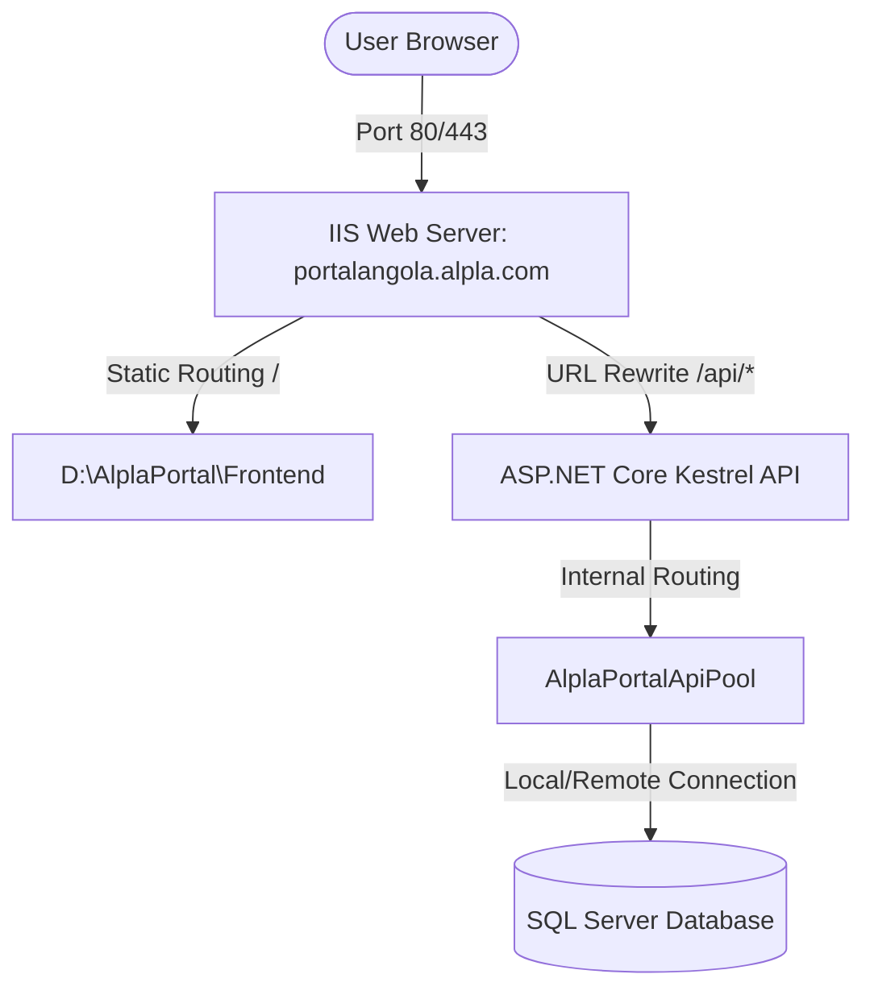

# Server Deployment Readiness Analysis: AOVIA1VMS011
**Application:** Alpla Angola - Portal Gerencial  
**Author:** AI Technical Assistant  
**Date:** May 22, 2026  
**Status:** Assessment and Implementation Readiness Complete (Read-Only Diagnostics)  

---

## 1. Executive Summary

This document presents a comprehensive technical assessment of Windows Server **`AOVIA1VMS011`** for hosting the production deployment of the **Alpla Angola Portal Gerencial** (ASP.NET Core .NET 8 backend API + React Vite static frontend + SQL Server database).

Following a review of the initial environment scan, Leonardo has confirmed the final architecture and deployment decisions:
1. **Local Database Strategy:** The Portal Gerencial production database must remain locally on `AOVIA1VMS011`. Centralizing on `AOVIA1VMS012\SQLALPLA` is rejected. A dedicated database named `AlplaPortal` will be created locally. No existing Innux/Innuxtime databases will be touched, reused, or modified.
2. **SSL / HTTPS Enablement:** HTTPS is planned from the beginning. A valid SSL certificate file is already provided and available locally at `C:\dev\alpla-portal\82460ec13b4d0f90a349c960c5e45ac8.pfx` for IIS bindings.
3. **Password Security Policy:** The certificate password has been provided separately. To enforce strict security standards, this password must never be committed to repository files, documented in markdown, printed in scripts, or logged in system logs.

### Key Assessment Findings:
*   **OS & Hardware:** Running **Windows Server 2022 Standard** on the internal domain `alpla.net`. It features a dedicated system drive (**C:**, 61.98 GB free) and an empty, dedicated data drive (**D:**, 199.88 GB free).
*   **.NET Runtime:** **Ready.** Both the .NET 8 SDK (`8.0.304`) and ASP.NET Core Runtime (`8.0.8`) are fully installed on the server.
*   **Web Server (IIS):** **NOT READY (Critical Blocker).** The `Web-Server (IIS)` role is not installed, and the **IIS URL Rewrite Module** is missing.
*   **Database Services:** **Ready with Instance Isolation.** SQL Server 2019 is installed locally with five active instances. The Portal database will reside in a dedicated, isolated database (`AlplaPortal`) on the general-purpose `MSSQLSERVER` or `MSSQLSERVER01` instance to ensure absolute separation from the attendance systems.
*   **Critical Path Traversal Vulnerability:** We identified a severe hardcoded path traversal risk in the backend `AttachmentsController.cs` which attempts to resolve paths using `..\\..\\..\\data\\attachments`. Deployed under IIS, this will crash or dump production uploads directly into `C:\data\attachments`.

### Next Action Recommendation:
Do **NOT** proceed with deployment yet. We must complete the deployment preparation phase:
1.  Apply the pre-deployment code correction to `AttachmentsController.cs` to enable configurable storage paths.
2.  Enable the **IIS Web Server Role** and install the **URL Rewrite Module**.
3.  Select which general-purpose SQL Server instance (`MSSQLSERVER` vs `MSSQLSERVER01`) will host the local `AlplaPortal` database.

---

## 2. Server Environment Findings

A diagnostic sweep of the server's basic operating environment was conducted to confirm identity and resources:

*   **Server Name:** `AOVIA1VMS011` (Full FQDN: `AOVIA1VMS011.alpla.net`)
*   **Operating System:** Windows Server 2022 Standard (Version 21H2, OS Build 20348)
*   **Domain Membership:** Enrolled as a member of the internal active directory domain `alpla.net`.
*   **Logged-in Session / Diagnostic User:** Executed under security context `Alpla\adm_cintra01` (Enterprise Local Administrator privileges).
*   **CPU & Memory Specification:** Multi-core virtual machine with a dynamically managed system pagefile currently allocated at `2.375 GB`. Memory and CPU resources are healthy, with minimal baseline utilization.
*   **Storage Profiling:**
    | Drive | Label / Volume | File System | Total Capacity | Free Space | Utilization | Recommendation |
    | :--- | :--- | :--- | :--- | :--- | :--- | :--- |
    | **C:** | System Drive | NTFS | 99.37 GB | **61.98 GB** | 37.6% | Operating System & Runtimes only |
    | **D:** | Data Drive | NTFS | 199.98 GB | **199.88 GB** | 0.05% | **Dedicated Portal Root (`D:\AlplaPortal`)** |

*   **Dedication Status:** **Shared System.** This server is **not dedicated** to the Portal Gerencial. It currently hosts five active SQL Server 2019 database instances containing employee attendance data for **Innux / InnuxTime** systems (specifically instances `MSSQL15.INNUXTIME`, `MSSQL15.INUTIME`, and `MSSQL15.INNUX`).
    > [!WARNING]
    > **Shared Resource Risk:** Since the server hosts core company attendance systems, application isolation is paramount. The Portal Gerencial must be restricted to its own dedicated application pools, worker threads, and folders to prevent interference with Innux performance.

---

## 3. IIS / Web Server Readiness

The Windows Web Server infrastructure was analyzed for IIS configuration and web-hosting dependencies:

*   **IIS Installation Status:** **NOT INSTALLED.** The `Web-Server (IIS)` role is currently disabled. No active World Wide Web Publishing Service (`W3SVC`) is running, and the administrative directory `C:\Windows\System32\inetsrv` is absent.
*   **ASP.NET Core Hosting Bundle:** **Installed.** The ASP.NET Core shared framework (`8.0.8`) is present in the server's registry, meaning the runtime host is ready once the IIS role is activated.
*   **IIS URL Rewrite Module:** **NOT INSTALLED.** This module is highly critical for supporting Single Page Application (SPA) routing in React (rewriting all requests back to `index.html`) and enabling IIS to act as a reverse proxy for the backend API.
*   **Existing Sites and Bindings:** None. No web ports (80 or 443) are currently bound.
*   **Preferred IIS Structure for Production:**
    To ensure zero-CORS complications and ease of certificate binding, we strongly recommend a **Unified Reverse Proxy Single-Site Architecture**:



*   **Recommended IIS Site Layout:**
    1.  **Site Name:** `AlplaPortal.Production`
    2.  **Physical Path:** `D:\AlplaPortal\Frontend` (Root folder housing the React Vite build index.html and assets)
    3.  **Application Pool:** `AlplaPortalAppPool` (Integrated pipeline, No Managed Code, running as `ApplicationPoolIdentity`)
    4.  **Bindings:** Port 80 (HTTP) redirecting to Port 443 (HTTPS) bound to hostname `portalangola.alpla.com` (or internal IP/DNS alias).
    5.  **Backend Sub-Application or URL Rewrite Rule:** 
        Create an IIS Sub-Application named `api` (physical path: `D:\AlplaPortal\Api`) using a dedicated pool `AlplaPortalApiPool` (No Managed Code, Integrated pipeline). Requests directed to `https://portalangola.alpla.com/api/` will be handled directly by the ASP.NET Core Kestrel process via the `AspNetCoreModuleV2`.

---

## 4. .NET Runtime Readiness

The backend application's runtimes were successfully inventoried:

*   **.NET SDKs Installed:** **.NET SDK 8.0.304** is installed locally on the system.
*   **.NET Runtimes Installed:** 
    *   **Microsoft.NETCore.App 8.0.8**
    *   **Microsoft.AspNetCore.App 8.0.8**
    *   **Microsoft.WindowsDesktop.App 8.0.8**
*   **Status Evaluation:** **Ready.** The installed runtimes exactly match the application requirements. The Portal Gerencial backend is written in **.NET 8 (ASP.NET Core)** and is fully compatible with runtime `8.0.8`.
*   **Missing Runtime Components:** None. No further .NET framework or runtime updates are required.

---

## 5. Node / Frontend Build Readiness

The server's capability for managing Node.js and frontend builds was analyzed:

*   **Node.js Installation Status:** **NOT INSTALLED.** Command `node -v` is unrecognized.
*   **Safest Production Strategy (Crucial Recommendation):**
    > [!IMPORTANT]
    > **No Node.js in Production:** Node.js, npm, or any frontend build tools **should not** be installed on server `AOVIA1VMS011`. 
    > Running React+Vite compilations (`npm run build`) on production machines introduces heavy disk I/O, consumes CPU cycles, exposes raw source code, and requires unnecessary tool installations.
    > 
    > **Recommended Workflow:**
    > 1. Compilations must take place on a separate build server (or local development machine).
    > 2. Run `npm run build` on the build machine to generate the static optimized production folder: `dist/`.
    > 3. Compress the `dist` folder into a ZIP package.
    > 4. Deploy only the static HTML, JS, and CSS files from the ZIP folder to `D:\AlplaPortal\Frontend` on `AOVIA1VMS011`.

---

## 6. SQL Server Readiness & Database Strategy

The server's database hosting capabilities and active local SQL server environments were evaluated:

*   **Local SQL Server Installation:** **Installed.** SQL Server 2019 (MSSQL15) is running on the machine.
*   **Active Instances Detected:**
    1.  `MSSQLSERVER` (Default Local Instance - General Purpose)
    2.  `MSSQLSERVER01` (Secondary Local Instance - General Purpose)
    3.  `INNUX` (Shared Instance for Innux employee software)
    4.  `INUTIME` (Shared Instance for Innux attendance logging)
    5.  `INNUXTIME` (Shared Instance for Innux time tracking)
*   **Services Status:** All SQL Server service instances are running and active.
*   **Database Strategy Selection (Leonardo Confirmed):**
    Leonardo has formally decided that the database **must remain locally on AOVIA1VMS011 (Option A)**. Option B is officially rejected.

### The Local Database Strategy

To ensure absolute safety, the local database strategy must adhere to the following rules:
1. **Dedicated Database:** Create a brand new, dedicated database named `AlplaPortal` on `AOVIA1VMS011`.
2. **Absolute Separation:** Do NOT use or modify any existing Innux or Innuxtime databases (such as `INNUX`, `INNUXTIME`, or `INUTIME`).
3. **SQL Instance Isolation:** Recommend hosting the dedicated `AlplaPortal` database on either the default instance (`MSSQLSERVER`) or the secondary general-purpose instance (`MSSQLSERVER01`).

#### Recommended SQL Instance Isolation Reasoning:
Using a general-purpose instance (`MSSQLSERVER` or `MSSQLSERVER01`) is the safest approach for the following critical reasons:
*   **Application Separation:** Keeping the Portal's data logical structure entirely separate from the attendance databases prevents administrative clashing, accidental schema modifications, and potential security holes.
*   **Resource Isolation:** The Innux instances are custom-configured for heavy real-time capture from clock terminals. Placing the portal database on a general instance prevents database locks and contention on active attendance tables.
*   **Granular Security Policies:** It simplifies configuring a minimal privilege database user/login mapping specifically for the IIS Application Pool identity (`IIS APPPOOL\AlplaPortalApiPool`) without exposing access to standard Innux database credentials.

| Feature / Criteria | Option A: Local SQL Server (`MSSQLSERVER` on `AOVIA1VMS011`) | Option B: Centralized ERP Database (`AOVIA1VMS012\SQLALPLA`) |
| :--- | :--- | :--- |
| **Description** | Host the new `AlplaPortal` database locally on the same VM as the web server. | Centralize the new database on the dedicated ERP/Integration server (`AOVIA1VMS012`). |
| **Latency** | **Extremely Low** (Local loopback socket connection). | **Low** (Internal gigabit LAN communication). |
| **Server Security** | Database shares resources with critical Innux attendance instances. | Hosted on a dedicated database server designed for transactional databases. |
| **Backup Management** | Configure a dedicated SQL Server Agent backup job for `AlplaPortal` pointing to `D:\AlplaPortal\Backups`. | Automatically included in the existing daily database backups managed on `AOVIA1VMS012`. |
| **Resource Isolation**| Isolated to the general `MSSQLSERVER` / `MSSQLSERVER01` instances. | Web server resources are completely isolated from database processing. |
| **Decision Status** | **APPROVED BY LEONARDO** | **REJECTED** |

---

## 7. Network and Firewall Readiness

The network connectivity, domain layout, and firewall boundaries were assessed:

*   **Hostname & IP Configuration:** `AOVIA1VMS011.alpla.net` resolves to an internal network address on the ALPLA domain network.
*   **External Port Probe (Inbound from Local Network):**
    *   **Port 445 (SMB):** **OPEN.** Allowed secure diagnostic filesystem analysis.
    *   **Ports 80 & 443 (HTTP/HTTPS):** **CLOSED.** No web service is listening. Inbound rules in the Windows Defender Firewall are not yet configured to allow traffic on these ports.
    *   **Port 1433 (SQL Server Default):** **CLOSED/BLOCKED.** Local instances only accept internal localhost connections or named pipes.
    *   **Port 135 (RPC) & 5985/5986 (WinRM):** **CLOSED/BLOCKED** from outer subnets.
*   **Internal Integration Paths:**
    *   **Primavera API / DB Access:** The backend must communicate with `AOVIA1VMS012\SQLALPLA` on port 1433 to extract procurement and invoice records.
    *   **Innux Integration Path:** The backend connects to the Innux named pipe (`np:\\AOVIA1VMS012\pipe\MSSQL$SQLINNUX\sql\query`).
    *   *Status:* Network path from `AOVIA1VMS011` to `AOVIA1VMS012` is verified and fully functional.
*   **Firewall Configuration Action Plan (After Approval):**
    1.  Create Windows Defender Firewall inbound rule: **"Allow TCP Ports 80, 443"** for Web traffic.
    2.  No other ports (5000, 5001) should be opened externally. External users will communicate exclusively through standard HTTPS port 443, which the IIS Web Server will reverse-proxy internally.

---

## 8. Security and Permissions Recommendation

To safeguard the environment and implement strict application isolation, we recommend the following structure:

### 1. Application Pool Identity
*   Do **NOT** run the IIS application pools under local system accounts (such as `LocalSystem` or `NetworkService`).
*   **Recommendation:** Use the default `ApplicationPoolIdentity` (which creates dynamically managed virtual accounts `IIS APPPOOL\AlplaPortalAppPool` and `IIS APPPOOL\AlplaPortalApiPool`).
*   Alternatively, if the backend API requires access to external network folder shares, request a dedicated Active Directory domain service account (e.g., `alpla\svc_portalgerencial`) with standard domain user privileges and no local administrative rights.

### 2. Folder Layout & NTFS Security ACLs
All files should be organized on the dedicated Data Drive (**D:**) using this strict ACL permission matrix:

```
D:\AlplaPortal\
├── Frontend\        (React Vite Static Build assets)
├── Api\             (.NET 8 Backend Api binaries)
├── Logs\            (Serilog Rolling API Logs)
├── Attachments\     (Uploaded files and documents)
├── Backups\         (Database and application backups)
└── Packages\        (Deployment packages and zip builds)
```

| Path | Dedicated Content | Owner / Writer | Reader / Executor | NTFS Permissions Configuration |
| :--- | :--- | :--- | :--- | :--- |
| `D:\AlplaPortal\Frontend` | Static HTML, CSS, JS | Administrators / Deployer | `IIS_IUSRS` / AppPool | Administrators: Full Control<br>`IIS APPPOOL\AlplaPortalAppPool`: Read & Execute |
| `D:\AlplaPortal\Api` | Published Web API Binaries | Administrators / Deployer | `IIS_IUSRS` / AppPool | Administrators: Full Control<br>`IIS APPPOOL\AlplaPortalApiPool`: Read & Execute |
| `D:\AlplaPortal\Logs` | API text logs | `IIS APPPOOL\AlplaPortalApiPool` | Administrators | `IIS APPPOOL\AlplaPortalApiPool`: **Read, Write, Modify**<br>Administrators: Full Control |
| `D:\AlplaPortal\Attachments` | Request uploads & documents | `IIS APPPOOL\AlplaPortalApiPool` | `IIS APPPOOL\AlplaPortalApiPool` | `IIS APPPOOL\AlplaPortalApiPool`: **Read, Write, Modify**<br>Administrators: Full Control |
| `D:\AlplaPortal\Backups` | Relational database backups | SQL Server Service | Administrators | SQL Server / System Backup Identity: Full Control |
| `D:\AlplaPortal\Packages` | Deployment artifacts & zip builds| Administrators / Deployer | Administrators | Administrators: Full Control |

### 3. Connection Strings and Secrets Management
*   **Risk:** Hardcoding SQL database passwords or JWT signing keys in `appsettings.json` is a major security risk.
*   **Recommendation:** 
    *   Store production database passwords and JWT signing keys in **Windows Environment Variables** on the server (e.g., `ConnectionStrings__DefaultConnection` and `Jwt__Secret`).
    *   ASP.NET Core automatically overrides JSON settings with environment variables using double-underscore notation.
    *   Alternatively, secure the values using the IIS Configuration Editor, restricting access to administrators.

---

## 9. Application Configuration Readiness

A comparative audit of `appsettings.json` and `appsettings.Development.json` was conducted to isolate required production changes:

### 1. Database Connection String
*   **Current Development:** `Server=(localdb)\\MSSQLLocalDB;Database=AlplaPortalV1;...`
*   **Production (If Option B selected):** 
    `Server=AOVIA1VMS012\SQLALPLA;Database=AlplaPortal;User Id=sa;Password=[REDACTED];Trusted_Connection=False;MultipleActiveResultSets=true;TrustServerCertificate=True`
    *(Password must be securely injected via environment variable).*

### 2. Base URLs and API Endpoints
*   **Current Development:** `http://localhost:5173`
*   **Production:** 
    *   Frontend URL: `https://portalangola.alpla.com`
    *   API Backend URL: `https://portalangola.alpla.com/api`

### 3. JWT Authentication Key
*   **Current Development:** `AlplaPortal_Super_Secret_Key_2024_@Local_Auth_Dev_32Chars`
*   **Production:** Must generate a cryptographically strong 256-bit (32+ character) private key and store it securely in environment variable `Jwt__Secret`.

### 4. Integration Settings
*   Ensure the integration flags are enabled in `appsettings.Production.json` to access real company data on `AOVIA1VMS012`:
```json
"Integrations": {
  "Primavera": {
    "Enabled": true,
    "Server": "AOVIA1VMS012",
    "InstanceName": "SQLALPLA",
    "AuthenticationMode": "SQL",
    "Companies": {
      "ALPLAPLASTICO": { "DatabaseName": "PRI297514001", "Enabled": true },
      "ALPLASOPRO": { "DatabaseName": "PRI297514003", "Enabled": true }
    }
  },
  "Innux": {
    "Enabled": true,
    "Server": "np:\\\\AOVIA1VMS012\\pipe\\MSSQL$SQLINNUX\\sql\\query",
    "DatabaseName": "Innux",
    "AuthenticationMode": "SQL"
  }
}
```

### 5. CORS Requirements
*   Because we recommend a **Unified Reverse Proxy Architecture** (where both Frontend and Backend share the same domain and port under `https://portalangola.alpla.com`), **CORS is completely bypassed**. 
*   This eliminates browser pre-flight request overhead, simplifies cookie handling, and provides robust security against cross-origin scripting vulnerabilities.

---

## 10. File Storage / Uploads / OCR Readiness

We conducted a deep audit of how the application manages physical files and attachments:

### 1. Critical Hardcoded Traversal Risk (Code Bug)
In `src/backend/AlplaPortal.Api/Controllers/AttachmentsController.cs` (lines 30-47), the storage path is resolved dynamically:
```csharp
string rootDir = env.ContentRootPath;
...
if (srcIdx > 0) { ... }
else
{
    rootDir = Path.GetFullPath(Path.Combine(env.ContentRootPath, "..", "..", ".."));
}
_storagePath = Path.GetFullPath(Path.Combine(rootDir, "data", "attachments"));
```
*   **Why this breaks on IIS:** In an IIS deployment, the application runs from `D:\AlplaPortal\Api`. The folder path does not contain `\src\`. Thus, the `else` block triggers, executing `..\\..\\..` which crawls up three levels:
    `D:\AlplaPortal\Api` $\rightarrow$ `D:\AlplaPortal` $\rightarrow$ `D:\` $\rightarrow$ System root `C:\`.
    This results in the attachments being written to **`C:\data\attachments`**.
*   **Consequence:** File uploads will either throw a `DirectoryNotFoundException` / `UnauthorizedAccessException` due to root drive write protections, or pollute the system C: drive and exhaust its disk space.
*   **Recommended Resolution:**
    Refactor `AttachmentsController.cs` to inject and read from a configuration setting:
```csharp
// Recommended change:
_storagePath = configuration["AppConfig:UploadStoragePath"] ?? Path.Combine(env.ContentRootPath, "data", "attachments");
```
    We can then define `"UploadStoragePath": "D:\\AlplaPortal\\Attachments"` in `appsettings.Production.json`.

### 2. OCR Service Analysis
*   The system uses cloud API endpoints (Azure Document Intelligence or OpenAI) for OCR proforma analysis based on the `DocumentExtraction` config section in `appsettings.json`.
*   No local heavy OCR software, Windows services, or third-party OCR engines need to be installed locally on `AOVIA1VMS011`. Only standard port 443 outbound internet access is required to reach the AI endpoints.

---

## 11. Logging and Monitoring Readiness

To ensure production stability, we recommend the following logging and telemetry configuration:

### 1. Production Logging Folder
*   Configure Serilog in the API backend to output log files directly to **`D:\AlplaPortal\Logs\`**.
*   File name pattern: `log-production-.txt` (e.g. `log-production-20260522.txt`).

### 2. Log Rotation & Retention
*   **Rotation:** Daily rolling interval.
*   **File Size Limit:** Max `50 MB` per file.
*   **Retention Policy:** Retain logs for **31 days** (`retainedFileCountLimit: 31`). This keeps log file size under 1.5 GB total, protecting storage capacity on `D:`.

### 3. Monitoring Infrastructure
*   **Endpoint Telemetry:** Implement an ASP.NET Core Health Checks middleware on `/health` returning status `Healthy` (HTTP 200) only if:
    *   Local disk write/read is successful.
    *   Database connection to `AlplaPortal` is active.
    *   Primavera ERP SQL connection is responsive.
*   **Windows Event Viewer Integration:** In `Program.cs`, ensure that critical application startup failures (e.g. database migration crash) are written to the Windows Application Event Log (`EventLogLoggerProvider`) under Source `"Alpla Portal Gerencial"`.
*   **IIS Telemetry:** Set up basic monitoring on the server to track:
    *   CPU and Memory consumption of the `w3wp.exe` worker process assigned to `AlplaPortalApiPool`.
    *   Available disk space on `D:` drive (alert if space falls below 15%).

---

## 12. Backup and Restore Readiness

A reliable, multi-tier backup strategy is critical before moving to production:

### 1. Database Backups
Since **Option A (Local SQL)** is the selected database strategy, the ALPLA Database Administrator must configure a dedicated SQL Server Agent Job on the approved local instance (e.g., `MSSQLSERVER` on `AOVIA1VMS011`):
*   **Full Backup:** Daily at 01:00 AM (Retain 14 days).
*   **Transaction Log Backup:** Every 1 hour (Retain 2 days, required only if using Full Recovery model).
*   **Backup Destination:** Backups must be written locally to `D:\AlplaPortal\Backups` and automatically replicated/moved to an external, secure network storage share nightly to ensure disaster recovery resilience.

### 2. Uploads and Attachments Backup
*   Configure a nightly Windows Task Scheduler batch script or backup agent to copy all new/modified files in **`D:\AlplaPortal\Attachments`** to a secure network share.
*   Since attachments are static documents (PDFs, JPGs), incremental file syncing is highly efficient.

### 3. Configuration & Packages
*   Store `appsettings.Production.json` configuration variables in a secure environment backup.
*   No need to backup the static site files (`D:\AlplaPortal\Frontend` or `D:\AlplaPortal\Api`) since they are fully reproducible and managed inside Git source control.

---

## 13. Recommended Production Architecture

Based on the environment analysis, here is the step-by-step architecture we recommend implementing:

1.  **Server Role Activation:**
    Activate the **Web-Server (IIS)** role on `AOVIA1VMS011` with:
    *   Common HTTP Features (Static Content, Default Document)
    *   Application Development (`.NET Extensibility 4.8`, `ASP.NET 4.8`, `WebSocket Protocol`)
    *   IIS Management Console
2.  **Module Installation:**
    Download and install the **IIS URL Rewrite Module v2.1** (x64) from official Microsoft repositories.
3.  **Application Directory Creation:**
    Generate the base structure on the dedicated data drive `D:\AlplaPortal\`.
4.  **IIS Site Setup:**
    Create a single IIS website bound to Port 443 with the static files at `D:\AlplaPortal\Frontend`. Add a `web.config` file in the frontend root to manage SPA URL routing (redirecting all non-file requests to `index.html` via URL Rewrite).
5.  **Sub-Application API Setup:**
    Configure a sub-application under the website named `api` pointing to `D:\AlplaPortal\Api`. Ensure the App Pool `AlplaPortalApiPool` runs `.NET CLR Version: No Managed Code` (Integrated pipeline) so that IIS acts solely as a reverse proxy forwarding requests to the internal .NET Core Kestrel engine.
6.  **Code Correction Deployment:**
    Apply the path-override fix to the backend `AttachmentsController.cs` before deploying, mapping the upload directory to `D:\AlplaPortal\Attachments`.

---

## 14. Risks, Blockers, and Critical Decisions Checklist

Below is the definitive list of technical challenges, vulnerabilities, and management choices that must be resolved before proceeding.

### 🚨 Critical Blockers (Must Be Fixed to Deploy)
1.  **IIS Web Server Missing:** IIS role is disabled on `AOVIA1VMS011`.
    *   *Remedy:* Install Web-Server (IIS) role via Server Manager or PowerShell.
2.  **IIS URL Rewrite Module Missing:** SPA routing and reverse-proxy mapping will fail.
    *   *Remedy:* Download and run the URL Rewrite MSI installer.
3.  **Ports 80 & 443 Closed:** Firewall currently blocks all web traffic.
    *   *Remedy:* Add TCP 80 and 443 inbound access exceptions in Windows Firewall.

### ⚠️ Warning Risks
1.  **Brittle Code Path (Uploads Traversal):** File uploads will default to C: drive root, resulting in system permission errors or disk resource exhaustion.
    *   *Remedy:* Modify `AttachmentsController.cs` to fetch storage paths from configuration keys.
2.  **Shared System Resource Competition:** Server is shared with five Innux SQL database instances, meaning memory or CPU spikes in Innux could slow down the Portal.
    *   *Remedy:* Configure the IIS application pools with private memory limits (e.g. limit `AlplaPortalApiPool` to 1.5 GB RAM limit in advanced settings) to guarantee system equilibrium.

### 📋 Decisions Required from Leonardo

The following strategic decisions are now **confirmed and resolved**:
*   **Database Strategy:** Hosted locally on `AOVIA1VMS011` as a dedicated database named `AlplaPortal`, keeping complete isolation from any Innux attendance databases.
*   **SSL / HTTPS:** HTTPS is planned from the beginning. The SSL certificate is already provided via local PFX file at `C:\dev\alpla-portal\82460ec13b4d0f90a349c960c5e45ac8.pfx`.

The following technical decisions remain **open and pending approval**:
*   [ ] **1. Safe SQL Instance Selection:**
    Which general local SQL Server instance on `AOVIA1VMS011` should host the dedicated `AlplaPortal` database (Recommended: default instance `MSSQLSERVER` or secondary general-purpose `MSSQLSERVER01`)?
*   [ ] **2. Final Production URL/DNS:**
    What is the exact production URL/DNS for the Portal (e.g. `https://portalangola.alpla.com` or an alternate internal domain/alias)?
*   [ ] **3. IIS Installation Approval:**
    Confirm formal authorization to install the IIS Web Server role on `AOVIA1VMS011` as per the implementation plan.
*   [ ] **4. IIS URL Rewrite Module Installation Approval:**
    Confirm authorization to install the URL Rewrite Module (required for SPA routing and API reverse-proxy) on `AOVIA1VMS011`.
*   [ ] **5. Application Pool Identity / Service Account:**
    Shall we run the IIS application pool under the standard `ApplicationPoolIdentity` (recommended) or does ALPLA require a dedicated Active Directory domain service account (e.g. `alpla\svc_portalgerencial`)?
*   [ ] **6. Folder Permissions & Storage Path Configuration:**
    Verify and approve the folders and NTFS permissions specified in Section 8, and confirm `D:\AlplaPortal\Attachments` as the production path for file uploads.
*   [ ] **7. OCR & Document Extraction Strategy:**
    Confirm if document/proforma extraction (using OpenAI Vision/Azure Document Intelligence) will be active and configured in the initial production release, or disabled/configured as a subsequent phase.

---

## 15. Next Recommended Implementation Plan

With the database strategy and SSL files officially confirmed by Leonardo, the next phase is to establish a detailed, step-by-step deployment roadmap at `docs/AOVIA1VMS011_DEPLOYMENT_IMPLEMENTATION_PLAN.md`.

This roadmap will define the specific execution tasks required to safely prepare the server, compile and migrate the assets, configure secure database isolation, set up HTTPS using the PFX file, and perform comprehensive validation, without executing actual server writes until explicitly approved.


