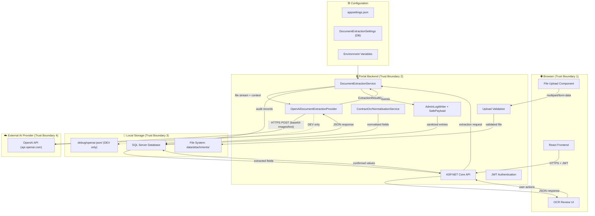
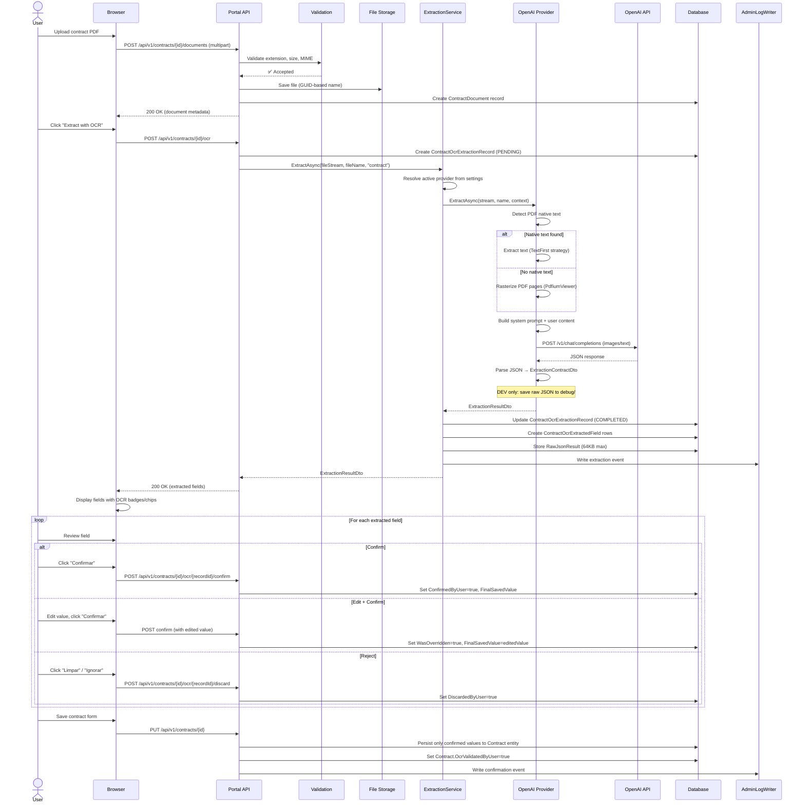
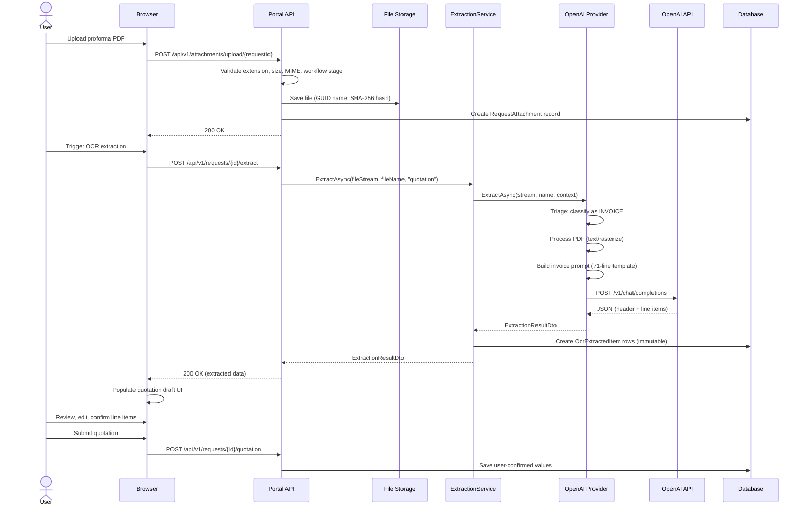
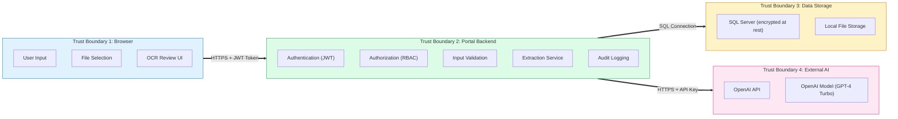

# AI Data Flow Map — Portal Gerencial OCR Feature

> **Version**: 1.0 | **Date**: 2026-06-18 | **Status**: Technical Documentation

---

## 1. High-Level Architecture

---

## 2. Data Flow Sequence — Contract OCR

---

## 3. Data Flow Sequence — Invoice/Proforma OCR

---

## 4. Trust Boundary Diagram

### Data Crossing Trust Boundaries

| Boundary Crossing | Data Transferred | Protection | Risk |
|:---|:---|:---|:---|
| TB1 → TB2 (Browser → Backend) | JWT token, uploaded file, user actions | HTTPS, JWT validation, input validation | File contains untrusted content |
| TB2 → TB3 (Backend → Storage) | Extraction records, file bytes, audit entries | SQL connection string, file system ACLs | Data at rest protection |
| TB2 → TB4 (Backend → OpenAI) | Base64 images, extracted text, system prompt | HTTPS, API key in Authorization header | **Data leaves corporate boundary** |
| TB4 → TB2 (OpenAI → Backend) | JSON response with extracted fields | HTTPS, response validation | Untrusted AI output |

---

## 5. Data Sources and Sinks

| # | Data Element | Source | Processing | Sink | Sensitivity |
|:---|:---|:---|:---|:---|:---|
| 1 | Uploaded document (PDF/image) | User upload via browser | Validated, stored, sent to AI | File system + AI provider | Business documents — varies |
| 2 | Rasterized page images | PDF → PdfiumViewer | Converted to base64 | AI provider (in-memory only) | Same as source document |
| 3 | Extracted text (native PDF) | PDF text layer | Sent in prompt | AI provider (in-memory only) | Same as source document |
| 4 | System prompt | Hardcoded in provider | Prepended to user content | AI provider | Non-sensitive |
| 5 | AI JSON response | AI provider | Parsed, normalised | Database (RawJsonResult, fields) | Contains extracted document data |
| 6 | Normalised field values | AI response + normalisation | Type-converted, validated | Database (ContractOcrExtractedField) | Business data |
| 7 | User confirmation actions | User clicks in browser | Recorded with userId/timestamp | Database (confirmation audit fields) | Non-sensitive |
| 8 | Final saved values | User-confirmed data | Persisted to business entity | Database (Contract, Request) | Business data |
| 9 | Audit log entries | Service events | Sanitized via SafePayload | Database (AdminLogEntry) | Operational data |
| 10 | Debug JSON files | AI response (DEV only) | Raw JSON to disk | `debug/openai-json/` | ⚠️ Contains extracted data |

---

## 6. Data That MUST NOT Be Sent to AI Provider

> [!CAUTION]
> The following data categories must never be included in documents processed by the AI provider, unless explicitly approved by Legal, Information Security, and the AI CoE:

| # | Data Category | Reason | Current Control |
|:---|:---|:---|:---|
| 1 | Passwords, tokens, API keys | Credential exposure | Not expected in business documents |
| 2 | Employee payroll data | Personal data / GDPR | OCR not used in HR module |
| 3 | Employee health/medical data | Special category data / GDPR | OCR not used in HR module |
| 4 | Secret/confidential legal strategy | Legal privilege | 🟣 Requires document classification policy |
| 5 | Security-relevant source code | Intellectual property | Not expected in business documents |
| 6 | Customer personal data without consent | GDPR / data protection | 🟣 Requires assessment per document type |
| 7 | Supplier confidential pricing (non-disclosure) | Contractual obligation | 🟣 Depends on NDA terms |
| 8 | Government-classified documents | Regulatory | Not applicable currently |
| 9 | Biometric or identification data | Special category data | Not expected in business documents |
| 10 | Financial account numbers / IBAN | Financial data exposure | May appear in invoices — assess risk |

### Recommended Mitigations

1. **Document classification policy**: Define which document types are approved for AI processing
2. **Pre-processing PII detection**: Consider scanning for sensitive patterns before AI submission
3. **User training**: Inform users about document types that should NOT be processed via OCR
4. **Admin controls**: Allow administrators to restrict OCR to specific document type codes

---

## Evidence Package References

| Area | Evidence Files |
|:---|:---|
| Debug logging guard (G1) | `evidence/code-references/G1-debug-logging-guard.md`, `evidence/configuration/debug-raw-payload-logging-redacted.md` |
| Policy controls (G2) | `evidence/code-references/G2-ai-ocr-policy-controls.md`, `evidence/configuration/ai-ocr-policy-redacted.md` |
| Provider endpoint (G6) | `evidence/code-references/G6-provider-switch-readiness.md`, `evidence/configuration/provider-endpoint-redacted.md` |
| System Logs (G8) | `evidence/code-references/G8-system-logs-integration.md` |
| API samples | `evidence/api/extraction-response-sample-redacted.json`, `evidence/api/upload-rejection-response.json` |

> 👉 Full evidence index: [`evidence/EVIDENCE_INDEX.md`](evidence/EVIDENCE_INDEX.md)
