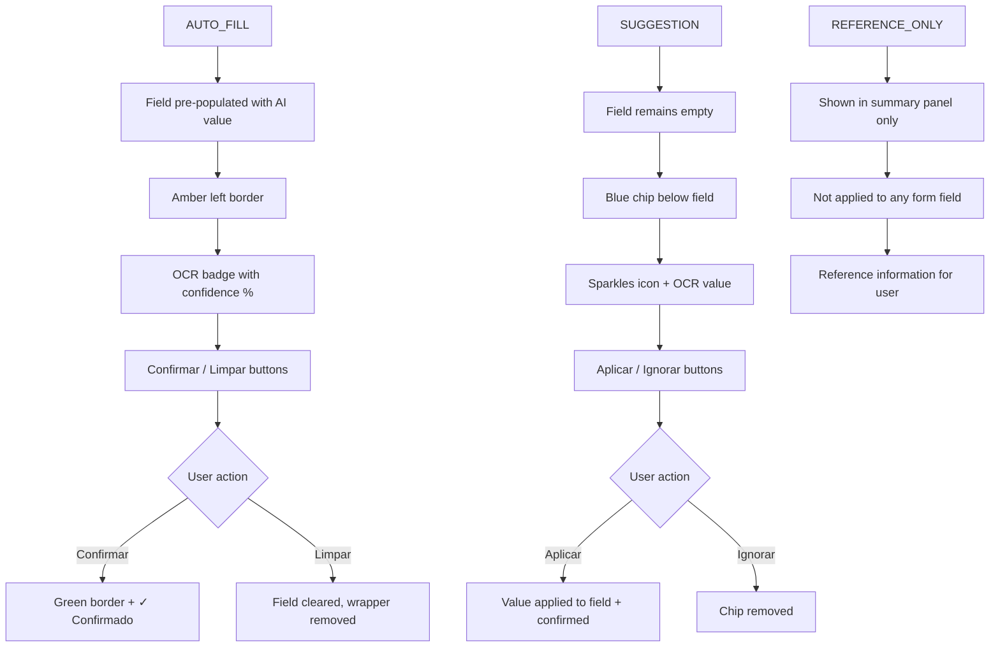

# AI Human Oversight and Transparency Assessment — Portal Gerencial

> **Version**: 1.0 | **Date**: 2026-06-18 | **Status**: Technical Evidence Assessment

---

## 1. Frontend Components Inventory

### 1.1 Contract OCR Components

| Component | File | Purpose |
|:---|:---|:---|
| OcrFieldWrapper | [OcrFieldWrapper.tsx](file:///c:/dev/alpla-portal/src/frontend/src/pages/Contracts/ocr/OcrFieldWrapper.tsx) | Wraps form fields with OCR visual treatment |
| OcrSuggestionChip | [OcrSuggestionChip.tsx](file:///c:/dev/alpla-portal/src/frontend/src/pages/Contracts/ocr/OcrSuggestionChip.tsx) | Blue chip with suggested value, Aplicar/Ignorar |
| ContractOcrUploadZone | [ContractOcrUploadZone.tsx](file:///c:/dev/alpla-portal/src/frontend/src/pages/Contracts/ocr/ContractOcrUploadZone.tsx) | Upload trigger for contract OCR |
| ContractOcrSummaryPanel | [ContractOcrSummaryPanel.tsx](file:///c:/dev/alpla-portal/src/frontend/src/pages/Contracts/ocr/ContractOcrSummaryPanel.tsx) | Overview of all extracted fields |
| ContractOcrCautionBanner | [ContractOcrCautionBanner.tsx](file:///c:/dev/alpla-portal/src/frontend/src/pages/Contracts/ocr/ContractOcrCautionBanner.tsx) | Warning banners (3 variants) |
| OcrTerminationReferencePanel | [OcrTerminationReferencePanel.tsx](file:///c:/dev/alpla-portal/src/frontend/src/pages/Contracts/ocr/OcrTerminationReferencePanel.tsx) | Reference-only termination data display |
| useContractOcr | [useContractOcr.ts](file:///c:/dev/alpla-portal/src/frontend/src/hooks/useContractOcr.ts) | State management hook |

### 1.2 Invoice/Request OCR Components

| Component | File | Purpose |
|:---|:---|:---|
| useOcrProcessor | [useOcrProcessor.ts](file:///c:/dev/alpla-portal/src/frontend/src/hooks/useOcrProcessor.ts) | Hook for invoice OCR triggering |
| QuotationEntry | [QuotationEntry.tsx](file:///c:/dev/alpla-portal/src/frontend/src/components/QuotationEntry.tsx) | Quotation form with OCR prefill |
| BuyerItemsList | [BuyerItemsList.tsx](file:///c:/dev/alpla-portal/src/frontend/src/pages/Buyer/BuyerItemsList.tsx) | Buyer view with extraction results |

### 1.3 Admin Components

| Component | File | Purpose |
|:---|:---|:---|
| DocumentExtractionSettings | [DocumentExtractionSettings.tsx](file:///c:/dev/alpla-portal/src/frontend/src/pages/Settings/DocumentExtractionSettings.tsx) | Provider config, model selection, testing |
| IntegrationHealth | [IntegrationHealth.tsx](file:///c:/dev/alpla-portal/src/frontend/src/pages/Admin/IntegrationHealth.tsx) | Integration status dashboard |

---

## 2. Backend Audit Fields (Human Oversight)

### Contract OCR — Per-Field Tracking

Source: [ContractOcrExtractedField.cs](file:///c:/dev/alpla-portal/src/backend/AlplaPortal.Domain/Entities/ContractOcrExtractedField.cs)

| Field | Type | Purpose | Compliance Relevance |
|:---|:---|:---|:---|
| `ConfirmedByUser` | bool | User explicitly accepted the value | ✅ Human oversight proof |
| `ConfirmedAtUtc` | DateTime? | Timestamp of confirmation | ✅ Temporal audit |
| `ConfirmedByUserId` | Guid? | Who confirmed | ✅ Accountability |
| `WasOverridden` | bool | User changed the AI value before confirming | ✅ Edit tracking |
| `FinalSavedValue` | string? | The value ultimately accepted | ✅ Decision trail |
| `DiscardedByUser` | bool | User explicitly rejected the suggestion | ✅ Rejection tracking |

### Contract Entity — OCR Status Tracking

Source: [Contract.cs](file:///c:/dev/alpla-portal/src/backend/AlplaPortal.Domain/Entities/Contract.cs)

| Field | Purpose |
|:---|:---|
| `OcrExtractionBatchId` | Links to latest extraction record |
| `OcrValidatedByUser` | True when all fields confirmed |
| `OcrStatus` | PENDING / PROCESSING / COMPLETED / FAILED |

---

## 3. Transparency Evidence — Source Code Analysis

### 3.1 AI Origin Indicators

| Indicator | Component | Evidence (Source Code) | Visible to User |
|:---|:---|:---|:---|
| **"OCR" badge** with Cpu icon | `OcrFieldWrapper.tsx` line 105–107 | `<Cpu size={9} /> OCR {pct}%` | ✅ Yes — top-right corner of AUTO_FILL fields |
| **Confidence percentage** | `OcrFieldWrapper.tsx` line 106 | `OCR {pct != null ? \`${pct}%\` : ''}` | ✅ Yes — shown in badge |
| **Sparkles icon** on suggestions | `OcrSuggestionChip.tsx` line 78 | `<Sparkles size={13} color={CHIP_BLUE.text} />` | ✅ Yes — left of suggestion chip |
| **"OCR" prefix** on chip | `OcrSuggestionChip.tsx` line 86 | `OCR{pct != null ? \` (${pct}%)\` : ''}:` | ✅ Yes — prefixes suggested value |
| **Amber left border** | `OcrFieldWrapper.tsx` lines 112–124 | `borderLeft: \`3px solid ${colours.border}\`` | ✅ Yes — visual differentiation for AI-filled fields |
| **Green border after confirm** | `OcrFieldWrapper.tsx` line 79 | `const colours = isConfirmed ? OCR_CONFIRMED : OCR_AMBER;` | ✅ Yes — changes from amber to green |
| **"Confirmado pelo utilizador"** text | `OcrFieldWrapper.tsx` line 226 | `<CheckCircle /> Confirmado pelo utilizador` | ✅ Yes — shown after confirmation |
| **Raw AI value shown** | `OcrFieldWrapper.tsx` lines 191–203 | `OCR: "{field.rawValue}"` in italics | ✅ Yes — original AI output shown for reference |

### 3.2 Caution Banners

Source: [ContractOcrCautionBanner.tsx](file:///c:/dev/alpla-portal/src/frontend/src/pages/Contracts/ocr/ContractOcrCautionBanner.tsx)

| Variant | Title (Portuguese) | Body Text | Trigger |
|:---|:---|:---|:---|
| `unconfirmed_at_submit` | "Campos OCR não confirmados" | "Os valores extraídos pelo OCR nos campos destacados não foram confirmados e serão excluídos ao guardar..." | User attempts to submit with unconfirmed AI fields |
| `conflicts_detected` | "Conflitos detectados na extracção OCR" | "O OCR detectou valores potencialmente conflituantes no documento. Reveja cada campo cuidadosamente..." | Backend flags `ConflictsDetected = true` |
| `partial_extraction` | "Extracção parcial" | "O OCR não conseguiu extrair todos os campos. Preencha manualmente os campos em falta." | Backend flags `IsPartial = true` |

### 3.3 User Action Buttons

| Action | Button Text | Component | Effect |
|:---|:---|:---|:---|
| **Confirm AI value** | "Confirmar" | `OcrFieldWrapper.tsx` line 164 | Sets `ConfirmedByUser = true` |
| **Clear/Reject AI value** | "Limpar" | `OcrFieldWrapper.tsx` line 188 | Sets `DiscardedByUser = true` |
| **Apply suggestion** | "Aplicar" | `OcrSuggestionChip.tsx` line 131 | Applies suggested value to field |
| **Use as search** | "Usar como pesquisa" | `OcrSuggestionChip.tsx` line 131 | Pre-fills search box (supplier) |
| **Ignore suggestion** | "Ignorar" | `OcrSuggestionChip.tsx` line 156 | Hides suggestion chip |
| **Undo confirmation** | "Desfazer" | `OcrFieldWrapper.tsx` line 244 | Reverts confirmed state |

---

## 4. UX Evidence Checklist

| # | Requirement | Status | Evidence | Verification Method |
|:---|:---|:---|:---|:---|
| HO1 | AI notice visible to user | ✅ Implemented | Cpu icon + "OCR" label on AUTO_FILL fields; Sparkles icon + "OCR" prefix on SUGGESTION chips | Screenshot required |
| HO2 | AI-suggested fields visually differentiated | ✅ Implemented | Amber left border (AUTO_FILL), blue chip (SUGGESTION) | Screenshot required |
| HO3 | Confidence score displayed | ✅ Implemented | `{pct}%` shown in badge and chip | Screenshot required |
| HO4 | User review required before persistence | ✅ Implemented | `ConfirmedByUser` must be true; unconfirmed fields excluded on save | Code review confirmed |
| HO5 | User can edit AI-suggested value | ✅ Implemented | Fields are editable inputs; `WasOverridden` tracks changes | Code + screenshot required |
| HO6 | User can reject/discard AI suggestion | ✅ Implemented | "Limpar"/"Ignorar" buttons; `DiscardedByUser` field | Code + screenshot required |
| HO7 | User can proceed fully manually | ✅ Implemented | OCR is optional; all fields can be typed manually | Functional test required |
| HO8 | Confirmation action logged | ✅ Implemented | `ConfirmedByUserId`, `ConfirmedAtUtc` in `ContractOcrExtractedField` | Database evidence required |
| HO9 | Override action logged | ✅ Implemented | `WasOverridden`, `FinalSavedValue` fields | Database evidence required |
| HO10 | Rejection action logged | ✅ Implemented | `DiscardedByUser` field | Database evidence required |
| HO11 | Warning for unconfirmed fields at submit | ✅ Implemented | `ContractOcrCautionBanner` variant `unconfirmed_at_submit` | Screenshot required |
| HO12 | Warning for extraction conflicts | ✅ Implemented | `ContractOcrCautionBanner` variant `conflicts_detected` | Screenshot required |
| HO13 | Warning for partial extraction | ✅ Implemented | `ContractOcrCautionBanner` variant `partial_extraction` | Screenshot required |
| HO14 | Original AI value shown for reference | ✅ Implemented | Italic text `OCR: "{field.rawValue}"` below AUTO_FILL actions | Screenshot required |
| HO15 | Undo confirmation possible | ✅ Implemented | "Desfazer" button on confirmed fields | Screenshot required |
| HO16 | Summary panel for all extracted fields | ✅ Implemented | `ContractOcrSummaryPanel` showing field status overview | Screenshot required |

---

## 5. Display Hint System

The `DisplayHint` field on `ContractOcrExtractedField` controls how each extracted value is presented:

---

## 6. Items Requiring Manual Verification

The following items cannot be fully verified from source code alone and require screenshot or functional testing evidence:

| # | Item | Verification Method | Screenshot ID |
|:---|:---|:---|:---|
| V1 | OCR badge is visible on AUTO_FILL fields | Take screenshot of contract form with OCR data | SCR-07 |
| V2 | Suggestion chip renders correctly | Take screenshot of SUGGESTION chip on empty field | SCR-07 |
| V3 | Amber/green border transitions work | Screenshots of before/after confirmation | SCR-08, SCR-10 |
| V4 | Caution banners display correctly | Trigger each variant and capture | SCR-06 |
| V5 | Manual entry works without OCR | Create contract without uploading document | Functional test |
| V6 | Unconfirmed values excluded on save | Submit with unconfirmed fields; verify DB | DB query evidence |
| V7 | Invoice OCR flow shows suggestions | Upload proforma and trigger OCR | SCR-12 |
| V8 | Admin can disable OCR feature | Toggle IsEnabled in settings | SCR-18 |

> [!NOTE]
> See `evidence/screenshots/SCREENSHOT_CAPTURE_GUIDE.md` for detailed capture instructions for each screenshot.

---

## Evidence Package References

| Area | Evidence Files |
|:---|:---|
| Human confirmation policy | `evidence/configuration/ai-ocr-policy-redacted.md` |
| Field review audit trail | `evidence/sql/ocr_field_review_evidence.sql` |
| Screenshot guide | `evidence/screenshots/SCREENSHOT_CAPTURE_GUIDE.md` |
| Screenshot placeholders | `evidence/screenshots/SCR-28-debug-logging-disabled.md` through `SCR-32-ocr-log-detail-safe-payload.md` |

> 👉 Full evidence index: [`evidence/EVIDENCE_INDEX.md`](evidence/EVIDENCE_INDEX.md)

