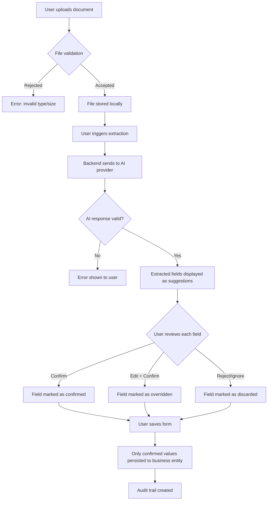
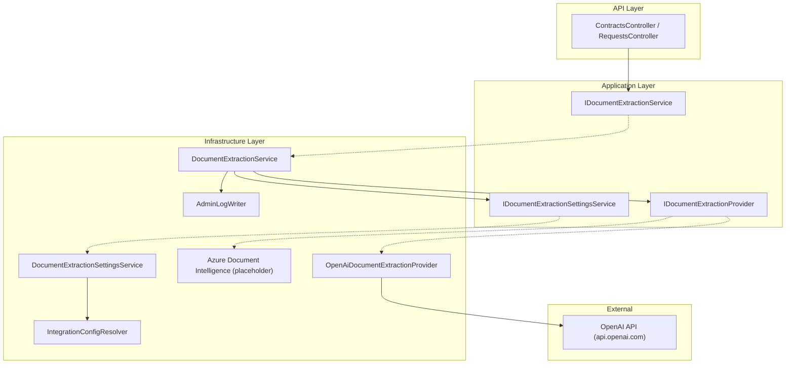
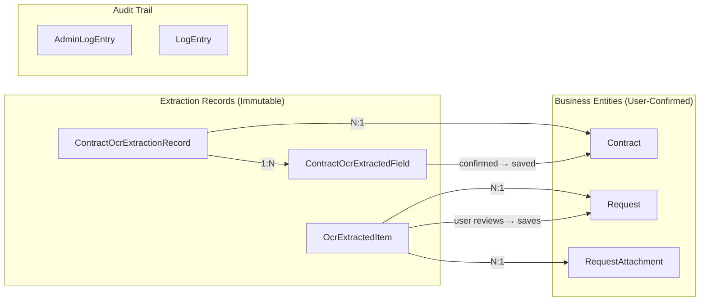

# AI OCR Feature Overview — Portal Gerencial

> **Version**: 1.0 | **Date**: 2026-06-18 | **Status**: Technical Documentation

---

## 1. Business Purpose

The AI-assisted OCR feature enables users of the Portal Gerencial to upload scanned documents (invoices, proformas, contracts) and have structured data automatically extracted using AI (currently OpenAI GPT-4 Turbo with Vision). This reduces manual data entry, minimizes transcription errors, and accelerates procurement and contract management workflows.

**Key Principle**: All AI outputs are presented as **suggestions only**. Human confirmation is mandatory before any extracted data is persisted to business entities.

---

## 2. Modules Using OCR

### 2.1 Request / Invoice / Proforma Flow

**Use Case**: A requester or buyer uploads a proforma invoice during the quotation phase of a purchase request. The system extracts supplier information, line items (description, quantity, unit, unit price, discounts, taxes), and header data (document number, totals).

**Entities involved**:
- [OcrExtractedItem.cs](file:///c:/dev/alpla-portal/src/backend/AlplaPortal.Domain/Entities/OcrExtractedItem.cs) — Immutable snapshot of extracted line items
- [RequestAttachment.cs](file:///c:/dev/alpla-portal/src/backend/AlplaPortal.Domain/Entities/RequestAttachment.cs) — Uploaded document metadata

**Frontend components**:
- [useOcrProcessor.ts](file:///c:/dev/alpla-portal/src/frontend/src/hooks/useOcrProcessor.ts) — Hook for triggering extraction
- [QuotationEntry.tsx](file:///c:/dev/alpla-portal/src/frontend/src/components/QuotationEntry.tsx) — Quotation form with OCR prefill
- [BuyerItemsList.tsx](file:///c:/dev/alpla-portal/src/frontend/src/pages/Buyer/BuyerItemsList.tsx) — Buyer view with extraction results

### 2.2 Contract OCR Flow

**Use Case**: A contract manager uploads a contract document (PDF) during contract creation. The system extracts metadata including dates, counterparty, financial terms, governing law, and termination clauses.

**Entities involved**:
- [ContractOcrExtractionRecord.cs](file:///c:/dev/alpla-portal/src/backend/AlplaPortal.Domain/Entities/ContractOcrExtractionRecord.cs) — Per-extraction audit record
- [ContractOcrExtractedField.cs](file:///c:/dev/alpla-portal/src/backend/AlplaPortal.Domain/Entities/ContractOcrExtractedField.cs) — Per-field audit with user confirmation tracking
- [ContractDocument.cs](file:///c:/dev/alpla-portal/src/backend/AlplaPortal.Domain/Entities/ContractDocument.cs) — Uploaded document with OCR link
- [Contract.cs](file:///c:/dev/alpla-portal/src/backend/AlplaPortal.Domain/Entities/Contract.cs) — Contract entity with OCR status fields

**Frontend components**:
- [ContractOcrUploadZone.tsx](file:///c:/dev/alpla-portal/src/frontend/src/pages/Contracts/ocr/ContractOcrUploadZone.tsx) — Upload trigger
- [OcrFieldWrapper.tsx](file:///c:/dev/alpla-portal/src/frontend/src/pages/Contracts/ocr/OcrFieldWrapper.tsx) — Visual treatment for AI-populated fields
- [OcrSuggestionChip.tsx](file:///c:/dev/alpla-portal/src/frontend/src/pages/Contracts/ocr/OcrSuggestionChip.tsx) — Suggestion chip with Aplicar/Ignorar
- [ContractOcrSummaryPanel.tsx](file:///c:/dev/alpla-portal/src/frontend/src/pages/Contracts/ocr/ContractOcrSummaryPanel.tsx) — Overview panel
- [ContractOcrCautionBanner.tsx](file:///c:/dev/alpla-portal/src/frontend/src/pages/Contracts/ocr/ContractOcrCautionBanner.tsx) — Warning banners
- [OcrTerminationReferencePanel.tsx](file:///c:/dev/alpla-portal/src/frontend/src/pages/Contracts/ocr/OcrTerminationReferencePanel.tsx) — Reference-only display
- [useContractOcr.ts](file:///c:/dev/alpla-portal/src/frontend/src/hooks/useContractOcr.ts) — Contract OCR state hook

---

## 3. User Journey



---

## 4. Backend Architecture

### 4.1 Service Layer



### 4.2 Provider Abstraction

The system uses the **Strategy Pattern** via `IDocumentExtractionProvider`:

```csharp
public interface IDocumentExtractionProvider
{
    string Name { get; }
    Task<ExtractionResultDto> ExtractAsync(Stream fileStream, string fileName,
        string? sourceContext = null, CancellationToken ct = default);
}
```

- Currently registered in DI: `OpenAiDocumentExtractionProvider`
- Settings cascade: Database → `appsettings.json` → Safe defaults
- Provider selection: `DocumentExtractionService` resolves the active provider from settings
- New providers implement `IDocumentExtractionProvider` and register via DI — no code changes needed in consuming services

### 4.3 OpenAI Provider Implementation

[OpenAiDocumentExtractionProvider.cs](file:///c:/dev/alpla-portal/src/backend/AlplaPortal.Infrastructure/Services/Extraction/OpenAiDocumentExtractionProvider.cs) — 1185 lines

Key capabilities:
- **Document Triage**: Keyword-based classification (invoice vs contract)
- **PDF Processing**: Native text detection → TextFirst strategy or rasterization via PdfiumViewer
- **Vision API**: Sends rasterized pages as base64 images to GPT-4 Turbo Vision
- **Prompt Templates**: Structured system prompts with JSON schema instructions
- **Response Parsing**: JSON deserialization with error handling
- **Debug Logging**: Saves raw JSON to `debug/openai-json/` in development

### 4.4 Azure Document Intelligence (Placeholder)

Configuration exists in [appsettings.json](file:///c:/dev/alpla-portal/src/backend/AlplaPortal.Api/appsettings.json) (lines 42–45) but no provider class is implemented. The architecture supports adding this provider without modifying existing code.

### 4.5 Settings Management

[DocumentExtractionSettingsService.cs](file:///c:/dev/alpla-portal/src/backend/AlplaPortal.Infrastructure/Services/Extraction/DocumentExtractionSettingsService.cs)

- **Cascade**: Database settings → `appsettings.json` → hardcoded defaults
- **Admin UI**: Provider selection, model config, timeout, connection testing
- **API Key Resolution**: `IntegrationConfigResolver` — DB (AES-256 encrypted) → env var (`OPENAI_API_KEY`) → error

---

## 5. Frontend Architecture

### 5.1 Contract OCR Components

| Component | Purpose | Display Hint |
|:---|:---|:---|
| `OcrFieldWrapper` | Wraps form fields with OCR visual treatment (amber/green borders, badges) | AUTO_FILL |
| `OcrSuggestionChip` | Blue chip below empty fields with Aplicar/Ignorar actions | SUGGESTION |
| `ContractOcrSummaryPanel` | Overview panel showing all extracted fields and status | All |
| `ContractOcrCautionBanner` | Warning banners for conflicts, partial extraction, unconfirmed fields | N/A |
| `OcrTerminationReferencePanel` | Reference-only display for extracted termination/signatory data | REFERENCE_ONLY |
| `ContractOcrUploadZone` | Upload trigger area for contract documents | N/A |

### 5.2 Display Hint System

The `DisplayHint` field on `ContractOcrExtractedField` drives frontend rendering:

| Hint | Behavior | User Action |
|:---|:---|:---|
| `AUTO_FILL` | Field pre-populated with amber border, OCR badge with confidence % | Must click "Confirmar" or "Limpar" |
| `SUGGESTION` | Blue chip below empty field showing suggested value | Must click "Aplicar" or "Ignorar" |
| `REFERENCE_ONLY` | Shown in summary panel only; not applied to any form field | View only |

---

## 6. Database Entities

### 6.1 Data Persistence Flow



### 6.2 Key Entity Fields

**ContractOcrExtractionRecord** (per extraction run):
- `TriggeredByUserId`, `TriggeredAtUtc` — Who and when
- `ProviderName`, `RoutingStrategy` — Which AI provider
- `TotalTokensUsed`, `QualityScore` — Usage metrics
- `Status` — PENDING → PROCESSING → COMPLETED / FAILED
- `RawJsonResult` — Raw response (64KB max, not API-exposed)

**ContractOcrExtractedField** (per field):
- `RawExtractedValue`, `NormalisedValue` — Before/after normalisation
- `ConfidenceScore` — 0.0–1.0
- `DisplayHint` — AUTO_FILL / SUGGESTION / REFERENCE_ONLY
- `ConfirmedByUser`, `ConfirmedAtUtc`, `ConfirmedByUserId` — User action
- `WasOverridden`, `FinalSavedValue` — Edit tracking
- `DiscardedByUser` — Explicit rejection

**OcrExtractedItem** (invoice line items):
- `ExtractionBatchId` — Groups items from same OCR run
- `RawDescription`, `Quantity`, `UnitPrice`, `LineTotal` — Extracted values
- `QualityScore`, `ProviderName` — Metadata
- Immutable after creation

---

## 7. Upload Handling

**Controller**: [AttachmentsController.cs](file:///c:/dev/alpla-portal/src/backend/AlplaPortal.Api/Controllers/AttachmentsController.cs)

| Control | Implementation | Config Source |
|:---|:---|:---|
| Extension whitelist | `.pdf`, `.jpg`, `.jpeg`, `.png`, `.doc`, `.docx`, `.xls`, `.xlsx` | `Security:Upload:AllowedExtensions` |
| Extension blocklist | `.exe`, `.bat`, `.cmd`, `.sh`, `.msi`, `.js`, `.vbs` | `Security:Upload:BlockedExtensions` |
| File size limit | 15 MB | `Security:Upload:MaxFileSizeBytes` |
| MIME consistency check | Extension ↔ Content-Type validation (soft check, logged) | Hardcoded mapping |
| Filename sanitization | Regex strip, space→underscore, 100-char truncation | `SanitizeFileName()` |
| SHA-256 hash | Computed after save for deduplication | Stored in `FileHash` |
| Storage path | GUID-based filename, local disk: `data/attachments/` | Computed from `ContentRootPath` |

---

## 8. Security Overview

| Layer | Implementation | Evidence |
|:---|:---|:---|
| Authentication | JWT Bearer tokens, `[Authorize]` on all controllers | `Program.cs` lines 122–146 |
| Authorization | RBAC via `User`/`Role`/`UserRoleAssignment`, plant/department scoping | `BaseController`, `Role.cs` |
| API Key Storage | AES-256 encrypted in DB + env var fallback | `AesEncryptionHelper.cs`, `IntegrationConfigResolver` |
| Payload Sanitization | `SafePayload.cs` — field masking + regex redaction | Never logs raw payloads |
| Rate Limiting | IP-based fixed window on login endpoint | `Program.cs` lines 148–189 |
| Correlation IDs | `X-Correlation-ID` on every request | `CorrelationIdMiddleware.cs` |

---

## 9. Known Limitations

| # | Limitation | Impact | Planned Mitigation |
|:---|:---|:---|:---|
| 1 | Single AI provider (OpenAI) implemented | No fallback if OpenAI is unavailable | Architecture supports adding Azure Doc Intelligence |
| 2 | No malware scanning on uploads | Malicious file content not detected | Integrate AV engine |
| 3 | Debug file writes in development | Raw AI responses saved to disk | Add environment guard |
| 4 | No retention/cleanup policy | AI records accumulate indefinitely | Define policy with Legal |
| 5 | No monitoring dashboard | No visibility into AI operation metrics | Build dashboard |
| 6 | No prompt injection defenses | Adversarial document content could influence extraction | Add guardrails |
| 7 | No per-module kill-switch | Cannot disable OCR for Contracts independently from Requests | Add granular feature flags |
| 8 | Local file storage only | Not cloud-ready for horizontal scaling | Migrate to blob storage |
