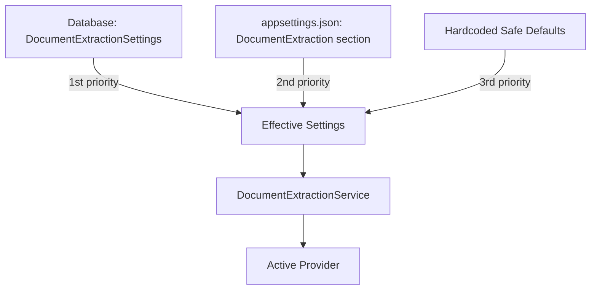

# AI Supplier/API Readiness Assessment — Portal Gerencial

> **Version**: 2.0 | **Date**: 2026-06-18 | **Status**: Post-Hardening (G6 Applied) — Requires Corporate IT / Legal Confirmation

---

## 1. Current Provider Abstraction Status

| Aspect | Status | Evidence |
|:---|:---|:---|
| Strategy pattern interface | ✅ Implemented | [IDocumentExtractionProvider.cs](file:///c:/dev/alpla-portal/src/backend/AlplaPortal.Application/Interfaces/Extraction/IDocumentExtractionProvider.cs) — `Name` + `ExtractAsync()` |
| Service orchestrator | ✅ Implemented | [DocumentExtractionService.cs](file:///c:/dev/alpla-portal/src/backend/AlplaPortal.Infrastructure/Services/Extraction/DocumentExtractionService.cs) — resolves provider from settings |
| DI registration | ✅ Implemented | [Program.cs](file:///c:/dev/alpla-portal/src/backend/AlplaPortal.Api/Program.cs) line 37: `AddHttpClient<IDocumentExtractionProvider, OpenAiDocumentExtractionProvider>()` |
| Settings cascade | ✅ Implemented | [DocumentExtractionSettingsService.cs](file:///c:/dev/alpla-portal/src/backend/AlplaPortal.Infrastructure/Services/Extraction/DocumentExtractionSettingsService.cs) — DB → appsettings → defaults |
| Provider-agnostic DTOs | ✅ Implemented | [ExtractionResultDto.cs](file:///c:/dev/alpla-portal/src/backend/AlplaPortal.Application/DTOs/Extraction/ExtractionResultDto.cs) — shared model |
| Admin UI for config | ✅ Implemented | [DocumentExtractionSettings.tsx](file:///c:/dev/alpla-portal/src/frontend/src/pages/Settings/DocumentExtractionSettings.tsx) |
| Connection testing | ✅ Implemented | `IDocumentExtractionSettingsService.TestConnectionAsync()` |
| New provider addition | ✅ Ready | Implement `IDocumentExtractionProvider`, register in DI — no consuming code changes needed |

**Conclusion**: The architecture fully supports provider switching. Adding Azure OpenAI or Azure Document Intelligence requires only a new provider class and DI registration.

---

## 2. OpenAI Provider Status

| Aspect | Detail |
|:---|:---|
| Provider class | [OpenAiDocumentExtractionProvider.cs](file:///c:/dev/alpla-portal/src/backend/AlplaPortal.Infrastructure/Services/Extraction/OpenAiDocumentExtractionProvider.cs) (1185 lines) |
| API endpoint | `api.openai.com` (direct OpenAI, not Azure-hosted) |
| Model | `gpt-4-turbo` (configurable via settings) |
| Capabilities | Vision API (base64 images), TextFirst strategy, PDF triage |
| Authentication | API key via `IntegrationConfigResolver` (DB encrypted or env var) |
| Timeout | Configurable: default 60 seconds |

### ⚠️ Risk: Direct OpenAI API

| Concern | Assessment |
|:---|:---|
| **Data sovereignty** | Data may be processed outside EU/EEA (OpenAI default: US) |
| **Corporate control** | No tenant-level isolation; no Azure AD integration |
| **DPA coverage** | OpenAI's standard DPA may not meet ALPLA requirements |
| **Training opt-out** | OpenAI API has training opt-out for API usage, but confirmation needed |
| **Audit logging** | Limited visibility into OpenAI's processing |
| **SLA guarantees** | Standard API SLA; no enterprise-grade commitment |

---

## 3. Azure Document Intelligence Placeholder

| Aspect | Status |
|:---|:---|
| Config in appsettings.json | ✅ Present: `"AzureDocumentIntelligence": { "Enabled": false }` |
| Provider class | 🔴 Not implemented |
| Integration | Ready for implementation via provider abstraction |

---

## 4. API Key Management

| Control | Implementation | Evidence |
|:---|:---|:---|
| Primary storage | Database — AES-256 encrypted | [AesEncryptionHelper.cs](file:///c:/dev/alpla-portal/src/backend/AlplaPortal.Infrastructure/Security/AesEncryptionHelper.cs) |
| Fallback | Environment variable `OPENAI_API_KEY` | [OpenAiDocumentExtractionProvider.cs](file:///c:/dev/alpla-portal/src/backend/AlplaPortal.Infrastructure/Services/Extraction/OpenAiDocumentExtractionProvider.cs) line 71 |
| Resolution cascade | DB (encrypted) → env var → error | `IntegrationConfigResolver.ResolveApiSettingsAsync()` |
| Admin UI | API key entry via settings page (not displayed after save) | `DocumentExtractionSettings.tsx` |
| Frontend exposure | ✅ Never exposed — all API calls are backend-only | No API key references in frontend code |
| Rotation support | Manual — update via admin UI or env var | No automated rotation |
| Sanitization in logs | ✅ `SafePayload.cs` redacts `apikey`, `token`, `secret` patterns | Two-layer masking |

---

## 5. Configuration Cascade

| Setting | DB | appsettings.json | Default |
|:---|:---|:---|:---|
| DefaultProvider | ✅ | `"OPENAI"` | `"OPENAI"` |
| OpenAI Enabled | ✅ | `true` | `false` |
| OpenAI Model | ✅ | `"gpt-4-turbo"` | `"gpt-4-turbo"` |
| OpenAI Timeout | ✅ | `60s` | `30s` |
| Global Timeout | ✅ | `30s` | `30s` |

---

## 6. Supplier Compliance Requirements

| # | Requirement | Current Evidence | Status | Gap | Recommendation |
|:---|:---|:---|:---|:---|:---|
| 1 | AI CoE provider approval | No approval document found | 🟣 Unconfirmed | No evidence | Confirm if OpenAI is approved; if not, evaluate Azure OpenAI |
| 2 | Corporate IT approval | No approval document found | 🟣 Unconfirmed | No evidence | Confirm with Corporate IT |
| 3 | Data Processing Agreement (DPA) | Not found in repository | 🟣 Unconfirmed | No evidence | Confirm with Legal |
| 4 | Standard Contractual Clauses (SCC) | Not found in repository | 🟣 Unconfirmed | No evidence | Required for EU→US transfer; confirm with Legal |
| 5 | Transfer Impact Assessment (TIA) | Not found in repository | 🟣 Unconfirmed | No evidence | Required for cross-border processing; confirm with Legal |
| 6 | Data residency confirmation | No region config for OpenAI | 🟣 Unconfirmed | Unknown region | Azure OpenAI allows region selection (e.g., West Europe) |
| 7 | Data retention by provider | OpenAI API: 30-day default, opt-out available | 🟣 Unconfirmed | Not verified | Confirm retention settings in OpenAI account |
| 8 | Training data usage | OpenAI API: opt-out by default for API | 🟣 Unconfirmed | Not verified | Confirm training opt-out is active |
| 9 | Privacy policy review | Not reviewed | 🟣 Unconfirmed | Not started | Legal must review OpenAI privacy policy |
| 10 | Terms of use review | Not reviewed | 🟣 Unconfirmed | Not started | Legal must review OpenAI ToS |
| 11 | Security certification (SOC 2, ISO 27001) | OpenAI has SOC 2 Type II | 🟣 Unconfirmed | Not verified against ALPLA requirements | Confirm certification requirements |
| 12 | Incident notification process | Standard OpenAI status page | 🟣 Unconfirmed | No ALPLA-specific SLA | Define incident notification requirements |
| 13 | Sub-processor transparency | OpenAI publishes sub-processor list | 🟣 Unconfirmed | Not reviewed | Legal must review sub-processors |

---

## 7. Provider Comparison: Direct OpenAI vs Azure OpenAI

| Dimension | Direct OpenAI (Current) | Azure OpenAI (Recommended) |
|:---|:---|:---|
| **Data residency** | US (default) | Configurable (West Europe, etc.) |
| **Tenant isolation** | Shared API | Azure subscription isolation |
| **Authentication** | API key only | Azure AD + managed identity |
| **DPA** | OpenAI DPA | Microsoft DPA (existing ALPLA-Microsoft relationship) |
| **Network security** | Public API | Private endpoint support |
| **Compliance certs** | SOC 2 Type II | SOC 2, ISO 27001, ISO 27701, GDPR Article 28 |
| **Training opt-out** | Opt-out by default (API) | Guaranteed no training |
| **Content filtering** | Optional | Built-in content safety |
| **Monitoring** | Limited | Azure Monitor integration |
| **Cost management** | Direct billing | Azure subscription billing, budgets |
| **SLA** | Standard API | Enterprise SLA available |

---

## 8. Final Recommendation

> [!IMPORTANT]
> **Maintain the provider abstraction architecture and prepare a switch path to Azure OpenAI (or another ALPLA-approved AI provider) before production compliance sign-off, if Corporate IT requires it.**

### Action Items

1. **Immediate**: Confirm with Corporate IT whether direct OpenAI API is approved
2. **If not approved**: Implement `AzureOpenAiDocumentExtractionProvider` using the existing abstraction
3. **If approved**: Document the approval and ensure DPA/SCC/TIA are in place
4. **Regardless**: Keep provider abstraction intact — the ability to switch is a governance strength
5. **Long-term**: Evaluate Azure Document Intelligence as a secondary provider for failover

---

## Evidence Package References

| Area | Evidence Files |
|:---|:---|
| Provider endpoint (G6) | `evidence/code-references/G6-provider-switch-readiness.md`, `evidence/configuration/provider-endpoint-redacted.md` |
| Provider settings | `evidence/configuration/document-extraction-settings-redacted.md` |
| Screenshot placeholder | `evidence/screenshots/SCR-30-provider-settings-masked.md` |

> 👉 Full evidence index: [`evidence/EVIDENCE_INDEX.md`](evidence/EVIDENCE_INDEX.md)
