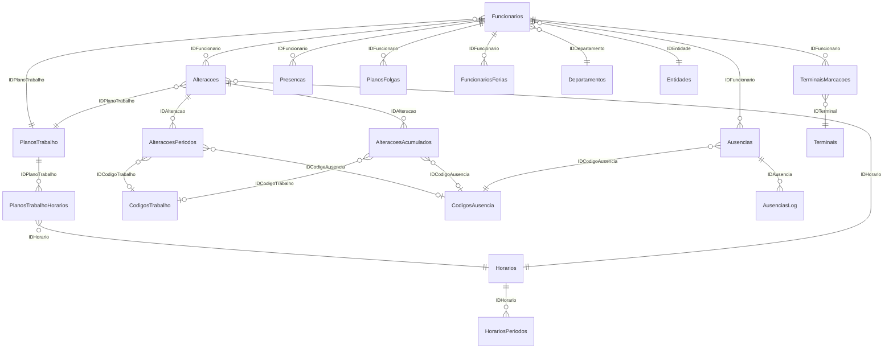

# Innux Database Schema Mapping — Attendance & Time Tracking

> **Database**: `Innux` on `AOVIA1VMS012\SQLINNUX`  
> **Engine**: SQL Server (SQL Authentication)  
> **Investigation Date**: 2026-04-22  
> **Method**: Read-only schema extraction via diagnostic API endpoint

---

## Executive Summary

The Innux database contains **~150 tables** spanning time & attendance, access control, and HR management. The schema uses **implicit relationships** (no declared foreign keys) — all joins rely on naming conventions (`IDFuncionario`, `IDHorario`, `IDPlanoTrabalho`, etc.).

### Key Metrics
| Category | Table | Rows |
|---|---|---:|
| Daily Attendance Results | `Alteracoes` | 112,549 |
| Attendance Period Details | `AlteracoesPeriodos` | 75,964 |
| Raw Clock Punches | `TerminaisMarcacoes` | 74,962 |
| Accumulated Results | `AlteracoesAcumulados` | 64,487 |
| Absence Audit Log | `AusenciasLog` | 47,063 |
| Absence Records | `Ausencias` | 8,433 |

---

## 1. Raw Clock-In / Clock-Out Records

### `TerminaisMarcacoes` — Raw Punch Data (74,962 rows)

This is the **primary transactional table** containing every clock punch from biometric terminals.

| Column | Type | Description |
|---|---|---|
| `IDMarcacao` | int (PK) | Auto-increment punch ID |
| `IDFuncionario` | int | FK → `Funcionarios.IDFuncionario` |
| `Data` | datetime | Punch date (date part only) |
| `Hora` | datetime | Punch time (stored as `1900-01-01T{HH:mm:ss}`) |
| `Cartao` | nvarchar(12) | Employee badge/card number |
| `Tecla` | nvarchar(1) | Terminal key pressed |
| `Tipo` | nvarchar(2) | Raw direction (empty = auto-detect) |
| `TipoProcessado` | nvarchar(2) | **Processed direction**: `EN` = Entry, `SA` = Exit |
| `IDTerminal` | int | FK → `Terminais.IDTerminal` |
| `Gerada` | bit | Whether this was auto-generated |
| `DataInsercao` | datetime | When the record was inserted into DB |
| `DataAtribuida` | datetime | Manually assigned date (if corrected) |
| `Latitude` | decimal | GPS latitude (mobile punches) |
| `Longitude` | decimal | GPS longitude (mobile punches) |
| `Enviada` | bit | Whether sent to external system |
| `ErroEnvio` | bit | Error flag for export |
| `TipodeMarcacaoNoTerminal` | nvarchar(150) | Terminal-reported punch description |
| `TM_SerialNumber` | nvarchar(20) | Terminal serial number |
| `Temperatura` | nvarchar(20) | Temperature reading (COVID-era feature) |

**Sample Data**:
```
ID=453 Func=1510 Date=2024-06-13 Time=09:27 Type=EN Terminal=10
ID=454 Func=1510 Date=2024-06-13 Time=09:29 Type=SA Terminal=10
```

> [!IMPORTANT]
> `TipoProcessado` is the reliable direction field: `EN` = Clock In, `SA` = Clock Out.

---

### `TerminaisEventos` — Terminal Access Events (555 rows)

Secondary event log for terminal-level access events (door access, etc.).

| Column | Type | Description |
|---|---|---|
| `IDEvento` | int (PK) | Event ID |
| `Data` | datetime | Event date |
| `Hora` | datetime | Event time |
| `Cartao` | nvarchar(12) | Badge number |
| `IDTipoEvento` | int | FK → `TerminaisEventosTipos` |
| `IDTerminal` | int | FK → `Terminais` |
| `DataInsercao` | datetime | DB insertion timestamp |
| `IDFuncionario` | int | FK → `Funcionarios` |

---

## 2. Processed Daily Attendance Results

### `Alteracoes` — Daily Attendance Summary (112,549 rows)

The **core processed attendance table**. Each row represents one employee's attendance for one day, computed from raw punches against their assigned schedule.

| Column | Type | Description |
|---|---|---|
| `IDAlteracao` | int (PK) | Record ID |
| `IDFuncionario` | int | FK → `Funcionarios` |
| `IDHorario` | int | FK → `Horarios` (schedule used that day) |
| `IDPlanoTrabalho` | int | FK → `PlanosTrabalho` (work plan) |
| `Data` | datetime | **The attendance date** |
| `Coluna1–4` | datetime | Configurable computed time columns |
| `Falta` | datetime | **Absence duration** (as time, e.g., `08:00:00` = 8h absence) |
| `Ausencia` | datetime | Justified absence duration |
| `Validado` | bit | Whether the record was validated by HR |
| `Alterado` | bit | Whether manually modified |
| `Entrada1` | datetime | 1st clock-in time |
| `Saida1` | datetime | 1st clock-out time |
| `Entrada2` | datetime | 2nd clock-in time |
| `Saida2` | datetime | 2nd clock-out time |
| `Entrada3` | datetime | 3rd clock-in time |
| `Saida3` | datetime | 3rd clock-out time |
| `Entrada4` | datetime | 4th clock-in time |
| `Saida4` | datetime | 4th clock-out time |
| `Justificacao` | nvarchar(100) | Free-text justification |
| `IDEntidade` | int | FK → `Entidades` (company entity) |
| `Objectivo` | datetime | **Expected working hours** (as time) |
| `Saldo` | datetime | **Balance** (worked - expected, can be negative) |
| `FaltouPeriodosObrigatorios` | bit | Missed mandatory schedule periods |
| `Tolerancia` | datetime | Applied tolerance duration |
| `SaldoCopia` | datetime | Original balance (before adjustments) |
| `ToleranciaFalta` | datetime | Tolerance applied to absence |
| `CortesParagens` | datetime | Break time deductions |
| `Marcacao` | int | Punch count for the day |
| `Dispensa` | datetime | Dispensed time (from flex bank) |
| `Bloqueado` | bit | Whether the record is locked |
| `CreditoFolgas` | datetime | Day-off credit hours |
| `Exportar` | bit | Ready for payroll export |
| `TipoAnomalia` | nvarchar(100) | Anomaly description |
| `IDHorarioAdicional` | int | Additional schedule reference |

> [!TIP]
> Time values are stored as `datetime` with base date `1900-01-01`. To get actual hours: extract the time part. E.g., `1900-01-01T08:00:00` = 8 hours.

---

### `AlteracoesPeriodos` — Attendance Period Breakdown (75,964 rows)

Detailed breakdown of each time segment within a day (e.g., basic work, overtime, absence).

| Column | Type | Description |
|---|---|---|
| `IDAlteracaoPeriodo` | int (PK) | Period ID |
| `IDAlteracao` | int | FK → `Alteracoes.IDAlteracao` |
| `Inicio` | datetime | Period start time |
| `Fim` | datetime | Period end time |
| `IDCodigoTrabalho` | int | FK → `CodigosTrabalho` (work code) |
| `IDCodigoAusencia` | int | FK → `CodigosAusencia` (absence code) |
| `Dispensa` | bit | Whether this is dispensed time |
| `CentroCusto` | nvarchar(10) | Cost center |
| `FaltaPorSaldoNegativo` | bit | Absence due to negative balance |

---

### `AlteracoesAcumulados` — Accumulated Hours (64,487 rows)

Aggregated/accumulated hours per code per day. Used for reporting and payroll export.

| Column | Type | Description |
|---|---|---|
| `IDAlteracaoAcumulado` | int (PK) | Accumulation ID |
| `IDAlteracao` | int | FK → `Alteracoes.IDAlteracao` |
| `IDCodigoTrabalho` | int | FK → `CodigosTrabalho` |
| `IDCodigoAusencia` | int | FK → `CodigosAusencia` |
| `Acumulado` | datetime | Accumulated hours (as time) |
| `Dispensa` | bit | Whether dispensed |
| `Credito` | bit | Credit flag |
| `Pendente` | bit | Pending approval |
| `NivelAutorizacao0–2` | int | Authorization levels (0=Pending, 1=Approved, 2=Rejected) |
| `Observacoes` | nvarchar(max) | Notes |

---

## 3. Absence Records

### `Ausencias` — Absences (8,433 rows)

All registered absences (planned, approved, or rejected).

| Column | Type | Description |
|---|---|---|
| `IDAusencia` | int (PK) | Absence record ID |
| `Data` | datetime | Absence date |
| `IDCodigoAusencia` | int | FK → `CodigosAusencia` |
| `Tipo` | int | `0` = Full day, `1` = Morning, `2` = Afternoon |
| `DuracaoIni` | datetime | Start time (for partial-day absences) |
| `DuracaoFim` | datetime | End time (for partial-day absences) |
| `IDFuncionario` | int | FK → `Funcionarios` |
| `Pendente` | bit | Pending approval |
| `Planificado` | bit | Was this planned/scheduled |
| `DataPedido` | datetime | Request date |
| `Observacoes` | nvarchar(100) | Notes |
| `NivelAutorizacao0–2` | int | Multi-level approval status |
| `NivelRH` | bit | HR-level approval required |
| `AnoCivil` | int | Calendar year |
| `Documento` | nvarchar(50) | Supporting document reference |
| `Gerada` | bit | Auto-generated |

### `AusenciasLog` — Absence Audit Trail (47,063 rows)

Complete audit trail for all absence record changes.

| Column | Type | Description |
|---|---|---|
| `IDAusencia` | int | FK → `Ausencias` |
| `Data` | datetime | Absence date |
| `DataHoraLog` | datetime | When the change was logged |
| `IDFuncionario` | int | Employee |
| `IDFuncionarioChefe` | int | Approving manager |
| `IDCodigoAusencia` | int | Absence code |
| `IDUtilizador` | int | System user who made the change |
| `Operacao` | nvarchar(50) | Operation type |
| `Observacoes` | nvarchar(max) | Details |

---

## 4. Work Schedules & Shift Definitions

### `Horarios` — Schedule Definitions (26 rows)

| Column | Type | Description |
|---|---|---|
| `IDHorario` | int (PK) | Schedule ID |
| `Codigo` | nvarchar(15) | Code |
| `Descricao` | nvarchar(50) | Description |
| `HorasNormais` | datetime | Normal working hours |
| `InicioHorario` | datetime | Schedule start time |
| `FimHorario` | datetime | Schedule end time |
| `DiaDuplo` | bit | Crosses midnight |

**Known Schedules (sample)**:
| ID | Code | Description |
|---|---|---|
| 1 | DIASEM | Dia de Semana (Weekday) |
| 2 | FIMSEM | Fim de Semana (Weekend) |
| 3 | FPUB | Função Pública (Public Function) |
| 12 | Descanso | Dia de descanso (Rest Day) |
| 13 | Manha | Trabalho durante a manhã (Morning) |

### `HorariosPeriodos` — Schedule Time Periods (33 rows)

Defines the specific time windows within a schedule (mandatory, optional, tolerance).

| Column | Type | Description |
|---|---|---|
| `IDHorarioPeriodos` | int (PK) | Period ID |
| `IDHorario` | int | FK → `Horarios` |
| `Tipo` | nvarchar(15) | `Obrigatório` (Mandatory) / `Opcional` (Optional) |
| `Inicio` | datetime | Period start time |
| `Fim` | datetime | Period end time |
| `ToleranciaEntrada` | datetime | Entry tolerance |
| `ToleranciaSaida` | datetime | Exit tolerance |
| `Arredondar` | datetime | Rounding interval |
| `IDCodigoTrabalho` | int | FK → `CodigosTrabalho` |

**Sample**: Schedule 1 (DIASEM) has mandatory period 08:30–17:00.

### `PlanosTrabalho` — Work Plans (11 rows)

Defines rotating or fixed schedule patterns (which schedule applies on which day of the cycle).

| Column | Type | Description |
|---|---|---|
| `IDPlanoTrabalho` | int (PK) | Plan ID |
| `Codigo` | nvarchar(15) | Code |
| `Descricao` | nvarchar(50) | Description |
| `Tipo` | nvarchar(15) | Plan type (Semanal/Rotativo) |
| `NumeroDias` | int | Cycle length in days |
| `DataInicio` | datetime | Cycle start date |
| `IDAusencia` | int | Default absence code for non-working days |

### `PlanosTrabalhoHorarios` — Schedule-to-Day Mapping (2,506 rows)

Maps which `Horario` applies on each day of a work plan cycle.

| Column | Type | Description |
|---|---|---|
| `IDPlanoTrabalhoHorario` | int (PK) | Mapping ID |
| `IDPlanoTrabalho` | int | FK → `PlanosTrabalho` |
| `IDHorario` | int | FK → `Horarios` |
| `Dia` | int | Day number in cycle (0-indexed) |

---

## 5. Reference / Lookup Tables

### `CodigosAusencia` — Absence Codes (66 rows)

| Column | Type | Description |
|---|---|---|
| `IDCodigoAusencia` | int (PK) | Code ID |
| `Codigo` | nvarchar(15) | Short code |
| `Descricao` | nvarchar(50) | Description |
| `TipoCodigo` | int | `0`=Unjustified, `1`=Vacation, `2`=Justified |
| `Cor` | nvarchar(50) | Display color |
| `Justificada` | bit | Is justified |
| `Greve` | bit | Strike |
| `AusenciaFolga` | bit | Day-off absence |
| `Inativo` | bit | Inactive flag |

**Known Absence Codes (sample)**:
| ID | Code | Description | Type |
|---|---|---|---|
| 1 | FLTINJ | Falta Injustificada (Unjustified Absence) | 0 |
| 3 | FLTJUS | Falta Justificada (Justified Absence) | 2 |
| 4 | FER | Férias (Vacation) | 1 |
| 5 | FLTDOE | Doença (Illness) | 2 |
| 6 | F01 | Baixa Médica (Sick Leave) | 2 |

### `CodigosTrabalho` — Work Codes (204 rows)

| Column | Type | Description |
|---|---|---|
| `IDCodigoTrabalho` | int (PK) | Code ID |
| `Codigo` | nvarchar(25) | Short code |
| `Descricao` | nvarchar(100) | Description |
| `TrabalhoSuplementar` | bit | Is overtime |
| `CodigoExportacao` | nvarchar(25) | Export code for payroll |

**Known Work Codes**:
| ID | Code | Description |
|---|---|---|
| 1 | Basico | Trabalho Basico (Basic Work) |
| 2 | Extra | Trabalho Extra 150% (Overtime 150%) |
| 3 | Extra 2 | Trabalho Extra 200% (Overtime 200%) |
| 4 | Hora Extra | Trabalho Hora Extra (Overtime Hour) |
| 5 | Total | Coluna de totais (Totals Column) |

### `CodigosIncidencia` — Incident Codes (1 row)

| Column | Type | Description |
|---|---|---|
| `IDCodigoIncidencia` | int (PK) | Incident code ID |
| `Descricao` | nvarchar(50) | Description |
| `Tipo` | int | Type |
| `ProcessarComoAusencia` | bit | Treat as absence |
| `ProcessarComoMarcacao` | bit | Treat as punch |
| `IDCodigoTrabalho` | int | Associated work code |
| `IDCodigoAusencia` | int | Associated absence code |

### `MarcacoesTipos` — Punch Types

| ID | Code | Description |
|---|---|---|
| (lookup) | 2-char | Punch type classification |

### `TiposSaidaServico` — Service Exit Types

| Column | Type | Description |
|---|---|---|
| `IDTipoSaidaServico` | int (PK) | Type ID |
| `DescricaoTipo` | nvarchar(50) | Description |

---

## 6. Employee Master Data

### `Funcionarios` — Employees (161 rows)

Key columns for attendance context:

| Column | Type | Description |
|---|---|---|
| `IDFuncionario` | int (PK) | Employee ID |
| `Numero` | nvarchar | Employee number |
| `Nome` | nvarchar | Full name |
| `Cartao` | nvarchar | Badge card number |
| `Activo` | bit | Active status |
| `IDDepartamento` | int | FK → `Departamentos` |
| `IDPlanoTrabalho` | int | FK → `PlanosTrabalho` (assigned work plan) |
| `IDEntidade` | int | FK → `Entidades` (company) |
| `DataAdmissao` | datetime | Hire date |
| `DataDemissao` | datetime | Termination date |
| `Chefe` | bit | Is a manager |
| `SuperiorHierarquico` | bit | Is a hierarchical superior |

### `FuncionariosFerias` — Employee Vacation Balances (578 rows)

Vacation entitlements and balances per year/employee.

### `PlanosFolgas` — Day-Off Plans (73 rows)

Specific day-off dates per employee.

| Column | Type | Description |
|---|---|---|
| `IDPlanoFolga` | int (PK) | Plan ID |
| `IDFuncionario` | int | FK → `Funcionarios` |
| `Data` | datetime | Day-off date |

---

## 7. Presence / Real-Time Status

### `Presencas` — Current Presence Status (112 rows)

Live presence status for today.

| Column | Type | Description |
|---|---|---|
| `IDPresenca` | int (PK) | Presence record ID |
| `IDFuncionario` | int | FK → `Funcionarios` |
| `IDDepartamento` | int | FK → `Departamentos` |
| `Estado` | nvarchar(50) | **Status**: `Presente`, `Ausente` |
| `Atrasado` | bit | Is late |
| `Atraso` | datetime | Lateness duration |
| `IDHorario` | int | FK → `Horarios` |
| `UltimaMarcacao` | datetime | Last punch time |
| `Tipo` | nvarchar(2) | Last punch type: `EN`/`SA` |
| `IDEntidade` | int | FK → `Entidades` |
| `IDTerminal` | int | Last terminal used |

---

## 8. Infrastructure Tables

### `Terminais` — Biometric Terminals (3 rows)

Physical clock devices (biometric readers, RFID terminals).

### `Departamentos` — Departments (51 rows)

Department hierarchy with `IDDepartamentoPai` for parent reference.

### `Entidades` — Company Entities (2 rows)

Multi-entity support (e.g., different legal entities or plants).

### `Feriados` — Public Holidays (18 rows)

### `FechosMes` — Month Closing Status (2 rows)

Tracks which months have been "closed" (processed/locked) per entity.

---

## 9. Entity Relationship Diagram



---

## 10. Recommended Query Patterns for Integration

### A. Daily Attendance Summary
```sql
SELECT a.Data, f.Numero, f.Nome, d.Descricao AS Departamento,
       h.Descricao AS Horario, a.Entrada1, a.Saida1, a.Entrada2, a.Saida2,
       a.Objectivo, a.Falta, a.Ausencia, a.Saldo,
       a.Validado, a.TipoAnomalia, a.Justificacao
FROM Alteracoes a
INNER JOIN Funcionarios f ON a.IDFuncionario = f.IDFuncionario
INNER JOIN Departamentos d ON f.IDDepartamento = d.IDDepartamento
LEFT JOIN Horarios h ON a.IDHorario = h.IDHorario
WHERE a.Data BETWEEN @StartDate AND @EndDate
  AND f.Activo = 1
ORDER BY a.Data, d.Descricao, f.Nome
```

### B. Raw Punches for a Period
```sql
SELECT tm.Data, tm.Hora, tm.TipoProcessado,
       f.Numero, f.Nome, t.Nome AS Terminal
FROM TerminaisMarcacoes tm
INNER JOIN Funcionarios f ON tm.IDFuncionario = f.IDFuncionario
LEFT JOIN Terminais t ON tm.IDTerminal = t.IDTerminal
WHERE tm.Data BETWEEN @StartDate AND @EndDate
ORDER BY tm.Data, tm.Hora
```

### C. Absence Records with Codes
```sql
SELECT aus.Data, f.Numero, f.Nome,
       ca.Codigo, ca.Descricao AS TipoAusencia,
       aus.Tipo, aus.Pendente, aus.Observacoes
FROM Ausencias aus
INNER JOIN Funcionarios f ON aus.IDFuncionario = f.IDFuncionario
INNER JOIN CodigosAusencia ca ON aus.IDCodigoAusencia = ca.IDCodigoAusencia
WHERE aus.Data BETWEEN @StartDate AND @EndDate
ORDER BY aus.Data, f.Nome
```

### D. Current Presence Status
```sql
SELECT p.Estado, p.Atrasado, p.Atraso, p.UltimaMarcacao, p.Tipo,
       f.Numero, f.Nome, d.Descricao AS Departamento,
       h.Descricao AS Horario
FROM Presencas p
INNER JOIN Funcionarios f ON p.IDFuncionario = f.IDFuncionario
LEFT JOIN Departamentos d ON p.IDDepartamento = d.IDDepartamento
LEFT JOIN Horarios h ON p.IDHorario = h.IDHorario
ORDER BY d.Descricao, f.Nome
```

---

## 11. Important Notes

> [!WARNING]
> **Connection Timeout**: The Innux SQL Server requires **60+ seconds** for initial connection from the dev environment. The default 15-second timeout in `appsettings.Development.json` will fail. Production environment may have faster connectivity.

> [!CAUTION]
> **No Foreign Keys**: The database has **zero declared foreign key constraints**. All relationships are implicit via naming conventions. Data integrity is enforced by the Innux application layer, not the database.

> [!NOTE]
> **Time Storage Convention**: All duration/time columns use `datetime` with a base date of `1900-01-01`. To extract hours: `DATEDIFF(MINUTE, '1900-01-01', column) / 60.0`. A value of `1900-01-01T08:00:00` means "8 hours".
